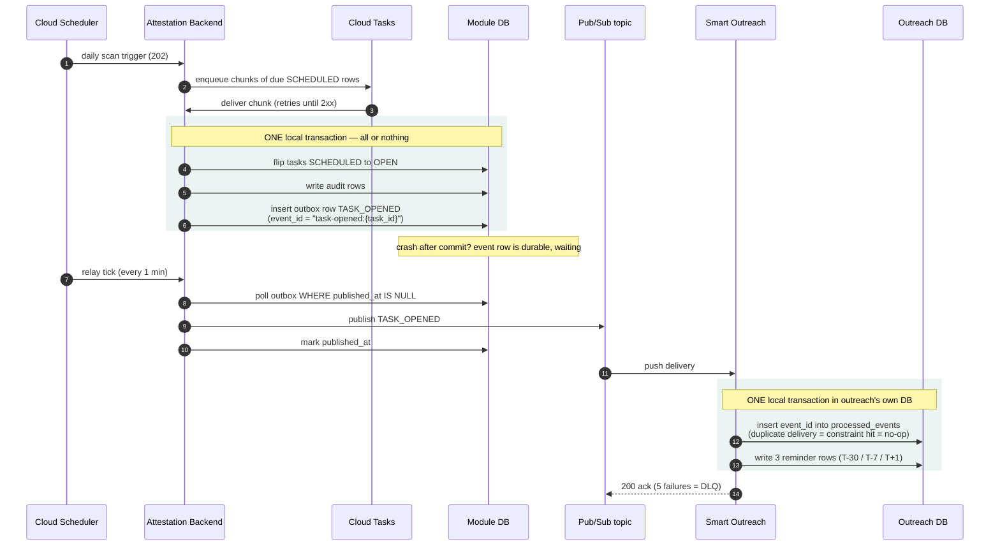
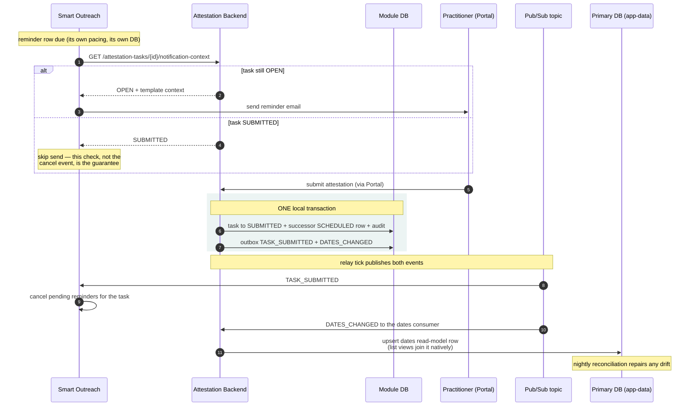

# Companion — Cycle module (concepts + supplementary material)

> Two parts. **Part 1 — Concepts:** plain-language explanations of every service, tool, and concept named in `cycle.md`, written for a reader new to the stack. **Part 2 — Supplementary material:** the deep-dive analysis behind the module doc (baseline evidence, full approach scoring, design rationale, open questions, ticket impact, engine research). The module doc stands alone as the shareable design; this file is the preparation and defense material.

## GCP services

### Cloud Scheduler

- GCP's managed cron service: "call this URL at this time, on this schedule."
- You give it a cron expression (`0 6 * * *` = 06:00 daily), a target URL, and an auth header. Google's infrastructure fires it — no server of ours has to stay up.
- If the call fails (non-2xx or timeout), Cloud Scheduler retries per its own retry config and can alert on repeated failure.
- It only *triggers* work — it carries no payload logic and does no processing.
- Pricing: 3 jobs free per account, then $0.10 per job per month.

### Cloud Tasks

- **Is it a queue? Yes** — a managed *work* queue: you create "tasks", each task is one HTTP call the queue promises to deliver to your endpoint.
- How a task flows:
  1. Your code creates a task: target URL + payload + optional name.
  2. The queue stores it and dispatches it — an HTTP POST to your endpoint.
  3. Your endpoint returns 2xx → the task is done and deleted.
  4. Non-2xx or timeout → the queue **retries automatically** with exponential backoff (delays that grow: 1s, 2s, 4s…), up to a configured maximum.
- **Task names — the duplicate shield:** you can name a task. Creating a second task with the same name is **refused by the queue**. Deterministic names (built from run date + tenant + page number) mean a crashed-and-retried producer cannot enqueue the same work twice.
- **Dispatch deadline:** how long the queue waits for your response before calling the attempt failed — 10 minutes by default, configurable 15 seconds to 30 minutes.
- **Pacing:** the queue dispatches at a configured rate (e.g., max N tasks/second) — a burst of 100 created tasks reaches your service smoothly, not all at once.
- **The trap: no dead-letter queue.** When a task exhausts all retries it is *silently deleted* — no parking lot, no alert. Any design using Cloud Tasks must answer "what happens to exhausted tasks?" itself (ours: a final-attempt failure record + the next daily scan re-finds the work).
- **Future scheduling cap:** a task can be scheduled at most **30 days** into the future — why it cannot carry our T+1 reminder (~31 days out).
- Pricing: first 1 million operations/month free, then $0.40 per million.

### Pub/Sub

- GCP's managed **publish/subscribe messaging**: publishers write messages to a *topic*; every *subscription* on that topic gets its own copy; subscribers consume independently.
- Built for **events** — "something happened, whoever cares can react" — not for directed work assignments.
- **At-least-once delivery:** every message is delivered *at least* once — which explicitly means it may arrive **twice or more** (slow acknowledgment, network retry, redelivery after a timeout). Subscribers are required to tolerate duplicates.
- **Push vs pull:** push subscriptions POST each message to your URL (2xx = acknowledged, anything else = redelivered later); pull subscriptions let your code fetch and acknowledge explicitly.
- **No publish-time dedup:** there is no message name and no way to say "refuse this if an identical message exists" — the receiver's database has to catch duplicates.
- **Process first, acknowledge after:** a consumer must do its work (commit its writes) *before* acking — an ack sent before processing lets a crash mid-write discard the message with no retry left.
- **Ordering keys:** messages sharing an ordering key are delivered in publish order — how a cancel event is kept behind its schedule event (key = task id).
- Its real strength over Cloud Tasks: a native **dead-letter queue** (below) and fan-out to many subscribers.
- This module uses it for the outreach handoff: outbox rows are published as commands to the Smart Outreach Service's topic; its outcomes come back on a second topic.

### Dead-letter queue (DLQ)

- A **parking lot for messages that keep failing**: after N failed delivery attempts, the message is moved to a separate queue/topic instead of retrying forever or being dropped.
- Why it matters: without one, a "poison" message (one that crashes the consumer every time) either blocks the queue or disappears silently.
- Pub/Sub supports a DLQ natively (configure max attempts + a dead-letter topic). **Cloud Tasks has none** — exhausted tasks are silently deleted.
- A DLQ is only worth building when the lost work **cannot be regenerated**. If a daily scan re-derives the work anyway, a DLQ stores what you'd recover for free.

### Cloud Run

- GCP's managed container runtime: you give it a container image; it runs copies ("instances") of it, scales them with traffic — including down to zero — and fronts them with an HTTPS URL.
- Relevant behaviors here:
  - Scale-to-zero means *nothing of yours is running* between requests — one reason in-process cron timers are unreliable on it.
  - Requests have a time limit — one reason "process everything inline in one request" fails on big days.
- Billing is per vCPU-second and memory-second while handling requests (~$0.000024 per vCPU-second).

### Cloud Spanner

- Google's distributed relational (SQL) database: tables, columns, SQL queries, **strong consistency** (every read sees the latest committed write), and horizontal scale.
- Concepts the design leans on:
  - **Transaction:** a group of reads/writes that commits **atomically** — all of it happens or none of it. Our task flip + audit rows + outbox row commit as one.
  - **Unique index:** a rule the database itself enforces — a second row with the same indexed values is *refused at insert*. This is stronger than any application check: two servers racing cannot both succeed.
  - **Index:** a sorted lookup structure on chosen columns, so a query filtering on them jumps straight to matching rows instead of scanning the table.
  - **Mutation limit:** one transaction can carry only so many cell-level changes (tens of thousands) — why bulk work is grouped into batches of rows per transaction.
  - **Interleaving/joins:** tables in the *same database* can be joined in one query; tables in *different databases* cannot — a query runs inside exactly one database.
- Storage pricing ≈ $0.30/GB/month.

### Secret Manager

- GCP's vault for secrets (API keys, passwords): code references a secret by name and version (`SMART_OUTREACH_API_KEY:latest`) instead of embedding the value.
- The alternative — a literal value in config or Terraform — means the secret is visible to anyone who can read the repo.

## Messaging and reliability concepts

### Queue (general concept)

- A line of work items: producers put items in, consumers take them out, the queue holds them safely in between.
- What a *managed* queue buys you: persistence (items survive crashes), retries, pacing, and visibility (how many waiting, how old) — all things you'd otherwise hand-build.

### Table as queue

- Using a database table *as* the queue: rows are the work items (`status = PENDING`, `scheduled_at = when due`); a periodic job ("sweep") queries for due rows and processes them.
- Strengths: items are queryable and **cancellable** (update the row), no horizon limit (schedule years ahead), and everything is visible with plain SQL.
- Weaknesses: you provide the sweep (a scheduled job), and without a claim/lease step two overlapping sweeps can grab the same rows.
- The Smart Outreach Service's `outreach_sends` table is exactly this pattern (so is the legacy `scheduled_outreaches`).

### Idempotency

- **"Running it twice produces the effect once."** The property that makes retries safe.
- Why it is non-negotiable in distributed systems: retries and duplicate deliveries are *normal* (queues redeliver, schedulers double-fire, clients time out and resend). If a duplicate call creates a duplicate effect, every retry is a potential bug.
- Robust idempotency lives in the **database** — a unique index refusing the second insert, a state check refusing the second transition — never in "the code remembers it already ran" (memory is lost on restart, and two servers have two memories).

### Exponential backoff

- Retrying with growing delays: 1s, 2s, 4s, 8s… instead of hammering a failing dependency every second.
- Gives a struggling service room to recover and spreads retry load. Managed queues do this automatically.

### Keyset pagination

- Reading a big result set page by page using "continue **after this id**" instead of "skip N rows" (offset).
- Offset pagination re-counts skipped rows every page — slower as you go deeper. Keyset uses the index to jump straight to the continuation point — equally fast at page 1 and page 1,000.
- Requires a stable sort key (we order by row id).

### Leader election / distributed lock

- When a service runs as several identical copies, "run this job once a day" needs exactly **one** copy to do it. Electing that copy — usually via a database lock row — is leader election.
- The hard parts: lock expiry when the leader dies mid-run, clock skew, and handover. Managed schedulers (Cloud Scheduler) make the whole problem disappear — the trigger comes from outside.

### Outbox pattern (transactional outbox)

- A technique for "write to my database AND reliably tell another system": the message is saved as a row **in the same transaction** as the business change; it is delivered afterwards, retried until acknowledged.
- Solves the "I committed, then crashed before sending" gap — a database commit and a network publish can never be atomic, so the intent is made durable first.
- **This module's shape (D11):** the outbox row commits with the task flip; right after commit the handler publishes it to Pub/Sub and marks the row `PUBLISHED` (so the sweep does not re-pick it); a Cloud Scheduler relay sweep publishes anything a crash left `PENDING`.
- A crash between publish and the `PUBLISHED` mark causes a duplicate publish — expected and harmless: the consumer deduplicates on the event id (= the outbox row id).
- One table (`attestation_outbox`) carries every event type the module ever emits — later modules add types, not tables.

### Database per service

- The microservice storage rule: a service owns its database outright — schema, migrations, backups — and no other service touches it; other services get data through the owner's API or events.
- What it buys: independent evolution (no cross-team DDL), a real boundary (not a naming convention), independent backup/restore scope.
- What it costs: no cross-database transactions — every cross-service effect needs the outbox/event machinery above.
- Here: `attestation-db`, a sibling database on the platform's existing Spanner instance (instance-billed, so the extra database is free).

### Staging area / staging boundary

- A holding zone where incoming data lives **before it is approved** to touch the system of record.
- In this program: attestation submissions and vendor recommendations stage in module tables; only reviewed/approved changes ever move toward the golden record.

### Kill switch

- A configuration flag that stops a feature **immediately, without a deployment**. Per-tenant here: flip the config entry and the scans/sends stop for that tenant while everything else keeps running.

## Platform-specific concepts

### OV (operational value) / golden record

- `core_practitioners_ov` — the platform's **merged, authoritative view** of each practitioner: one row per `(certify_id, tenant_id)`.
- "Golden record" = the single version of truth after merging all sources. Consumers (UI, exports, egress feeds) read the OV.

### MDM pipeline (cleansing → matching → survivorship)

- The platform's **master data management** chain. When a source contributes practitioner data:
  1. **Cleansing** normalizes it (casing, formats).
  2. **Matching** figures out which practitioner it belongs to.
  3. **Survivorship** merges all sources' values by ranking rules and writes the winner into the OV's `data` JSON.
- Asynchronous (each hop is a Pub/Sub push), and the layers deliberately swallow failures into 200 responses — so the chain guarantees *eventual convergence* when data is re-supplied, never *delivery* of any single write.

### Source slice

- One source's contribution for one practitioner — the *input* rows to the MDM pipeline (N rows per practitioner: one per source). The OV is the *output* (one row per practitioner).

### Denormalized (denorm) column

- A real column holding a value that also exists somewhere less queryable (inside a JSON document, or derivable from other rows) — duplicated deliberately so queries can filter/index it fast.
- The platform precedent: credentialing's `next_credentialing_date` column on the OV, kept honest against its JSON twin by a reconciler CLI.

### Liquibase / changeset

- **Liquibase** — the tool the platform uses to evolve database schemas: every schema change is a versioned file applied in order, tracked so each runs exactly once.
- **Changeset** — one such migration file (e.g., `001-create-scheduled-outreach.yaml`). Reading a table's changesets in order tells you its exact current schema.

### DAL (data access layer)

- `core-data-access-layer` — the service that **owns the platform's databases** (the primary PDM database and its siblings). Other services do not open database connections to them; they call the DAL's REST endpoints, which do the reads and writes.
- Why: one place enforcing schema, tenant scoping, and auditing — instead of every service handling raw database access.
- The attestation module's own database (`attestation-db`) is **not** behind the DAL — the module's own data layer is its single gateway (D2-32). The DAL is not in this module's write path at all; the OV reads go through the existing api-layer endpoints.

### The DAL `/batch` endpoint

- `POST {DAL}/batch` — executes a **list of operations** (CREATE / UPDATE / FIND / UPSERT) across different resource types **in one Spanner transaction** when `transaction: true`.
- All operations succeed together or fail together. Not used by this design (kept here because the superseded same-database variant relied on it).
- Later operations can reference earlier results with `${alias.field}`.

### Smart Outreach Service

- The platform's new standalone email delivery service (its own design doc under `cos-docs/platform/`): a recipient registry, a send queue with a one-minute sweep, service-owned templates, a SendGrid adapter, and an outcome topic.
- Producers — this module first — publish three commands (`UPSERT_RECIPIENT`, `SCHEDULE_SENDS`, `CANCEL_SENDS`) and consume outcomes (`SENT`, `FAILED`, `CANCELLED`, …). The service knows nothing about attestation; it sends what it is told, when it is told, unless cancelled or expired.

### smart_outreach engine (legacy)

- The platform's existing credentialing follow-up system inside `api-layer`: a `scheduled_outreaches` table (table-as-queue) + a daily sweep + a 14-rule exclusion engine + SendGrid sending.
- **Not used by this module.** The earlier plan (an api-layer consumer plus an attestation branch in this engine) was withdrawn 2026-09-07 in favor of the Smart Outreach Service. The research at the end of this file is kept as the record of why.

### AutoRecred (auto-recredentialing)

- The existing production feature this module's scheduling pattern clones: Cloud Scheduler fires a trigger endpoint daily → the endpoint replies 202 → work is split into named Cloud Tasks → a callback endpoint processes each.

### SendGrid

- The platform's email delivery provider. Sends emails via API; reports delivery/bounce/open events back through a **webhook** (an HTTP callback SendGrid makes to an endpoint) — in this design the Smart Outreach Service's webhook, which turns them into outcomes we consume.

### Shared-secret header auth

- Internal endpoints protected by a header (`X-Attestation-Cycle-Key`) whose value must match a configured secret. **Fail-closed**: if the secret is unset or the header is wrong/missing → 401. Constant-time comparison prevents timing attacks.

### Google ID token (service-to-service auth)

- A short-lived signed token proving *which service* is calling (not which user). The caller mints it, sends `Authorization: Bearer <token>`, the receiver verifies the signature. How the api-layer authenticates to the DAL.

### Tenant / tenant isolation

- **Tenant** = one customer organization (a health plan). Everything is scoped by `tenant_id`.
- **Server-side isolation** = every query and job filters by tenant in the backend — never trusting a client or UI to do the filtering.

## Domain concepts

### Attestation

- A provider's periodic confirmation that their directory information (address, phone, specialty, accepting-patients…) is correct — required every 90 days by the CAA 2021 / No Surprises Act.

### The 90-day clock / the 48-hour rule

- **90-day rule:** each provider's directory data must be verified at least every 90 days — the reason this module exists.
- **2-business-day ("48-hour") rule:** once the plan *receives* changed information (an attestation with edits), the directory must be updated within 2 business days. Attaches to provider attestations, not vendor recommendations.

### Obligation / task / cycle

- **Obligation** — "this practitioner owes an attestation by this next attestation date." One row in `attestation_tasks`.
- **Task** — the same row once opened: the actionable item the provider sees in the Portal.
- **Cycle** — the repeating 90-day rhythm. A concept, not a table (D7): each cycle is just the next row.
- **States** — `SCHEDULED → OPEN → SUBMITTED`, plus the terminal `CLOSED` (terminations only, D18); OVERDUE is derived, never stored (D9).

### Deterministic identity

- `(tenant_id, practitioner_id, due_period)` — the unique name of one obligation (`practitioner_id` is stored physically as `certify_practitioner_id`, referencing the OV's `certify_id`). "Deterministic": the same inputs always produce the same identity, so retries and replays collide with the existing row instead of creating a second one.

### Reminder ladder

- **Ladder:** the scheduled email sequence — tiers `T-30` (30 days before due), `T-7`, and `OVERDUE` (one day after the due date, final); a late-opened task gets a `KICKOFF` instead of past tiers.
- A task opened late drops the past tiers and adds one immediate kickoff (D5). *(The former "compressed ladder" for rejection resets was removed 2026-09-01 — a rejection no longer resets the clock.)*

### Backfill / stagger

- **Backfill:** the first, supervised run of the module's one **reconcile job** (`POST /internal/attestation-cycles/reconcile`, D19) — population check only, per tenant, dry-run first. The weekly check is the same endpoint fired unattended with both checks (`population`, `terminated`).
- **Stagger:** spreading due dates across N days (`run_date + hash(certify_id) mod 90`, where `run_date` is the run that first inserts the row) so ~70k practitioners don't all become due at once. Hashing gives a spread that is even, deterministic within a run, and memoryless; insert-if-missing means the first inserting run fixes the date forever.

### Dry run

- Running a job in "compute and report, write nothing" mode. Standard first step for any bulk operation: read the report, then run for real.

---

# Supplementary material

Deep-dive material behind the module doc (`cycle.md`): baseline evidence, the full approach analysis with weightage and cost derivations, traceability, design rationale, open questions, ticket impact, and the smart-outreach engine research. Vocabulary is in the *Concepts* half of this file, above.

## Baseline — verified current behavior

The platform runs exactly **four** scheduling patterns in production:

1. **Cloud Scheduler → HTTP trigger → Cloud Tasks** — the "AutoRecred" pattern. Trigger replies 202 and splits work into Cloud Tasks. Evidence: `AutoRecredResource.java:47` (endpoint), `:79-80` (`/trigger`, `@TenantAgnostic`), `:110` (202), `AutoRecredService.java:375-383` (task per practitioner), deterministic task name at `:377`.
2. **Cloud Scheduler → GCP Workflow → api-layer** — monitoring runs (`MonitoringRunResource.java:53,97`).
3. **Quarkus `@Scheduled`** — exactly one in the workspace, a cache refresh in the survivorship layer.
4. **Pub/Sub consumers** — webhook delivery, roster ingestion. Eventing, not scheduling.

Also verified: no Temporal, no Kafka, no db-scheduler; Quartz on the classpath only to parse cron expressions. Cloud Scheduler jobs and Cloud Tasks queues are **not provisioned in this repo** — every approach needs a DevOps request.

The scan query's proven twin: `findAutoRecredEligible` (`CompositePractitionerOperationalValueRepository.java:4263-4305`) — window predicate, anti-join, keyset pagination, `NULL_FILTERED` index. Ours is simpler still: state + date on one row, one table.

⚠ **Corrections to older claims** (from SoT v1 — tickets fixed in *Ticket impact*):

- No `last_credentialing_date` column exists — the credentialing precedent has only `next_credentialing_date` + `credentialing_status`.
- `event_email_settings` is a configuration entry, not a table.
- Outreach "batch observability" is structured logs only — our audit events are our own.
- SendGrid reports delivery/bounce/open via a webhook onto the outreach row (`SendGridWebhookResource.java:49,298`); no email-events table exists or is needed.

## Approaches analyzed in depth

> **Decision overlay (2026-09-01, D2-32).** The analysis below was scored before the microservices decision. D2-32 added a criterion the original set did not carry — service-boundary alignment — and it now dominates the storage question. Outcome: the **scheduling machinery of 5.A is retained** (Cloud Scheduler → trigger → Cloud Tasks chunks, module-owned table, state-guard idempotency), and the **storage posture of 5.F is adopted** — the module's own `attestation-db` database — with 5.F's decisive con (no cross-database transaction for the reminder rows) answered by the transactional outbox + published event + outreach consumer (D11/D12). The same-database placement 5.A originally bundled is superseded; its scoring is kept below as the honest record of what that variant bought and cost.

**Decision criteria (stated before the approaches):**

1. **Reliability of the recurring trigger** — a missed or doubled run must be harmless. Highest weight: compliance clock.
2. **Idempotency enforcement** — duplicates blocked by database uniqueness, never "the code remembers."
3. **Operational burden** — who is on call, how many new moving parts.
4. **Team familiarity** — does the platform already run this pattern?
5. **Audit and observability fit** — same-transaction audit, correlation, stuck-work visibility.
6. **Cost** — with derivation; at this scale every candidate is cheap, so cost decides nothing.
7. **Future-limitation risk** — 10× growth, per-tenant schedules, more reminder tiers.

**Volume inputs for every estimate:** ~780 openings/day ≈ 23,400/month; ~2 chunk tasks/day ≈ 60–90/month; ~71,000 emails/month; ~24,000 task rows + audit rows per year.

Weightage scale: **5 = fully satisfies · 3 = workable with caveats · 1 = fails or requires hand-building.**

### 5.A Current GCP stack, module-owned table, same-database placement — machinery adopted; placement superseded 2026-09-01

- **How it works:** the scheduling half is the shipped design — see *Approach*. The storage half (tables inside the platform database, reminder rows written in the same transaction via the DAL `/batch`) is the part D2-32 superseded.

- **Pros:**
  - Every building block runs in production today — assembly, not invention.
  - Task, audit, and reminder writes commit in one transaction (same database) — the strongest consistency of any variant.
  - Duplicate protection at three layers: task-name dedup, state-flip guard, unique index.
  - Missed runs are structurally harmless (SCHEDULED rows wait).
  - Zero new on-call surfaces.

- **Cons:**
  - Scheduler/queue provisioning lives outside the repo (DevOps request — true for every approach).
  - The in-house Cloud Tasks client is a hand-rolled wrapper with a hardcoded region (`CloudTasksService.java:38`) — inherited debt.
  - The service is a shared deployable — a bad unrelated deploy pauses the scheduler (mitigated: missed runs harmless).

- **Weightage:**

| Criterion | Score | Note |
| --- | --- | --- |
| 1 Trigger reliability | 5 | Managed; missed run waits, doubled run no-ops |
| 2 Idempotency | 5 | Unique index + state guard + name dedup |
| 3 Ops burden | 5 | Zero new surfaces |
| 4 Familiarity | 5 | The production idiom, verified |
| 5 Audit fit | 5 | One-transaction commit, native |
| 6 Cost | 5 | ≈ $5–10/mo |
| 7 Future limits | 4 | Per-tenant sub-daily cadence needs more Scheduler jobs |

- **Failure modes:** double-fire → no-op; crash mid-scan → next run covers; redelivery → state guard skips.

- **Cost ≈ $5–10/month, derived:**
  - Cloud Scheduler: $0.10/job/month after 3 free → 1–3 jobs = **$0–0.30**.
  - Cloud Tasks: first 1M operations/month free, then $0.40/M → ~90 chunk tasks/month = **$0**.
  - Cloud Run: ~30 vCPU-minutes/day at ~$0.000024/vCPU-second = **< $5/month**.
  - Spanner storage: ~24k rows + audit/year, well under 1 GB at $0.30/GB/month = **< $1/month**.
  - SendGrid: ~71k sends/month — $0 with plan headroom, else next tier ≈ **$90/month** (Q5).

### 5.B AWS equivalent (EventBridge Scheduler → SQS → Lambda → SES)

- **How it works:** EventBridge cron → Lambda trigger → same scan query (calling back into GCP) → SQS messages → Lambda consumers → SES email.

- **Pros:**
  - First-class managed equivalents for every part.
  - SQS+Lambda retry/DLQ semantics are excellent.
  - SES is the cheapest email at our volume (~$7/month).

- **Cons:**
  - The compliance clock lives in a second cloud: identity federation, egress design, second bill, **second on-call surface**.
  - The same-transaction audit rule cannot be met across clouds — state is in Spanner (GCP).
  - No AWS operational muscle on this platform.

- **Weightage:**

| Criterion | Score | Note |
| --- | --- | --- |
| 1 Trigger reliability | 5 | Managed, equal |
| 2 Idempotency | 3 | Same DB logic, rebuilt across a cloud boundary |
| 3 Ops burden | 1 | +1 cloud, +1 on-call rotation |
| 4 Familiarity | 1 | None |
| 5 Audit fit | 1 | Cross-cloud — same-transaction rule broken |
| 6 Cost | 3 | ≈ $40–70/mo + un-dollared ops |
| 7 Future limits | 4 | Scales fine, wrong place |

- **Why it loses:** fails criteria 3, 4, and 5 outright — disqualified by the audit rule alone (§5 non-negotiable 2).

- **Cost ≈ $40–70/month, derived:** EventBridge ~$1/M invocations ≈ $0 · SQS $0.40/M after 1M free ≈ $0.01 · Lambda inside free tier < $1 · SES $0.10/1k × 71k ≈ $7 · cross-cloud NAT/VPN/secrets/monitoring ≈ $30–60.

### 5.C-i In-process timer (Quarkus `@Scheduled` + a database lock)

- **How it works:** a `@Scheduled(cron = "…")` method inside the backend fires daily. Because the service runs as several copies (Cloud Run instances), a database lock elects one copy to do the work; that copy runs the scan and processes obligations in a loop.

- **Pros:**
  - **Zero new infrastructure** — no Scheduler job, no queue, no DevOps request.
  - Simplest mental model: "a cron method in our own code."
  - Everything in-process; $0 incremental cost.

- **Cons:**
  - **Hand-builds everything the managed pair provides:**
    - leader election — the DB lock, including expiry when the leader dies mid-run;
    - retries with backoff — a crashed run must resume or restart safely;
    - pacing — nothing throttles a large loop hitting the database;
    - stuck-work visibility — no queue console; failures are invisible until someone reads logs.
  - **Every instance fires the timer** — the copies share nothing and do not know about each other; five instances means the same scan running five times unless the hand-built lock arbitrates.
  - **The scheduler only runs while the service runs** — scale-to-zero, a deploy restart, or a process that is alive-but-stuck (deadlock, exhausted thread pool — health checks pass, the timer thread never runs) silently stops the clock.
  - **The alerting asymmetry:** Cloud Scheduler is external — it fires even when the service is down, the failed call is a recorded event (run history, retries, Cloud Monitoring alerts). An in-process timer inside a dead service never fires at all — no log, no error, no event; only an absence-based alert can catch it, a day late.
  - **A silently dead scheduler is the worst possible failure for a compliance clock** — nothing pages; days pass unnoticed.
  - The platform already voted: exactly **one** `@Scheduled` in the entire workspace (a cache refresh); every per-entity job uses the external pattern. Adopting it here reverses a platform-wide decision.
  - Restart mid-scan needs hand-written resume logic (the queue gives this free per chunk).

- **Weightage:**

| Criterion | Score | Note |
| --- | --- | --- |
| 1 Trigger reliability | 1 | Fires only while the process lives; fails silently |
| 2 Idempotency | 4 | Same unique index; more code paths to guard |
| 3 Ops burden | 2 | No infra, but hand-built lock/retry/visibility to maintain forever |
| 4 Familiarity | 1 | Idiom deliberately absent from the platform |
| 5 Audit fit | 5 | Same database, native |
| 6 Cost | 5 | $0 infrastructure |
| 7 Future limits | 2 | Every growth step grows hand-rolled scheduler code |

- **Why it loses:** it fails criterion 1 — the highest-weighted one — in the worst way (silent failure of a compliance clock), and fails criterion 4 by reversing an existing platform decision. The $0 price is paid in correctness risk, the expensive currency.

- **Failure modes:** leader dies holding the lock → no run until lock expiry; deploy during a run → half-processed scan needing resume logic; scale-to-zero overnight → no run, no error anywhere.

- **Cost:** $0 infrastructure + engineering time for lock/retry/resume/visibility + the un-priced risk of a silent miss.

### 5.C-ii Temporal (durable per-practitioner workflow timers)

- **How it works:** each obligation is a long-running Temporal workflow sleeping until T-30/T-7/T+1, sending reminders as it wakes; Temporal persists timer state across restarts.

- **Pros:**
  - Purpose-built for "remind, then wait" — durable timers, automatic retries, full history.
  - Effortless at 10×; cancellation is first-class.

- **Cons:**
  - A **new runtime + persistence cluster + programming model** for a team with zero Temporal footprint.
  - Bought to solve a daily query and three reminders the incumbent pattern already solves.
  - Cluster outage stalls every timer; upgrades add process.

- **Weightage:**

| Criterion | Score | Note |
| --- | --- | --- |
| 1 Trigger reliability | 5 | Excellent, durable |
| 2 Idempotency | 4 | Workflow-id dedup — a new model to learn |
| 3 Ops burden | 1 | +1 runtime cluster, real on-call |
| 4 Familiarity | 1 | None |
| 5 Audit fit | 3 | Needs side-writes into our audit table |
| 6 Cost | 2 | $200–600/mo |
| 7 Future limits | 5 | Over-capable |

- **Why it loses:** criteria 3 and 4 — an entire new operational surface for a problem the platform idiom already solves. Revisit only if the platform adopts Temporal broadly.

- **Cost ≈ $200–600/month, derived:** Temporal Cloud published tiers start ≈ $200/month at low action volume; self-hosted needs a 3-node cluster + database ≈ $300–600/month plus on-call.

### 5.D Inline batch in the trigger request

- **How it works:** one endpoint runs the scan and processes **every** due obligation inline in that request — no queue.

- **Pros:**
  - Simplest shape; genuinely works at steady state (~780/day, seconds).
  - Same unique-index idempotency; its first half *is* 5.A's first half.

- **Cons:**
  - **Timeouts on guaranteed high-volume days** — backfill day, large-tenant onboarding exceed the request time limits.
  - **All-or-nothing retries** — one poison item means the batch never succeeds without re-implementing the queue by hand.
  - No pacing; poor progress visibility.

- **Weightage:**

| Criterion | Score | Note |
| --- | --- | --- |
| 1 Trigger reliability | 2 | Managed trigger, but high-volume days exceed the time limit |
| 2 Idempotency | 4 | Same index; all-or-nothing retries around it |
| 3 Ops burden | 5 | Zero new surfaces |
| 4 Familiarity | 3 | Simple, but not the platform idiom |
| 5 Audit fit | 5 | Native |
| 6 Cost | 5 | ≈ $0–5/mo |
| 7 Future limits | 1 | Breaks on guaranteed events |

- **Why it loses:** criteria 1 and 7 — the failure days are certainties, not tail risks. 5.A as adopted is 5.D made safe for high-volume days.

- **Cost:** ≈ $0–5/month.

### 5.E OV denorm date columns (the superseded earlier draft)

- **How it works:** add `next/last_attestation_date` columns to `core_practitioners_ov` (the credentialing changeset-012 pattern), backfill them there, scan the OV by date window, keep tasks in a separate table, filter open tasks with a second query.

- **Pros:**
  - Exact production precedent: credentialing's denorm columns + `NULL_FILTERED` index feed AutoRecred today.
  - Survivorship provably cannot clobber app-owned columns (`AbstractOVRepository.java:521-541` is column-scoped).
  - Dates visible to anything that already reads the OV.

- **Cons:**
  - **A migration on the platform's most shared table** — cross-team DDL coordination.
  - **A permanent two-place stitch:** dates on the OV, tasks elsewhere — the scan needs two queries and an in-memory filter.
  - **Workflow state leaks onto the golden-record surface** — scheduling metadata on the row every consumer and egress feed reads.
  - Clock advances become OV writes — with a separate task database, an outbox relay per submission.
  - The module is not self-contained: its core read depends on another team's table evolving safely.

- **Weightage:**

| Criterion | Score | Note |
| --- | --- | --- |
| 1 Trigger reliability | 5 | Same managed pair |
| 2 Idempotency | 4 | Same unique index; plus a cross-table race window handled in code |
| 3 Ops burden | 3 | Shared-table migration + cross-team coordination |
| 4 Familiarity | 5 | Credentialing precedent, verified |
| 5 Audit fit | 3 | Task audit and date writes in different places — relay needed |
| 6 Cost | 5 | Same ≈ $5–10/mo |
| 7 Future limits | 3 | Every schedule-shape change touches the shared table |

- **Why it loses:** criteria 3 and 5 — the module-owned table gives the identical scan with one query, zero shared-table changes, and single-transaction audit. The OV design's only unique advantage (dates visible to OV readers) serves no consumer we have. Superseded 2026-08-29.

- **Failure modes:** all of 5.A, plus the cross-table filter race and denorm drift (would need the reconciler pattern credentialing runs).

- **Cost:** same as 5.A.

### 5.F A separate module database (microservice-style split) — **ADOPTED 2026-09-01 (D2-32), with the transactional outbox**

- **How it works:** the module's tables move to their own Spanner database (`attestation-db`) on the same instance; the scheduler/queue/scan machinery is identical to 5.A. For list views, either (a) a small dates table stays in the platform database, updated on every submission, or (b) nothing stays and list views intersect id sets across the two databases.
- **As adopted:** the cross-service reminder intent leaves through the transactional outbox as commands to the Smart Outreach Service, which writes its own tables. The list-view variants are both moot — Product confirmed (2026-09-01) no PDM-side filter on attestation dates is needed; a date-sync event type is the parked future improvement (D13).

- **Pros:**
  - Physical storage isolation: module-owned schema, backup, and restore scope; no shared-database coordination ever.
  - Everything module-internal (task + audit + submission + successor) still commits in one transaction.
  - A future service extraction's hardest step is already done.

- **Cons:**
  - **Reminders sit inside both critical transactions, and `scheduled_outreaches` stays in app-data.** Opening (create 3 rows) and submission (cancel them) each become two commits with no atomicity between them — Spanner has no cross-database transaction.
    - The worst failure is silent: task OPEN, no ladder — nobody nudged until the overdue surfaces 90 days later.
    - The earlier separate-DB draft mitigated exactly this (Cloud Tasks retry wrapping both writes + a stuck-work sweep) — the machinery the same-database decision deleted.
  - Variant (a): the dates copy is eventually consistent — outbox relay + reconciliation + a stale window where list views misreport who is due.
  - Variant (b): combined filters and sort-plus-pagination intersect id sets in application code on every page load — a permanent tax on every list screen.
  - Same instance, same DAL, same team — the isolation is nominal while the machinery is real.

- **Weightage:**

| Criterion | Score | Note |
| --- | --- | --- |
| 1 Trigger reliability | 5 | Same managed pair |
| 2 Idempotency | 3 | Module-internal guards hold; cross-database retries must be made safe by hand |
| 3 Ops burden | 1 | Second database + relay + reconciliation + drift alerting |
| 4 Familiarity | 2 | roster's separate-DB staging exists, but no outbox-relay precedent anywhere on the platform |
| 5 Audit fit | 1 | Task and reminder writes cannot share a transaction — the non-negotiable breaks |
| 6 Cost | 4 | Infra ≈ $5–10/mo; the machinery is the real, un-dollared cost |
| 7 Future limits | 5 | The one criterion it wins: extraction pre-paid |

- **Why it originally lost, and why it now wins:** the pre-D2-32 scoring dinged it on criteria 3 and 5 — the outbox/relay/consumer machinery and the broken cross-table transaction. D2-32 changed the frame: the service boundary is a decided requirement, not an optional purchase, so the machinery is the cost of a decision already made — and the outbox pattern converts the criterion-5 failure ("task open, no ladder — silent") into a bounded delay (outbox row durable, sweep republishes, weekly invariant re-emits). Module-internal audit atomicity — the actual non-negotiable — was never at risk: task + audit + outbox commit as one.

- **Failure modes (as adopted):** all of 5.A's, plus: dispatch fails post-commit (sweep republishes), crash between publish and mark (duplicate event — consumer dedups), consumer down (Pub/Sub redelivers; retention ≥ 7 days), poison event (DLQ + audited replay), event lost beyond retries (provable from intent-vs-confirmation audit events — the on-demand consistency report; ops re-emits, D19).

- **Cost:** ≈ $5–10/month like 5.A (Spanner bills the instance, not the database count; Pub/Sub at ~1,600 events/day ≈ $0; relay compute < $5) — plus the outbox/consumer build (one-time, doc 5) and second-database IAM/backup/monitoring configuration.

### Comparison

| Criterion                   | 5.A Module table | 5.B AWS | 5.C-i In-process | 5.C-ii Temporal | 5.D Inline | 5.E OV columns | 5.F Separate DB |
| --------------------------- | ---------------- | ------- | ---------------- | --------------- | ---------- | -------------- | --------------- |
| 1 Trigger reliability       | 5                | 5       | 1                | 5               | 2          | 5              | 5               |
| 2 Idempotency               | 5                | 3       | 4                | 4               | 4          | 4              | 3               |
| 3 Ops burden                | 5                | 1       | 2                | 1               | 5          | 3              | 1               |
| 4 Familiarity               | 5                | 1       | 1                | 1               | 3          | 5              | 2               |
| 5 Audit fit                 | 5                | 1       | 5                | 3               | 5          | 3              | 1               |
| 6 Cost                      | 5                | 3       | 5                | 2               | 5          | 5              | 4               |
| 7 Future limits             | 4                | 4       | 2                | 5               | 1          | 3              | 5               |
| **Total (unweighted)**      | **34**           | 18      | 20               | 21              | 25         | 28             | 21              |
| **Cost (monthly)**          | ≈ $5–10          | ≈ $40–70 + ops | $0 + risk | $200–600  | ≈ $0–5     | ≈ $5–10        | ≈ $5–10 + relay/ops |

**Recommendation rationale (updated 2026-09-01):** the table above is the pre-D2-32 scoring, kept as the honest record. Under it, 5.A led on every top-weighted criterion. D2-32 added service-boundary alignment as a binding requirement, which only 5.F satisfies — so the shipped design is **5.A's scheduling machinery on 5.F's storage posture**, with the outbox + published event + consumer answering 5.F's scored weaknesses: criterion 5 recovers to 4 (module-internal audit stays one-transaction; the cross-service effect is eventually consistent with a durable retry chain), criterion 3 to 3 (outbox table + one sweep + one consumer — bounded, standard machinery), criterion 2 to 4 (state guard + `commandId` dedup + the outreach service's unique send key). 5.E remains rejected on its own demerits (shared-table migration, workflow state on the golden-record surface) — D2-32 only strengthens that verdict.

## Requirements traceability

| #   | Requirement                                                                                                                    | Trace          |
| --- | -------------------------------------------------------------------------------------------------------------------------------- | -------------- |
| F1  | One-time backfill giving every in-scope practitioner a staggered attestation schedule — safe to re-run                          | v2 §6.0        |
| F2  | Recurring scan finds obligations entering the window and opens them                                                            | v2 §6.1        |
| F3  | Deterministic identity computed once: `tenant_id + practitioner_id + due_period`                                               | v2 §6.1, D2-12 |
| F4  | Never a duplicate task — structural (successor rows only on submission) + unique index                                         | v2 §6.1        |
| F5  | Clock rules: submission + 90 (submission-anchored, Product 2026-09-01); rejection never resets the clock; never-submitted → no successor | D2-28          |
| F6  | Reminders at T-30 / T-7 / T+1; T+1 final; overdue tasks stay visible and submittable                                           | v2 §6.2, D2-23 |
| F7  | Email failure never hides a task — the Portal shows it regardless                                                              | v2 §6.2        |
| F8  | Per-tenant settings for the window (`leadDays`), reminder offsets, stagger                                                     | v2 §6.1        |

Non-functional numbers: *Performance and scale*.

## Context from previous module docs

First module document. Inputs: SoT v2 + the instruction file. Exports:

| Export                                                                   | Used by                                       |
| ------------------------------------------------------------------------ | --------------------------------------------- |
| The deterministic identity definition (*Contracts*)                      | Every module (D2-12)                          |
| Task states + the row-per-obligation model (*Contracts*)                 | Backend (5), Database (6), UI (7), Portal (2) |
| Reminder tiers as `sendKey` suffixes, template keys, `expiresAt` rule, atomic-opening guarantee (*Contracts*) | Backend (5), Portal (2, deep links), Smart Outreach Service (template registration) |
| The `attestation_outbox` table + its mapping to the outreach commands (`OUTREACH_SCHEDULE` → `SCHEDULE_SENDS`, `OUTREACH_CANCEL` → `CANCEL_SENDS`; `commandId` = outbox id; ordering key = `cancellationKey`; recipient upserts are `pdm-platform`'s, D14) (*Contracts* 4b, 0b) | Backend (5, relay + outcome consumer), Database (6, DDL), Portal (2, cancel on submission) |
| The outcome → audit-event mapping (*Contracts* step 5) | Backend (5, outcome consumer), Database (6, audit DDL) |
| The `attestation-module-config` entry (*Contracts*)                      | Backend (5), Ingestion (4)                    |
| The audit events for Stages 0–1 (*Audit trail*)                          | Database (6), Operations                      |

## Design rationale — anticipated questions

**"Why not Pub/Sub for the chunks, since it has a native DLQ?"**

- Cloud Tasks refuses a duplicate task name at creation — Pub/Sub has no equivalent; it is at-least-once, so duplicates always reach the handler.
- Point-to-point work, not an event broadcast; per-task retry state and pacing come free.
- The DLQ would hold chunks whose obligations are still `SCHEDULED` — exactly what the next scan re-finds by itself.
- Rule of thumb: Pub/Sub for events you cannot regenerate (the directory accuracy service's vendor uploads, with a real DLQ — formerly doc 4); Cloud Tasks for work you can re-derive.

**"Why not store the dates in the OV `data` JSON, or write them through the practitioner update endpoints?"**

- The `data` JSON is the survivorship engine's output — the merge pipeline regenerates it from source slices on every run; hand-written fields that came from no slice are silently erased.
- The update endpoints write provider data into a slice and fire the full merge pipeline per practitioner — a 70k backfill would be 70k pipeline runs.
- Spanner cannot index a JSON path directly anyway — a filtered scan needs generated-column DDL exactly like a real column.
- Moot in the decided design: the dates live in the module's own table and never touch the OV. The analysis matters because it also rules out "just put the schedule in the practitioner record" in any form.

**"Why not the OV denorm columns, like credentialing did?"** Full scoring: 5.E. Short version: credentialing's columns are an *outcome summary* its consumers read from the OV; our dates have exactly one consumer — this module's scan. The module-owned table turns a two-database stitch into a one-table query and removes a shared-table migration. We kept credentialing's *split* (workflow rows in their own table; the OV untouched by workflow churn) and dropped the part we had no consumer for.

**"Why is there no dates copy in the platform database for list-view filtering?"**

- Product confirmed (2026-09-01) that no PDM-side filter on attestation dates is needed today — the copy's only consumer does not exist.
- A copy would also be eventually consistent (it cannot share the submission transaction across databases) — an outbox relay plus reconciliation to keep honest, for a filter nobody asked for.
- If the filter is ever wanted, it is a new outbox event type feeding a read-model row (D13) — machinery the module already runs, not a redesign.

**"Why can't the handler just commit to `attestation-db` and then write the reminder rows in sequence — why the outbox?"**

- It can — until the process dies between commit 1 and commit 2 (pod restart, deploy, timeout). Then the task is OPEN with no ladder and nothing notices on its own.
- Someone must repair that: retries have to be safe past the already-committed first write, and a background job has to hunt for "committed in one, missing in the other."
- The outbox is exactly that repair machinery, made standard: the intent commits *with* the flip (durable by construction), the publish is retryable bookkeeping, and the consumer's idempotency absorbs duplicates. Same crash, no silent state.

**"Doesn't the separate database put the reminders at risk — task open, nobody nudged?"** The pre-D2-32 analysis scored this as the split's worst failure. As shipped it is a bounded delay, not a silent miss:

- The `OUTREACH_SCHEDULE` intent commits in the opening transaction — it cannot be lost.
- Dispatch fails → sweep republishes (minutes). Consumer fails mid-write → no ack → Pub/Sub redelivers. Poison → DLQ + alert + audited replay. Lost past all of that → provable from the intent-vs-confirmation audit events (the consistency report) and re-emitted by ops (D19).
- The one truly silent case in the old analysis — crash between two direct writes with no record of the second — cannot occur: the record *is* the outbox row.

**"This is the event-integrated shape the earlier analysis called a 'future platform project'. What changed?"** D2-32. The earlier analysis treated the service boundary as an optional purchase and correctly priced it; the microservices decision made it a requirement, so the outbox/event/consumer machinery moved from "unfunded future" to "part of the module." The shape below was written then as the target state — it is now, with small differences, the shipped design:

- **Outreach is event-integrated instead of table-integrated.** Services no longer *insert rows into* `scheduled_outreaches` from inside their own transactions — the module publishes intent; the owning side writes its own table:
  - Task opening commits task + audit + an outbox row (`OUTREACH_SCHEDULE`, event id = the outbox row id) in `attestation-db` — one local transaction; post-commit dispatch publishes it, the relay sweep catches failures.
  - The Smart Outreach Service deduplicates on the command id and enforces a unique send key — a duplicate delivery schedules nothing twice. It **processes first, acks after**.
  - **`expiresAt` backs up the cancel command:** every tier carries the date after which it must not send. A lost or late `OUTREACH_CANCEL` costs at most one extra email inside that window, never a reminder months later. There is deliberately no send-time task lookup — that would put attestation knowledge inside the outreach service.
  - Every failure mode resolves locally: lost publish → sweep republishes; duplicate → dedup no-op; consumer down → redelivery then DLQ; anything beyond → provable from the intent-vs-confirmation audit and re-emitted by ops (D19).
- **List views get a read model — parked (D13).** If a PDM-side date filter is ever wanted, the module publishes date changes and a consumer maintains a dates read table in the platform database — seconds of lag, nightly reconciliation. Not built in MVP: Product confirmed no such filter is needed.

The two sequences below show the shape in time order — written pre-decision as the target state, kept as the walkthrough. Shaded blocks mark transaction boundaries: everything inside commits or nothing does.

*Deltas in the shipped design: the outbox types are `OUTREACH_SCHEDULE` / `OUTREACH_CANCEL`, published as the Smart Outreach Service's `SCHEDULE_SENDS` / `CANCEL_SENDS` commands (recipient upserts are `pdm-platform`'s, D14); "Smart Outreach" and "Outreach DB" in the diagrams are that service and its `outreach-db`; the service reports back on an outcome topic our backend consumes; the `DATES_CHANGED` read-model leg is parked (D13); and — important — the second diagram's send-time `notification-context` check **does not exist in the shipped design** (D16): the outreach service never asks whether a task is still OPEN; cancellation + `expiresAt` are the bounds, one extra email the accepted worst case.*

**"How do you know the MDM pipeline can't be trusted to deliver a single write?"** (verified in code; background for the rejections above)

- Each hop is Pub/Sub push, which retries only non-2xx — and the layers deliberately return 200 on failure: `// Always return 200 OK with error details in response body` in both failure paths (`SurvivorshipResource.java` ~:223-233, :255-267); cleansing suppresses exceptions by default.
- No DLQ on the chain — deliberate (a 500 would poison-loop). Consequence: the chain guarantees convergence for re-supplied data, never delivery of any single run.
- Success signals, in order of authority: the OV row itself (read-back) → the `dal-audit-events` topic (telemetry) → a 200 body no push reader ever reads.

**"What happens to the submission-time clock write now?"** It became an insert: the submission transaction marks the task SUBMITTED, inserts the successor `SCHEDULED` row, and writes the `OUTREACH_CANCEL` outbox row — all in `attestation-db`, one transaction (doc 5 owns the wiring). No OV or other-service database write anywhere; the cancel reaches the Smart Outreach Service as a `CANCEL_SENDS` command.

**"Why not use the certify practitioner id as the task's unique identifier — why mint a separate id?"**

- `certify_id` **is** stored on every row — in the `certify_practitioner_id` column, the platform's convention for referencing the OV's `certify_id` (same name as `credentialing_workflows` / `monitoring_workflows`). It is the permanent join key back to the OV, written at backfill.
- But it cannot be the row's unique identifier: one practitioner accumulates a row per 90-day cycle for 7 years — the same `certify_id` appears on many rows. Uniqueness needs the full natural key `(tenant_id, certify_practitioner_id, due_period)`.
- The separate `id` is not extra work at opening time — no identifier is minted when the Cloud Task processes a chunk. The id is born with the row (backfill or successor insert), and the chunk payload already carries it.
- It exists because everything wants one opaque string per row: the data layer generates it, the outreach command's `correlationId` and `cancellationKey` carry it, and the Portal's `/attestation-tasks/{id}` URL needs a single-string reference. The alternative — a three-part composite key in every URL, payload, and foreign reference — costs more everywhere than one UUID column.
- The considered one-row-per-practitioner variant (certify_id as the key, dates updated in place) was rejected: it destroys per-cycle history (downstream submissions and reviews reference *an obligation*, not *a practitioner*), makes `SUBMITTED` a transient state, and the 7-year audit requirement would force reconstructing cycles from audit events.

**"The rescan guarantee — what if an obligation is missed for months?"** Structural now: an unopened obligation stays `SCHEDULED` until a scan opens it — there is no window edge to fall past. The weekly reconcile watches population (practitioners with no row); aged unopened rows are one on-demand audit query, and the scan-liveness alert pages within a day of a dead scan (D19).

## Open questions and sign-offs

| #   | Question                                                                                                                                                       | Owner                |
| --- | ---------------------------------------------------------------------------------------------------------------------------------------------------------------- | -------------------- |
| Q1  | ✅ CLOSED (2026-09-01): v2 §6.0 text + §6 diagram amended — dates live only in the module's own database, never on the core table or OV, no sync to the primary database (D13) | Module owner         |
| Q2  | ✅ CLOSED (2026-09-08): `due_period` = the obligation's next attestation date, ISO `YYYY-MM-DD`, confirmed as the identity's third component — the date-based definition keeps each obligation naturally unique and avoids period-label collision edge cases | Module owner         |
| Q3  | Scan cadence & timezone anchoring (one daily UTC job vs per-tenant via `tenant-timezone-config`)                                                               | Eng, doc 5 review    |
| Q4  | Scheduler/queue provisioning — file the DevOps request                                                                                                         | DevOps, with D2-30   |
| Q5  | SendGrid plan headroom for ~71k extra sends/month                                                                                                              | Platform/Ops         |
| Q6  | ✅ CLOSED (Product, 2026-09-01): clock anchor = **submission date** (v2 O-11 closed). Bonus decision in the same answer: a rejection never resets the clock — the rejection + 30 rule is removed everywhere | Product + Compliance |
| Q7  | ✅ CLOSED (2026-09-07): seeding = the reconcile job's `population` check (D19) — the same endpoint as the backfill, weekly via Cloud Scheduler, remediation through Cloud Tasks chunks; an onboarding-time hook (a PDM onboarding event) stays a possible future fast path, the check remains the net | —                    |
| Q8  | ✅ CLOSED (2026-09-07): the `scheduled_outreaches` consumer write no longer exists — reminders are `SCHEDULE_SENDS` commands to the Smart Outreach Service                                                                  | —                    |
| Q9  | Updated 2026-09-07: no module-owned topic. Provision publish rights on `outreach.commands.v1` for the backend's service account and a filtered subscription (+ DLQ, retention ≥ 7 days) on `outreach.outcomes.v1` — joins the Q4 DevOps request | DevOps + Eng         |
| Q10 | ✅ MOVED (2026-09-07, D14): recipient sync — initial load and change trigger — is the PDM backend's (`pdm-platform`) deliverable, not this module's; the ask (initial load before our backfill + change publisher + `INACTIVE` on termination) goes to the PDM team | PDM team             |
| Q11 | ✅ CLOSED (2026-09-07, D14): `org-contact:` namespace **deferred** — no v1 send targets one; when a real need appears, its owner registers the namespace with the outreach service (one registration, no service change) | —                    |
| Q12 | PDM practitioner-terminated event (D18): topic, payload, and delivery to be agreed with the PDM team — until it exists, the reconcile `terminated` check is the only closer | PDM team + Eng       |
| Q13 | Product: termination timing rules — cancel-on-immediate-termination, fate of a submitted-then-terminated review, reinstatement (revive vs fresh cycle), clock across the gap — 4-question ask drafted 2026-09-07 | Product + Compliance |

## Ticket impact

| Ticket | Impact                                                                                                                                                                                                                     |
| ------ | ------------------------------------------------------------------------------------------------------------------------------------------------------------------------------------------------------------------------- |
| DA-04  | **Scope change (2026-09-01, supersedes 2026-08-29):** create the `attestation-db` database + `attestation_tasks`, `attestation_audit_events`, `attestation_outbox` tables, module-owned migrations (was: new tables in the app-data DB; originally: denorm columns on `core_practitioners_ov`). |
| DA-05  | Confirmed, updated: chunk tasks carry task ids (rows pre-exist as SCHEDULED); single-query scan; no lookbackDays; atomic opening transaction (flip + audit + outbox row) with the termination re-check (`TASK_OPEN_SKIPPED_TERMINATED`, D18); post-commit dispatch + relay sweep; liveness alert; weekly reconcile (two checks: `population`, `terminated` — D19). Compressed-ladder config removed (no rejection reset, 2026-09-01). |
| DA-06  | Confirmed, updated: backfill = the reconcile endpoint's supervised first run (D19 — `POST /internal/attestation-cycles/reconcile`, `checks: ["population"]`); reads via api-layer endpoints, inserts SCHEDULED rows into `attestation-db` (no OV dates, no primary-DB sync — D13); terminated practitioners excluded (D18); audited zero-insert re-run; dry-run + reconciliation report as acceptance criteria. |
| DA-07  | **Wording fix:** `event_email_settings` is a config row, not a table; outreach batch tracking is logs-only. Add the late-opening ladder rule and `OUTREACH_CANCELLED` on submission.                                       |
| DA-03  | Reminder: fingerprint/demotion superseded by `rejected_recommendations` (D2-07); the identity builders remain.                                                                                                             |
| New    | DevOps ticket: three Cloud Scheduler jobs (scan, relay sweep, weekly reconcile) + `attestation-cycle-queue` + publish rights on `outreach.commands.v1` + filtered subscription/DLQ on `outreach.outcomes.v1` (Q9).            |
| New    | Doc 5 ticket (replaces the withdrawn consumer + engine-branch ticket): outbox relay publishing the two command types; outcome consumer (process-then-ack, `outcomeId` dedup, outcome → audit mapping incl. `OUTREACH_SCHEDULE_CONFIRMED` / `OUTREACH_CANCEL_CONFIRMED`); template registration with the Smart Outreach Service; the reconcile endpoint (detector + chunk handlers); the termination-event consumer (D18). |
| New    | **PDM team tickets (cross-team, D14/D18):** `pdm-platform` producer registration + recipient initial load + contact-change publisher + `INACTIVE` on termination; practitioner-terminated event (topic/payload TBD, Q12).    |
| New    | Doc 5 note: submission transaction = task SUBMITTED + successor row + `OUTREACH_CANCEL` outbox row, all in `attestation-db`; nothing writes any other service's database.                                                  |

## Legacy smart outreach engine — research (historical; superseded 2026-09-07)

> Kept as the record behind the decision **not** to reuse the `api-layer` engine: what it is, where it lives, how it runs, and the write contract the earlier plan would have used. The shipped design sends reminders through the Smart Outreach Service instead (*Approach* step 6). Every claim carries a code receipt.

### What the engine is

- An automated email follow-up pipeline: rows meaning "send a follow-up at time X" sit in a table; a scheduled batch sweeps the table, applies skip rules, sends what is due via SendGrid.
- Built for credentialing; email only — no SMS anywhere in the package.
- **The flow:** Cloud Scheduler → `POST /internal/smart-outreach/process` (header `X-Smart-Outreach-Key`, fail-closed) → read due `PENDING` rows → per row, sequentially: resolve context → run the exclusion engine (14 ordered skip rules) → send → mark `SENT`, chain the next attempt.
- **Business-hours calculator** (`BusinessHoursCalculator.java`): "5 business days from now" → timestamp; `America/New_York`, 9:00–17:00, US federal holidays. Scheduling math only.
- **Runbook warning:** `api-layer/docs/smart-outreach-runbook.md` is materially stale — it describes services, tables, and endpoints that do not exist in code. Trust the receipts here.

### Where the code lives

| Piece | Location |
| --- | --- |
| Trigger endpoint | `api-layer` → `com.certifyos.api_layer.smart_outreach.resource.SmartOutreachSchedulerResource` (`POST process` + `GET ping` only) |
| Batch engine | `SmartOutreachSchedulerService` (sweep, per-row processing, chaining) |
| Evaluation + send | `ScheduledOutreachProcessor`, `OutreachExclusionEngine`, `OutreachEmailConstructor`, `BusinessHoursCalculator` |
| HTTP client to the table | `ScheduledOutreachDalService` — every read/write is an HTTP call to the DAL service |
| Table owner | `core-data-access-layer` → `com.certifyos.dal.scheduled_outreach` |
| Table DDL | `db/changelog/scheduled-outreach/` — changesets 001–005 |

### Where it runs in GCP

- **Compute:** the main api-layer Cloud Run service (`api-service`, `us-central1`).
- **Trigger:** a Cloud Scheduler job managed outside the repo (zero Terraform, verified) — same provisioning story as our new job.
- **Auth secret:** `SMART_OUTREACH_API_KEY` — ⚠ the feature-env Terraform carries it as a plaintext literal (`terraform/feature/cloudrun.tf:62`). Flag to platform.
- **Database:** `scheduled_outreaches` lives in the **platform's Spanner databases** (prod: instance `tfgen-spanid-20241126152307413`, database `data-production`) — a **different database from our `attestation-db` (D8, revised 2026-09-01)**: the reason the reminder writes cross the boundary as events, never as shared transactions.
- **Email:** SendGrid, keys via Secret Manager; per-tenant templates at send time.
- **Not involved:** no Pub/Sub, no Cloud Tasks, no DLQ — the table is the queue.

### The `scheduled_outreaches` table — current schema

- Changeset 001 created a rich table; **002 deliberately simplified it** — dropped `is_active`, `idempotency_key`, `evaluation_cycle`, `workflow_id`, `cancel_reason`, `exclusion_reasons`, and every index including the unique `(idempotency_key, evaluation_cycle)`. 003: `reason` nullable; 004: `tenant_id` re-added (nullable); 005: `email_id`.

| Column | Type | Null | What it holds |
| --- | --- | --- | --- |
| `id` | STRING(MAX) | no | PK — server-generated UUID |
| `outreach_id` | STRING(MAX) | no | the anchor: which outreach this attempt belongs to (for us: the task id) |
| `entity_type` | STRING(20) | no | `PRACTITIONER` or `FACILITY` |
| `reason` | STRING(255) | yes | schedule reason on insert; status detail after processing (engine trims failure text to 500 chars against a 255 column — latent quirk, not ours) |
| `attempt_number` | INT64 | no | ladder rung |
| `scheduled_at` | TIMESTAMP | no | due time |
| `status` | STRING(20) | no | `PENDING`/`SENT`/`FAILED`/`CANCELLED`/`SKIPPED` — `FAILED` terminal (no retry); `CANCELLED` unused today (we are its first writer) |
| `tenant_id` | STRING(MAX) | yes | fast-path tenant resolution — always set it |
| `email_id` | STRING(MAX) | yes | SendGrid message id after a send |
| `created_at`, `updated_at` | TIMESTAMP | no | server-managed |

- **Indexes:** `(status, scheduled_at)` — the sweep; `(outreach_id, attempt_number)`; `(tenant_id, status, scheduled_at)`.
- **⚠ No unique constraint** beyond the UUID PK. The engine's own dedup is application-level, with the race documented in-code (`SmartOutreachSchedulerService.java:456-465`). One of the reasons the engine was not reused: the Smart Outreach Service enforces `UNIQUE (producer, sendKey)` instead.

### How rows are written — the contract

- **A REST endpoint is the only write path** (nobody inserts directly):
  - `POST {DAL}/scheduled-outreaches` — create → `201` (server UUID, `PENDING` default, timestamps overwritten).
  - `PUT {DAL}/scheduled-outreaches/{id}/status?status=…&reason=…` — transition (touches `status`, `updated_at`, `reason` when given — the overwrite flagged in *Contracts* step 5).
  - `PUT {DAL}/scheduled-outreaches/{id}/email-id?emailId=…`.
  - `GET {DAL}/scheduled-outreaches/pending?scheduledBefore=…` — the sweep's read.
  - `GET {DAL}/scheduled-outreaches/outreach/{outreachId}` — all rows for one outreach, indexed by `(outreach_id, attempt_number)`.
- **Auth:** Google ID token + `tenant-id: no-tenant`, `requesting-user-id: smart-outreach-system` headers (`ScheduledOutreachDalService.java:271-280`).
- **Atomic multi-row writes:** `POST {DAL}/batch` runs several operations in one Spanner transaction; `ScheduledOutreachRequest` implements `TransactionalEntity`, and the registry auto-discovers resource types from service class names — the mechanism the withdrawn plan's consumer would have used for its three-row write.
- **Producers today:** the bootstrap service (seeds attempt #2 after a human send, guarded by a has-PENDING check) and the engine's own `scheduleNextAttempt` after each `SENT`. The withdrawn plan would have added an attestation consumer as the third.
- **The withdrawn payload sketch:** `outreachId` = task id; `tenantId` always set (fast path); `reason` = tier label (`ATTESTATION_*`); the dropped columns (`idempotency_key`, `evaluation_cycle`, `is_active`, `workflow_id`) no longer exist. Kept only as the record of what integrating here would have required.

### How the sweep picks and processes rows

- **The pick query** (`SpannerScheduledOutreachRepository.java:117-127`): `WHERE status = 'PENDING' AND scheduled_at <= now ORDER BY scheduled_at ASC LIMIT 500` — single read, cross-tenant.
- **No claim/lease step:** rows stay `PENDING` until after processing — overlapping runs can double-process (the race documented in-code); one of the gaps the Smart Outreach Service's leased claim closes.
- **Per-row processing is credentialing-shaped today:** the engine resolves `outreachId` into a credentialing workflow. The withdrawn plan needed an attestation branch here (`ATTESTATION_*` reason → resolve task → send-time skip rule) — exactly the per-producer business logic the Smart Outreach Service's boundary rule (and D16) exists to avoid.
