# Directory Accuracy & Attestations — Consolidated Source of Truth (v2)

**Prepared:** 2026-08-26 · **Supersedes:** v1 (2026-08-24) for workflow and decisions. The v1 document has been retired and deleted (2026-09-01); its still-relevant material lives on in the per-module design documents.
**Audience:** Product, Engineering, Compliance, Operations, Security, and Client teams
**Related Jira:** [CP-37409 — SPIKE: Solution for Directory Accuracy & Attestation module](https://certifyos.atlassian.net/browse/CP-37409)
**Interactive workflow map:** [Attestation Workflow Map](https://claude.ai/code/artifact/ed2323d3-994f-49bb-9cd0-456b33431c0b) — the §6 end-to-end diagram as a shareable page, with the stage-by-stage invariants, cross-cutting rules, and decision register alongside it.
**Status:** Team-discussed direction. This version captures what was **decided in the team discussions** (2026-08-25/27) plus everything from v1 that remains correct. Anything marked **open** is not yet decided.
**Major amendment 2026-09-08 (D2-38):** the external-vendor lane (Candor) is **decoupled from the attestation workflow** per the Product call of 2026-09-08. Candor is a directory-accuracy program with its own practitioner selection, its own cadence, and its own review — it is no longer an input lane of the attestation module. Sections describing the former second lane carry an amendment banner; the standalone Candor workflow is summarized in §6.3 and will be designed in its own document.
**Purpose:** One document a teammate can read end to end and understand the complete workflow — how an attestation or a vendor recommendation travels from its origin to the Golden record and back out to the client — clearly enough that a module architecture can be designed from it. This document deliberately stays at the workflow level; per-module architecture documents come next.

> This is the consolidated working source of truth, not a replacement for approved Product, Compliance, Security, or Architecture decisions. Anything marked **open** must not be treated as approved behavior.

## 1. Five-minute summary

A health plan publishes a provider directory so members can find in-network doctors and locations. That information goes stale when a provider changes a phone number, leaves a location, stops accepting patients, or ends a network relationship. Regulation (CAA 2021 / No Surprises Act) requires plans to verify directory data every 90 days and apply reported changes within 2 business days.

An **attestation** is a dated statement from a practitioner or an authorized provider administrator saying "I reviewed this information; it is correct," or "I reviewed it and these details should change."

**The attestation workflow has one input lane — the Portal** *(amended 2026-09-08, D2-38; the earlier "two input lanes converging in one review queue" description is superseded)*:

- **Portal lane.** Practitioners and provider admins log in to the existing **Portal UI**, see a prefilled form of their current data, and confirm, edit, or flag it. The Portal sends only the **delta** (what changed, was added, or removed) plus attestation metadata to the new **Attestation Module Backend**, which stores it in the new **Attestation Module database**.

**The external accuracy vendor (Candor first) is a separate directory-accuracy program, not an attestation input** (D2-38). Its practitioners are selected by a **tenant-configurable query**, not by the attestation window — the two populations are unrelated. On its own configurable cadence (monthly for Candor today), CertifyOS runs the tenant's query, exports the selected NPIs and fields as a file to the vendor over SFTP, ingests the vendor's response file row by row into the program's **own staging store**, and shows that staging data to a payer reviewer who approves, rejects, or skips each row; **Sync Latest** releases the approved rows to the Golden record under the vendor's own source (`candor:{tenantId}`, D2-37). Previously rejected recommendations are suppressed via the **rejected-recommendations lookup table** (audit kept). Approving or rejecting a Candor row never touches an attestation task or its 90-day clock. The full workflow is summarized in §6.3 and designed in its own standalone document.

Portal submissions land in **source-tagged staging** inside the Attestation Module database — nothing touches the Golden record directly. A **payer reviewer** (a payer-side actor, distinct from the provider admin) works in the new **Attestation Module UI**: a tenant-scoped queue of attested changes. Reviewers filter, get assigned work, approve, reject with a reason, skip, bulk-act, and undo — with every action timestamped and audited.

Release to the Golden record happens **only** through **Sync Latest** (per item or in bulk). The previously proposed scheduled batch sweep is **removed**. Before sync, an approved item can be **rolled back** to pending. Sync is asynchronous with a visible status. Released changes flow through the **existing** Golden-record processing (cleansing → match/merge → survivorship for adds/updates; the existing Terminations engine for removals), where per-tenant **source ranking** decides which value wins. Finally, an event-driven **client export** returns the latest attested data — for attested practitioners only — so the client sees their directory accuracy outcome.

The existing Golden-record engines are **extend-only** (we cannot rebuild them). Everything upstream of them — the ingestion layer, the Attestation Module UI/backend/database, and the Portal changes — is **not** bound to CertifyOS's current architecture: those modules will be designed on battle-tested patterns chosen on their merits, each in its own upcoming design document. This is now a decided direction (2026-09-01, D2-32): the new modules are built as their own service(s) — the microservices way, outside the current monolith — with the exact service decomposition chosen in each module's design document.

## 2. Plain-English foundations

### 2.1 Core terms

| Term | Plain-English meaning |
| --- | --- |
| Provider directory | A health plan's searchable list of in-network practitioners, groups, locations, specialties, phone numbers, hours, and availability. |
| Directory accuracy | How closely that directory matches the care a member can actually obtain. |
| Attestation | A dated confirmation that information was reviewed, with or without requested changes. |
| Practitioner | An individual healthcare professional, such as a doctor. |
| Provider | A broader term that can mean a practitioner or a healthcare organization. |
| Health plan | A specific insurance arrangement or product with benefits and a provider network. |
| Insurance organization/payer | The company administering insurance and paying covered claims; it may operate one or many plans. |
| Provider group | An organization connecting multiple practitioners, locations, billing relationships, and sometimes contracts. |
| Network | Providers contracted to serve members under a particular plan. A practitioner can belong to several networks. |
| Tenant | A CertifyOS client boundary, normally a health plan or customer, with isolated data, permissions, and configuration. |
| Delta | The specific difference between the old and proposed value: add, update, remove, or flag. |
| Staging/holding area | Safe storage where a proposed change waits before it can affect the Golden record. |
| PDM | Provider Data Management — CertifyOS's platform for managing provider data: it ingests provider information from many sources, consolidates it into one Golden record per provider, and serves it to downstream systems. |
| Golden record / OV | The consolidated provider record and selected operational value ("OV") used by downstream systems — the single version of the truth PDM maintains per provider. |
| Survivorship | Rules that choose which source's value wins when sources disagree. |
| Termination | Ending a practitioner, group, location, affiliation, or network relationship, normally via an effective/expiry date rather than deleting history. |
| Candor | The first external accuracy vendor supplying provider-directory recommendations. The design is vendor-agnostic; Candor is one adapter. **Decoupled from the attestation workflow (2026-09-08, D2-38):** its practitioner selection, cadence, staging, and review are a separate directory-accuracy program — see §6.3. |
| Portal UI | The existing provider-facing CertifyOS application where practitioners and provider admins review and attest their data. |
| Attestation Module UI | **New.** The payer-reviewer-facing application: the unified review queue for attestations and vendor recommendations. |
| Attestation Module Backend | **New.** The service that owns attestation workflow state: tasks, submissions, staged change items, review decisions, releases. The Portal UI and the Attestation Module UI both talk to it. |
| Attestation Module Data Layer | **New.** The single gateway between the Attestation Module Backend and its database: every read and write passes through it (tenant scoping, validation, audit stamping). No other component touches the database directly. |
| Attestation Module database | **New.** The datastore owned by the Attestation Module Backend, accessed only through the data layer — staging, workflow state, review actions, audit. |
| External Source Ingestion Layer | **New.** The vendor-agnostic pipeline that turns an inbound recommendations file into dispositioned, staged change items. |
| Sync Latest | The reviewer's release action — per item or bulk. **The only path** by which approved changes reach Golden-record processing. Asynchronous, with visible status. |
| Rollback | Reviewer action returning an approved-but-not-yet-synced item to pending, with the full history retained. |
| Manifest | A small companion file the vendor uploads **last**, containing the batch identity, referenced export batch, file checksum (SHA), row counts, and produced-at timestamp. Its arrival signals "the data file is complete and safe to read." |
| Batch registry | The record of every inbound batch ever seen (identity + checksum + status), used to recognize and skip duplicate or replayed deliveries. |
| Durable queue | A message queue that persists events so they survive restarts and can be retried; protects ingestion against duplicated, delayed, or out-of-order upload events. |
| Idempotency | Retrying the same request or event does not create the business effect twice. |
| Disposition | The single outcome assigned to every inbound recommendation row (actionable, no-op, duplicate, excluded, quarantined, previously-rejected, …). No row is ever silently discarded. |
| Quarantine | "Decide later": a row or item parked safely because the system could not safely process it right now; it is retried automatically or replayed by an operator — never lost, never mislabeled. |
| Dependency outage | A system the pipeline needs mid-processing (e.g., the provider/crosswalk lookup service, a status check) is temporarily unavailable. The affected rows are **quarantined and retried** rather than being wrongly marked invalid — an outage says nothing about whether the row itself is good or bad. |
| Poison item | An item that fails **every** retry the same way (malformed beyond repair, unresolvable reference) — retrying will never fix it. After a bounded number of attempts it is quarantined with its error so the rest of the batch/release continues; an operator later fixes or closes it. Without this rule, one bad row could block thousands of good ones. |
| Reconciliation | Comparing expected and actual state to find and recover missing, stuck, duplicated, or uncertain work. |

### 2.2 One example

Harbor Health Plan lists Dr. Priya Patel at Oak Street, River Road, and Hilltop clinics through Sunshine Medical Group. Dr. Patel actually works only at Oak Street. She opens the Portal, removes the two incorrect locations, corrects her phone number, and submits.

The submission is an **attestation**. Each removed location and the phone correction becomes a separate **delta**. The payer reviewer inspects the location removals and the phone change and approves or rejects each. An accepted location removal becomes a scoped **termination**. Survivorship decides which value survives into the Golden record. Harbor later receives an export of the freshly attested data for its attested practitioners.

Separately *(amended 2026-09-08, D2-38)*, Harbor's Candor program may also have sent Dr. Patel's NPI to the vendor — if Harbor's configured selection query included her. Any resulting recommendation is staged, reviewed, and released in the Candor program's own workflow, independent of her attestation. If both programs release a value for the same field, survivorship's per-tenant source ranking decides which value wins in the Golden record — that arbitration is the only place the two programs meet.

## 3. Problem, outcomes, and scope

### 3.1 Problem being solved

Health plans need a repeatable way to verify provider-directory information every 90 days, process received changes within the stated two-business-day obligation, reduce inaccurate or ghost listings, and prove what was reviewed and changed. Without a governed workflow, work can be lost, duplicated, applied to the wrong provider or tenant, or require direct database/engineering intervention.

Regulatory and penalty statements in the source documents are preserved as product context, not independent legal advice. Compliance must define the exact enforceable clock and retention obligations. One important evidence-backed reading stands: the two-business-day clock attaches to **provider attestations**, not to third-party vendor recommendations (S1 §5.2) — which is what makes an all-manual review of large vendor batches workable.

### 3.2 Intended outcomes

- One recurring practitioner attestation cycle per tenant obligation.
- Eligible practitioners/admins review prefilled information with low effort.
- Payer reviewers get one tenant-scoped queue for Portal attestation changes; vendor recommendations are reviewed in the Candor program's own queue *(amended 2026-09-08, D2-38 — was "side by side per practitioner")*.
- No unreviewed change ever alters provider truth.
- Governed survivorship and termination behavior is reused, never reimplemented.
- Clients can identify practitioners who have not attested, and receive their attested data back.
- Everything is reconstructable: what changed, why, who acted, when, from which source, and what result reached the Golden record.

### 3.3 MVP 1 included scope

- Practitioner attestations only (facility rows in vendor files are dropped with an audited disposition).
- Backfill of last/next attestation dates; 90-day scheduling; deterministic task creation; overdue visibility.
- T-30 / T-7 / OVERDUE email outreach ("T" is the attestation due date: reminder 30 days before, urgent reminder 7 days before, overdue notification 1 day after). The OVERDUE email is the final automated one; the task stays open and submittable.
- Practitioner and authorized provider-admin completion per tenant policy, in the existing Portal UI.
- Portal confirm / edit / flag modes per **tenant** configuration (wording amended 2026-09-01 with Product approval — the earlier "per plan" phrasing meant the tenant; see D2-31); delta + metadata submission; staleness guard; first-submission-wins; no-change capture.
- Source-tagged staging in the Attestation Module database, separate from all Golden-record tables.
- The Attestation Module UI: filters, counts, assignment, approve/reject-with-reason/skip, undo, bulk actions, full audit visibility.
- **The Candor directory-accuracy program — separate from the attestation workflow (amended 2026-09-08, D2-38):** query-selected outbound SFTP export on a configurable cadence; inbound vendor file; idempotent, event-driven, vendor-agnostic ingestion with per-row dispositions; rejected-recommendations memory via lookup table; its own staging, reviewer queue (approve/reject/skip, evidence display), and Sync Latest release. Scoped in its own design document. *(The earlier "export of window-entrant practitioners" is superseded — selection is by tenant-configured query, unrelated to attestation windows.)*
- Release exclusively via Sync Latest (item or bulk), asynchronous with status; pre-sync rollback.
- One governed merge path through existing MDM survivorship / Terminations, driven by per-tenant source ranking.
- Event-triggered client export of attested data (attested practitioners only).
- Audit, observability, retries, reconciliation, quarantine, and operator replay at **every** step — not just ingestion.

### 3.4 Explicit MVP 1 exclusions

- Facility attestations. Draft attestations. Bulk offline/client-collected attestation uploads.
- Any auto-approval (critical/non-critical, confidence-based, or timed).
- **Scheduled batch release** (removed by decision — Sync Latest only).
- Post-Golden-record automatic rollback/reversal (rollback exists **only** before sync).
- Provider-facing approval/rejection outcomes or claims that the public directory was updated.
- Shared-credit/multi-plan propagation; survivorship configuration UI; vendor feedback-loop writes.
- Advanced analytics/trend dashboards.
- Reimplementing survivorship, termination cascade, credentialing termination, or downstream directory engines.

### 3.5 External boundary

CertifyOS governs receipt, review, release, Golden-record processing, and its own export handoff. It cannot guarantee when a client's public directory or a downstream vendor reflects the change. The provider-facing product must say "submission recorded," never "directory updated."

## 4. Actors and surfaces

| Actor | Surface | Responsibility | Must not do |
| --- | --- | --- | --- |
| Practitioner | **Portal UI** (existing) | View and attest **own** prefilled form: confirm, edit, or flag | Cannot edit NPI; cannot see other practitioners; identity resolved server-side |
| Provider admin | **Portal UI** (existing) | Attest for the **multiple practitioners they manage**, per tenant policy | Cannot act outside authorized relationships; never reviews or approves |
| Payer reviewer | **Attestation Module UI** (new) | Filter, take assignment, approve/reject/skip, undo, bulk-act, view evidence, Sync Latest, rollback | Distinct from provider admin — see §4.1; access to the Attestation Module UI is granted to this role only |
| Client/reporting user | Reporting surface + client export | See non-attested practitioners; receive attested-data export | Only own tenant/plan |
| Support/operator | Ops tooling | Inspect quarantine, retries, reconciliation; audited replay | No silent direct DB edits |
| Scheduler & workers | — | Create cycles/tasks, send reminders, generate exports, ingest, sync | Repeated runs must never duplicate effects |
| External vendor (Candor first) | SFTP exchange | Consume outbound export; deliver recommendations file + manifest | Never writes the Golden record; never reaches past the ingestion boundary |
| Golden-record engines | Existing MDM + Terminations | Decide surviving values; apply expiry/cascades | Extend-only; the attestation workflow never duplicates their rules |

Every query, mutation, job, event, report, replay, and export enforces `tenant_id` server-side. UI filtering is never a security boundary.

### 4.1 Naming trap: provider admin ≠ payer reviewer

These two actors are sometimes conflated because both carry "admin"-flavored language, but every reviewed source keeps them separate, on opposite sides of the trust boundary:

- **Provider admin** is a *provider-side* Portal persona: manages multiple practitioners under a group and can attest on their behalf per tenant configuration (S5 §3). Their only write is an attestation submission. The Portal explicitly excludes approval workflows (S5 §4, §8).
- **Payer reviewer** is a *payer-side* persona: payer network-ops/data-quality staff, a distinct user group (S2 §3), working in the Attestation Module UI. Only this actor can approve, reject, skip, assign, bulk-act, roll back, and Sync Latest.
- The phrase "provider data analyst/admin" in S3's success metric refers to the payer-side data admin in the PDM UI — the likely source of the confusion.

Collapsing the two would let the actor who *asserts* a change also *approve and release* it, breaking the two-gate design (attestation capture → independent payer review → manual Sync Latest) and the audit story. Combining them would be a new decision requiring Compliance/Security sign-off.

## 5. Modules (nomenclature the whole team uses from now on)

| Module | New / Existing | One-line responsibility |
| --- | --- | --- |
| Attestation Cycle Scheduler | New logic | Backfill dates; find practitioners entering the window; create deterministic, non-duplicating tasks. |
| Outreach | **Smart Outreach Service** — new standalone platform service (amended 2026-09-07) | T-30 / T-7 / OVERDUE emails per open task, commanded by the backend, cancelled on submission. |
| Portal UI | Existing, extended | Prefilled attestation form for practitioners and provider admins; sends delta + metadata to the Attestation Module Backend. |
| External Source Ingestion Service (Candor program) | New — **separate from the attestation module (D2-38, 2026-09-08)** | The standalone directory-accuracy program: query-selected export to the vendor over the shared SFTP platform (`from/` CertifyOS→vendor, `to/` vendor→CertifyOS, per-vendor credentials); event-driven, idempotent, vendor-agnostic ingestion (one adapter per vendor schema); own staging, reviewer queue, and Sync Latest release. Own design document. *(Replaces the former "SFTP Exchange" and "External Source Ingestion Layer" rows — those were attestation-module lanes before the decoupling.)* |
| Attestation Module Backend + data layer + database | New | Owns all attestation workflow state: tasks, submissions, staged change items (source-tagged), review actions, assignments, releases, audit. The backend reaches the database only through its data layer (tenant scoping, validation, audit stamping). *(Rejected-recommendations memory moved to the External Source Ingestion Service with the decoupling — it is vendor-lane state, D2-07/D2-38.)* |
| Attestation Module UI | New | The payer reviewer's queue for attestations: filters, assignment, actions, Sync Latest, rollback. *(Side-by-side attestation vs. vendor recommendation removed 2026-09-08 — vendor rows are reviewed in the Candor program's own surface, D2-38.)* |
| Golden Record Processing | **Existing — extend-only** | Cleansing → match/merge → survivorship for adds/updates; Terminations engine for removals; writes the OV. |
| Downstream Client Export | New | Event-triggered export of the latest attested data for attested practitioners back to the client. |

**Interaction rule — the Attestation Module Backend is the hub of the attestation workflow.** Obligations pre-exist as scheduled rows in the backend's own database — created at backfill, by the weekly seeding check (practitioners onboarded later), or as a submission's successor — with the deterministic identity computed once at row creation. The scheduler's daily scan finds the rows entering their window; the backend opens them (scheduled → open, idempotently) and triggers the outreach service. The Portal UI talks only to the backend. The Attestation Module UI is served by the backend. The database is touched only through the backend's data layer — no other module reaches it directly. And only the backend's sync worker (on Sync Latest) hands data to Golden Record Processing. Nothing upstream ever writes the Golden record. *(Amended 2026-09-08, D2-38: the External Source Ingestion Service no longer stages through this backend — it is a separate program with its own store and release path; the two meet only at Golden-record survivorship.)*

**Architecture direction (decided 2026-09-01, D2-32):** Golden Record Processing is the only part of this list bound to today's implementation. Every new module above is built **as its own service(s), the microservices way** — not inside the existing `api-layer` monolith. Each module's design document chooses the best reliable, scalable, battle-tested design on its merits and decides the service decomposition. Reuse of existing *platform capabilities* (OV data layer, Golden-record engines, outreach service, egress rails) remains expected where they are the right tool — the decision is about service boundary and deployment, not about rewriting the platform.

## 6. End-to-end workflow

> **Shareable version:** this diagram is published as an interactive page — [Attestation Workflow Map](https://claude.ai/code/artifact/ed2323d3-994f-49bb-9cd0-456b33431c0b) — for circulation and meetings. It renders the same Mermaid source below, so the two never diverge; re-publish it whenever this section changes.

The diagram reads strictly top to bottom — one path to follow: Stage 0 backfill → Stage 1 cycle & outreach → Stage 2, the Portal input lane → Stage 3, the Attestation Module (Backend → Data Layer → Database), the owner of the whole workflow → Stage 4, the Attestation Module UI → Stage 5, Golden Record Processing → Stage 6, downstream back to the client. The operations surface sits alongside, receiving audit and stuck work from every stage. *(Amended 2026-09-08, D2-38: the former Lane B — external source — is removed from this workflow; the Candor program runs separately, §6.3, and meets this workflow only at Stage 5 survivorship. The published workflow-map artifact still shows the pre-amendment diagram until re-published.)*

```mermaid
flowchart TB
    subgraph STAGE0["Stage 0 — one-time backfill"]
        BACKFILL["Backfill last / next attestation dates for the in-scope population,<br/>read from the OV via the existing API layer (read-only),<br/>written into the Attestation Module database — core table and OV never written.<br/>Staggered so ~70k practitioners do not share one due date"]
    end

    subgraph CYCLE["Stage 1 — Cycle detection and outreach — §6.1, §6.2"]
        SCHED["Scheduler runs on its own schedule:<br/>daily scan finds SCHEDULED obligation rows entering the window<br/>(next_attestation_date within the lead window)"]
        IDENT{"Deterministic identity — computed once, at row creation<br/>(backfill / seeding / successor insert):<br/>tenant_id + practitioner_id + due_period,<br/>reused unchanged through the entire workflow"}
        TASK["Attestation task opened — SCHEDULED to OPEN,<br/>a state flip on the existing row:<br/>already open = skip, never a duplicate"]
        NOTIFY["Smart Outreach Service — standalone platform service, commanded by the backend:<br/>T-30 reminder / T-7 urgent / OVERDUE (due + 1 day, the final email);<br/>overdue tasks stay visible and submittable"]
        SCHED --> IDENT --> TASK --> NOTIFY
    end
    BACKFILL -->|inserts the SCHEDULED obligation rows| SCHED

    subgraph LANES["Stage 2 — Portal input lane — §6.7"]
        direction TB
        LOGIN["Login — server resolves identity:<br/>practitioner sees own form, admin sees managed practitioners"]
        FORM["Prefilled form from the Golden record snapshot"]
        GUARD{"Checks at submit"}
        REFRESH["Snapshot stale — warn, refresh, re-attest the latest data"]
        ALREADY["Already attested — show by whom and when"]
        NOCHANGE["No changes — outcome NO_CHANGE:<br/>attester's job done, task marked SUBMITTED,<br/>record still goes to the reviewer —<br/>workflow NOT complete until review concludes"]
        DELTA["Edits or flags — delta + metadata:<br/>attestation timestamp, changed / new / removed"]
        LOGIN --> FORM --> GUARD
        GUARD --> REFRESH
        GUARD --> ALREADY
        GUARD --> NOCHANGE
        GUARD --> DELTA
    end
    TASK -->|task discoverable in the Portal| LOGIN

    subgraph AM["Stage 3 — Attestation Module — the workflow owner — §6.8"]
        direction TB
        AMB["Attestation Module Backend —<br/>owns tasks, staging, review state;<br/>serves the Portal and the Attestation Module UI;<br/>computes the deterministic identity; triggers outreach"]
        AMDL["Attestation Module Data Layer —<br/>the single gateway between the backend and the database:<br/>tenant scoping, validation, audit stamping on every read and write"]
        AMDB[("Attestation Module Database —<br/>tasks, source-tagged staged change items,<br/>review actions, assignments, audit")]
        AMB --> AMDL --> AMDB
    end
    NOCHANGE -->|submission recorded| AMB
    DELTA -->|delta + metadata| AMB

    subgraph AMUI["Stage 4 — Attestation Module UI — payer reviewer only — §6.9, §6.10"]
        direction TB
        QUEUE["Tenant-scoped attestation queue — filters and counts:<br/>no-change, pending, aging;<br/>keyed by the deterministic identity from Stage 1"]
        ASSIGN["Assignment — divide items among reviewers,<br/>concurrency-safe, audited"]
        ACTIONS{"Reviewer actions — all timestamped,<br/>bulk versions return per-item results"}
        APPROVED["Approved — undoable until sync"]
        REJECTED["Rejected + mandatory reason"]
        SKIPPED["Skipped — stays actionable, undoable"]
        PENDINGAGAIN["Back to pending —<br/>history shows previously approved, rolled back"]
        SYNCREQ["Sync Latest — item or bulk, THE ONLY RELEASE PATH:<br/>asynchronous — started-at, in-progress, done, failed all visible"]
        QUEUE --> ASSIGN --> ACTIONS
        ACTIONS --> APPROVED
        ACTIONS --> REJECTED
        ACTIONS --> SKIPPED
        APPROVED -->|Rollback| PENDINGAGAIN
        APPROVED --> SYNCREQ
    end
    AMB -->|serves the queue, records every action| QUEUE

    SYNCW["Sync worker — part of the Attestation Module Backend:<br/>routes each approved item to the right existing engine;<br/>retries transient failures with backoff;<br/>poison items — fail every retry the same way — are quarantined<br/>so the rest of the sync continues"]
    SYNCREQ --> SYNCW

    subgraph GRP["Stage 5 — Golden Record Processing — existing engines, extend only — §6.11"]
        direction TB
        MDM["Cleansing, match/merge, survivorship —<br/>source ranking decides which value wins"]
        TERM["Existing Terminations engine — expiry dates,<br/>cascade to group / network / location"]
        OV[("Golden record / OV table")]
        MDM --> OV
        TERM --> OV
    end
    SYNCW -->|add or update| MDM
    SYNCW -->|termination| TERM

    CANDORPRG["Candor directory-accuracy program — SEPARATE workflow (§6.3, D2-38):<br/>query-selected export, vendor response, own staging + review + Sync Latest;<br/>releases under its own source candor:{tenantId}"]
    CANDORPRG -->|approved recommendations| MDM

    subgraph DOWNSTREAM["Stage 6 — Downstream — back to the client — §6.12"]
        DEVENT["Sync-complete event"]
        CEXPORT["Client export — latest attested data,<br/>ATTESTED practitioners only, never a full dump"]
        DEVENT --> CEXPORT
    end
    OV --> DEVENT

    OPS["Operations and support surface — where operators handle stuck work:<br/>audited quarantine handling, replay, reconciliation, retry dashboards<br/>across every stage — never direct database edits"]
    AMDB -.audit and observability at every step.-> OPS
    SYNCW -.-> OPS
```

### 6.0 Stage 0 — Backfill

One-time setup before the cycle can run: last and next attestation dates are backfilled for the in-scope practitioner population. The population is read from the OV (through the existing API layer's read endpoints, read-only) and the dates are written into the **Attestation Module database** as scheduled obligations — the core practitioner table and the OV are never written (amended 2026-09-01 per the cycle module design; supersedes the earlier "written on the core practitioner table and synced by the MDM engine" description). Nothing is synced back to the primary database: Product confirmed (2026-09-01) that no PDM-side filter on attestation dates is needed today; a date-sync into the platform database is a parked future improvement. The backfill is staggered (so ~70,000 practitioners do not share one due date) and idempotent (safe to re-run). From then on, the scheduler works purely off `next_attestation_date` in the module's own database.

### 6.1 Cycle detection and task creation

1. Obligations pre-exist as **scheduled rows** in the Attestation Module database (amended 2026-09-08 to match the cycle module design; supersedes the earlier "task created at window entry" description): one row per obligation, created at backfill (§6.0), by the weekly seeding check for practitioners onboarded after the backfill, or as the successor row a submission inserts. The **deterministic identity** is computed exactly once, **at row creation**: `tenant_id + practitioner_id + due_period` (the canonical platform practitioner identifier — stored physically as `certify_practitioner_id`, the platform's convention for referencing the OV's `certify_id` — the tenant, and `due_period` = **the obligation's next attestation date, ISO date — confirmed 2026-09-08**). This same identity travels **unchanged** through the whole attestation workflow — on the task, every staged change item, the review queue, the sync, and the client export — so the same practitioner is never duplicated anywhere. It is computed in one place and never recomputed differently downstream. *(The "vendor export row" leg is removed 2026-09-08 — vendor exports are the decoupled external program's, selected by query and carrying no task identity, D2-38.)*
2. A daily scheduled scan finds the scheduled rows entering the attestation window (`next_attestation_date` within the tenant's lead window) and hands them to the **Attestation Module Backend**, which **opens** them — a state flip on the existing row, not the creation of a new one.
3. Opening is idempotent: a row already open is skipped — **no second task is ever created** for the same obligation, structurally (only a submission inserts a successor row) and by unique index on the identity.
4. Clock rules (amended 2026-09-01, Product decision): submission sets `next_attestation_date` = submission + 90 days — **submission-anchored, confirmed** (closes O-11). **A rejection does not reset the clock**: the submission's +90 successor stands unchanged, and there is no separate re-attestation timeline after a rejection — a practitioner whose submission is rejected simply attests again in the next 90-day cycle. (The earlier rejection + 30 rule was a v1 working assumption, never spec-sourced; Product removed it.) A never-submitted task stays open indefinitely and no second task is opened for the same obligation.

### 6.2 Outreach

Outreach is handled by the **Smart Outreach Service** — a new standalone, domain-blind email platform service (its own design doc under `cos-docs/platform/`; amended 2026-09-07, supersedes "existing outreach microservice in the API layer, extended"). The Attestation Module publishes commands (`SCHEDULE_SENDS` with absolute send times, `CANCEL_SENDS` on submission) through its transactional outbox and consumes delivery outcomes; the service knows nothing about attestation — no task lookups, no send-time state checks (cancellation + per-send expiry bound stale sends; D2-33):

- **T-30** — first reminder, 30 days before the due date.
- **T-7** — urgent reminder, 7 days before.
- **OVERDUE** — 1 day after the due date.
- **The OVERDUE email is the final automated email.** Even after outreach stops, the task remains visible in all API responses and UIs, and remains submittable — users can attest late. Email failure never hides a task.
- **Recipient contact records are owned by the PDM backend** (`api-layer`, producer `pdm-platform`): it loads and maintains the outreach service's practitioner registry (initial load before the backfill, updates on contact changes, deactivation on termination). The Attestation Module only sends to practitioner ids (D2-34).
- **Emailed links are tokenless** — a stable portal entry URL (`<portalBaseUrl>/attest/<taskId>`); authentication happens at the portal's normal login (D2-35).

### 6.3 The external-vendor program — decoupled from attestation (amended 2026-09-08, D2-38)

**This section previously described the outbound export as an attestation-module lane ("practitioners entering the window"). That coupling is removed.** The Product call of 2026-09-08 established that the vendor program is **directory accuracy only**: it has no relationship to the attestation population, and no vendor recommendation ever touches an attestation task or its clock. The end-to-end vendor workflow, in full:

1. **Selection by query, not by attestation window.** On each run, a **tenant-configurable query filter** (stored in tenant configuration; the query language and storage format are an open design decision — O-17) selects the NPIs to send. The selected population is unrelated to who is in an attestation cycle.
2. **Schedule:** the export job runs on a configurable cadence per tenant — **first of the month for Candor today**.
3. The export file (agreed schema and columns) is written to the **`from/<tenant>/` folder** of the vendor's SFTP area on the shared CertifyOS SFTP platform (vendor read-only; per-vendor credentials). File placement signals the vendor to start; the export batch carries a **batch identity** the vendor echoes back, tying each delivery to the request that caused it.
4. The vendor's response file is ingested **row by row** into the program's **own staging store** (the file itself is archived); ingestion mechanics in §6.4–§6.5.
5. A payer reviewer works the staged rows: **approve / reject / skip** per row. Rejections feed the rejected-recommendations memory (§6.6).
6. **Sync Latest** releases the approved rows to Golden-record processing under the program's own source (`candor:{tenantId}`, D2-37). That is the entire workflow — nothing feeds back into attestation.

**Service boundary:** the program is designed as its own directory accuracy service with a **single** standalone design document, `cos-docs/platform/directory-accuracy/directory-accuracy.md` (to be written; its concepts companion exists since 2026-09-09). It replaces the former SFTP-exchange and ingestion module docs of the attestation series, whose drafts were moved out of that series on 2026-09-09 to `cos-docs/platform/directory-accuracy/source-material/` and are now non-binding source material. Where its review surface lives (inside the Attestation Module UI application or its own) and whether it reuses the attestation module's Sync Latest machinery are open decisions (O-19).

### 6.4 Inbound delivery: file + manifest (manifest last)

> *Amended 2026-09-08 (D2-38): §6.4–§6.6 describe the vendor program's ingestion — they belong to the standalone directory accuracy service, not to the attestation module. The mechanics below still hold for that service, and are the requirement input to `platform/directory-accuracy/directory-accuracy.md`. Amended 2026-09-09: the two retired drafts that detailed these mechanics (SFTP exchange, ingestion) now live at `platform/directory-accuracy/source-material/` — non-binding source material, not design docs.*

1. The vendor processes the export and uploads its **recommendations file** to the **`to/<tenant>/` folder** (renamed from `inbound/` 2026-09-08), followed by a **manifest** uploaded **last**.
2. The manifest contains at minimum: the vendor's batch id, the referenced CertifyOS export batch id, the data file's SHA checksum, row counts, and a produced-at timestamp.
3. Ingestion is **triggered by the manifest, never by the data file** — because the manifest is written last, its presence proves the data file is complete. This eliminates the classic partial-file-processing failure.
4. The exact file contract (columns, enums, formats) with Candor is **not yet signed**; a technical call is planned. **Before that call, we prepare an internal proposal**: our batch-identity scheme, file naming convention, manifest schema, checksum algorithm, and schema-versioning rules — so we negotiate from a prepared position (see §9, open item O-1).

### 6.5 Idempotent ingestion

Upload events from the SFTP/storage layer **can be duplicated, delayed, lost, or arrive out of order**. The pipeline is built so none of that matters:

1. **Event → durable queue.** The upload-complete event lands in a durable queue (survives restarts, supports retry and dead-lettering).
2. **Batch registry.** The worker first registers the batch (vendor batch id + checksum). A batch already registered as processed or in-flight is acknowledged and skipped — a duplicate or replayed event triggers nothing twice. A lost event is caught by a periodic sweep that lists the inbound folder and reconciles it against the registry.
3. **Idempotent ingestion worker.** Authenticates the source, verifies the file's SHA against the manifest, verifies row counts, and validates the schema version through the **vendor adapter**. An unknown schema version rejects the whole batch with a clear error — nothing is partially staged.
4. **Vendor-agnostic by construction.** All vendor-specific knowledge (columns, enums, quirks) lives in exactly one adapter per vendor. Onboarding a new vendor = register a source, add an adapter for its schema, grant SFTP credentials. The pipeline, staging, review queue, and sync path never change. No vendor name appears in any table, topic, class, or API name.
5. **Disposition per row** — every row gets exactly one, all counted, all audited:
   - **No-op** — the recommendation matches the current PDM value. Filtered out of review, counted and retained for audit.
   - **Duplicate / stale / superseded** — an equivalent item is already pending, or a newer batch supersedes this row. Suppressed, retained for audit.
   - **Excluded** — the practitioner is terminated, or the row failed validation. Recorded with its reason; never shown to the reviewer.
   - **Quarantined (dependency outage)** — a lookup the row needed (crosswalk/provider status) was unavailable, so the row *cannot be judged right now*. Parked and retried when the dependency recovers, or operator-replayed. Quarantine means "decide later," never "rejected."
   - **Previously rejected** — the rejected-recommendations lookup (§6.6) matched. Flagged and **suppressed from the reviewer queue in MVP** (full audit trail retained); the capability stays, so surfacing them later is a configuration/UX change (D2-07).
   - **Actionable** — becomes a staged change item.
6. Observability, audit logs, and retry mechanisms apply here **and at every other step of the workflow** — this is a stated requirement, not an ingestion-only property.

### 6.6 Rejected-recommendations memory

**Purpose:** if a reviewer rejected "this specialty does not belong to Dr. ABC" last cycle and the vendor sends the same recommendation again, we must know it was already rejected — before it wastes reviewer time.

**Decision (replaces v1's fingerprint-hash + confidence-tier design):**

- A dedicated **`rejected_recommendations` table**. On every reviewer rejection of an external-source item, one record is written capturing: tenant, deterministic practitioner identity, attribute, operation, the **normalized** proposed value, and metadata (source, rejected-by, rejected-at, reason, batch/item references).
- At ingestion, each inbound recommendation is looked up against this table for the same practitioner. A match on (practitioner, attribute, operation, normalized value) marks the row **previously-rejected/flagged**.
- The confidence-tier auto-demotion rule from v1 is **dropped**: we have no data from which to derive or trust a confidence ordering. Matching is exact on the normalized value; escalation logic can return later if real confidence data ever exists.
- The memory applies to the **external lane only**. A provider's own re-submission of a previously rejected edit always reaches the queue (annotated with the prior rejection), so a provider can never be silently ignored.

**Storage/retrieval guidance (to be finalized in the module design doc):** store the match key as **normalized, indexed columns** — `(tenant_id, certify_practitioner_id, attribute, operation, normalized_value)` (the practitioner column follows the platform's `certify_practitioner_id` referencing convention) under a composite index — rather than an opaque hash. Lookups are exact-match and index-served (fast even at millions of rows); writes are append-only (one row per rejection event, no update contention); and the record stays human-readable for audit ("show me everything rejected for Dr. ABC"). A fixed-width hash of the normalized value may be **added** as an index-key optimization if value strings prove long, but it is an optimization inside the table, not the design. Two invariants regardless of representation: value **normalization rules must be versioned** (a normalization change must trigger recomputation, never silent mismatch), and the table must be **per-tenant partitioned/indexed** so one tenant's volume never slows another's lookups.

### 6.7 Portal lane: prefill, guards, and the delta

1. Practitioner or provider admin logs in to the existing **Portal UI**. Identity and eligible practitioner relationships are resolved server-side — a practitioner sees only their own form; a provider admin sees the practitioners they manage.
2. The form is **prefilled** from the current Golden record snapshot. **The exact field set is already decided** (Product Spec S2 §1.5.9 — this is the mandated list, not a proposal):
   - Provider name
   - Group affiliation
   - Street address(es)
   - Telephone number(s)
   - Website URL
   - Specialty
   - Accepting-new-patients status
   - Cultural and linguistic capabilities
   - Disability accommodations
   - Telehealth availability
   - NPI — **display-only**, never editable
   Fax and office hours are explicitly **excluded** from the MVP form (D2-25). What remains open is only the *technical mapping* of each field to its Golden-record path, agreed with Product before the API contract freezes.
3. The user confirms, edits, or flags fields, then attests. On submit, the Portal sends **the delta plus metadata** — attestation timestamp, what changed, what is new, what was removed, attester identity/type — to the Attestation Module Backend, which stores it in the Attestation Module database. NPI is display-only.
4. **Staleness guard.** The Portal is not real-time: if the Golden record changed during the minutes the form was open, submitting would attest a stale snapshot. The submission carries the snapshot version; if it no longer matches, the submission is not accepted silently — the UX tells the user "the data has been updated since you opened this form," refreshes, and lets them attest the latest data.
5. **Already attested.** If another eligible actor (e.g., the provider admin) already attested this practitioner's current task, a second submitter sees "already attested by [Name] on [Date]" instead of double-attesting.
6. **No-change attestation.** If the user attests without any edits, the outcome is recorded as **NO_CHANGE** and there is no provider-data mutation — but the attestation record **still goes to the holding area and is visible to the payer reviewer**, so the reviewer can acknowledge that the provider confirmed everything as-is on [date] and the workflow record is complete. *(The earlier side-by-side rationale — weighing it against a pending vendor recommendation — is superseded by the vendor decoupling, D2-38; the visibility itself stands.)*
7. **Attester completion ≠ workflow completion.** Submission — with or without changes — completes only the **attester's** job: the task moves to **SUBMITTED** (the practitioner/admin has done their part; the attestation clock advances from the submission timestamp — submission-anchored, confirmed by Product 2026-09-01, closing O-11; outreach stops). The **attestation workflow** for that practitioner is complete only when review concludes: every staged item from the submission decided, approved items synced, and a NO_CHANGE record acknowledged by the reviewer. The two statuses are tracked separately — a task's SUBMITTED state must never be read (or reported) as "the whole attestation workflow is finished." (Decided: the reviewer **acknowledges/approves** a NO_CHANGE record — no mutation results; a vendor recommendation for the same practitioner is decided independently on its own row.)

#### 6.7.1 The prefill field set — what the Portal GET returns, and nothing more

**Why this is pinned here.** The Portal's task-fetch endpoint should return the attestable subset, not the whole practitioner record. Three reasons: a smaller payload is a smaller PHI surface on a provider-facing channel; the staleness guard hashes exactly what was displayed, so the displayed set has to be a closed, versioned list (§6.7 item 4); and every field returned is a field the provider can dispute, which becomes reviewer work.

**Provenance.** The authoritative list is **S2 §1.5.9**, verbatim: *"Mandated field set for attestation: provider name, group affiliation, street address(es), telephone number(s), website URL, specialty, accepting-new-patients, cultural/linguistic capabilities, disability accommodations, telehealth availability, and NPI (functionally required though not statutory)."* S2 §1.3.3 and S5 §5 (Section B) describe the same set only by category — "demographics, practice locations, contact information, network-related fields" — and name no fields, so they add grouping, not content. S5's PRD carries the payload envelope (§7) but no field list.

**What is deliberately *not* in it.** S1 §2 lists the **reviewer's** attribute tabs as Specialty, Accepting Patients, Address, Phone, **Fax**, and **Office Hours**. Fax and office hours are reviewer/vendor-verified attributes, not mandated attestation fields — which is what D2-25 records. Do not read S1 §2 as a Portal form spec; it describes the payer-side surface.

**Field set, mapped to where the data actually lives.** Verified against the entity schemas (`schemas/entities/*.schema.json`) and the DAL Liquibase tables on 2026-09-01. Reading the table: entity fields live in each named table's `data` JSON; `*_ov` tables are the golden merged rows. The practitioner→location join chain (implemented in production, `PractitionerLocationLookupRepository`): `core_practitioners_ov` → `tenant_practitioners` → `tenant_group_practitioners` → `group_practitioner_locations` → `tenant_group_locations` → `group_locations` → `core_locations_ov`.

| # | Mandated field (S2 §1.5.9) | Where it lives today (entity field → physical table) | Editable in the Portal? |
| --- | --- | --- | --- |
| 1 | Provider name | `Practitioner.prefix/firstName/middleName/lastName/suffix` → `core_practitioners_ov` | Per tenant config. Note: name is in S2 §2.2.1's default *critical* set |
| 2 | Group affiliation | The practitioner↔group link row itself: `tenant_group_practitioners` (`tenant_group_id` → `tenant_groups`, `tenant_practitioner_id` → `tenant_practitioners`) | Per tenant config; also a default critical field |
| 3 | Street address(es) | `EntityAddress.addressLine1/2/city/state/zip` → `core_entity_addresses_ov`, linked to the location by `location_entity_addresses` (`location_id`, `entity_address_id`, `addressType`); the location is reached via `group_practitioner_locations` → `tenant_group_locations` → `group_locations`; `Practitioner.addresses[]` and `Practitioner.practiceLocations[]` also exist on `core_practitioners_ov` (re-verified 2026-09-01: `Location` itself carries no street fields) | Per tenant config — list attribute, so add/remove, not only edit |
| 4 | Telephone number(s) | `Location.phone/appointmentPhone/afterHoursPhone/callCoveragePhone` → `core_locations_ov` (location reached via `group_practitioner_locations` → `tenant_group_locations` → `group_locations`); `TenantGroupLocationPractitionerNetwork.appointmentPhone` → `tenant_group_location_practitioner_networks`; `Practitioner.phoneNumbers[]` → `core_practitioners_ov` | Per tenant config — **which phone is "the" directory phone must be decided** |
| 5 | Website URL | `Location.website` → `core_locations_ov` (location reached via `group_practitioner_locations` → `tenant_group_locations` → `group_locations`) | Per tenant config |
| 6 | Specialty | `Practitioner.specialties[]/specialty/cmsSpecialties` → `core_practitioners_ov`; tenant-level link `tenant_practitioner_specialty`; also `Location.locationPrimarySpecialty/locationHsdSpecialty` → `core_locations_ov` | Per tenant config |
| 7 | Accepting new patients | **Three homes:** `Location.acceptsNewPatients` → `core_locations_ov`; `TenantGroupPractitionerLocation.acceptingNewPatients` → `group_practitioner_locations`; `TenantGroupLocationPractitionerNetwork.acceptingNewPatients` → `tenant_group_location_practitioner_networks` | Per tenant config — see finding F-2 |
| 8 | Cultural / linguistic capabilities | `Practitioner.languages[]/culturalCompetency/language` → `core_practitioners_ov`; `Location.languagesSpokenAtLocation` (single string) → `core_locations_ov`; `TenantGroupLocationPractitionerNetwork.languageSpoken[]` → `tenant_group_location_practitioner_networks` | Per tenant config — multi-homed |
| 9 | Disability accommodations | `Location.adaCompliance` (structured object; broader `Location.accessibility` also exists) → `core_locations_ov` | Per tenant config |
| 10 | Telehealth availability | `Practitioner.telemedicineAvailable` (string) and `Practitioner.telemedicineURL` → `core_practitioners_ov` — practitioner-level only; **no location- or network-level field** (re-verified 2026-09-01) — see finding F-1 | Per tenant config — level decision pending (F-1) |
| 11 | NPI | `Practitioner.npi` → `core_practitioners_ov` | **Never** — display-only, protected identity field (S2 §1.3.9, D2-19) |

**Three findings from the mapping, each needing a decision before the GET contract is fixed** *(Product answered 2026-09-08 — resulting field map in §6.7.2; ratification pending)*:

- **F-1 (corrected 2026-09-01) — Telehealth availability exists only at the practitioner level.** `Practitioner.telemedicineAvailable` (a string) and `Practitioner.telemedicineURL` exist; there is **no location- or network-level telehealth field** (the earlier "no field exists" claim searched "telehealth" — the schema term is "telemedicine"; `telehealthNoShow` on `Contracts` remains unrelated). Decision needed: is practitioner-level "offers telemedicine" the attested fact, or does the directory need "offers telehealth at this location / under this network" — which would require a new field on the practitioner↔location↔network relationship, alongside `acceptingNewPatients`?
- **F-2 (precision corrected 2026-09-01) — Several attributes live at more than one level, and the prefill must name one level per attribute.** Accepting-new-patients exists in **three** places — the location (`Location.acceptsNewPatients`), the practitioner↔location join (`TenantGroupPractitionerLocation.acceptingNewPatients`), and the practitioner↔location↔network join (`TenantGroupLocationPractitionerNetwork.acceptingNewPatients`). Office hours and languages exist in **two** — the location (`Location.officeHours`, `Location.languagesSpokenAtLocation` — a single string) and the network join (`…officeHours`, `…languageSpoken[]`); the practitioner↔location join carries neither, and languages additionally exist at the practitioner level (`Practitioner.languages[]`). These are genuinely different facts ("this office takes new patients" vs. "this doctor takes new patients here" vs. "this doctor takes new patients here, under this network"), and the provider is attesting to the most specific one. The prefill must name **one** level per attribute, and the delta must carry the same composite key the survivorship engine groups on, or the released change and the merged result will disagree (verified against the survivorship engine's hardcoded `ARRAY_FIELD_GROUPING_KEYS`).
- **F-3 — The attestable set is not one entity.** It spans `Practitioner`, `Location`, `EntityAddress`, `TenantGroupPractitionerLocation`, `TenantGroupLocationPractitionerNetwork`, and the group relationship. So the GET is a composed, tenant-scoped read across joins — not a projection of one row — and each returned item needs its own stable item identity so an edit can be routed back to the right row on submit. The join chain is already implemented in production (`PractitionerLocationLookupRepository`, verified 2026-09-01): `core_practitioners_ov` → `tenant_practitioners` → `tenant_group_practitioners` → `group_practitioner_locations` → `tenant_group_locations` → `group_locations` → `core_locations_ov`, with street addresses via `location_entity_addresses` → `core_entity_addresses_ov`, and the per-network layer on `tenant_group_location_practitioner_networks` (keyed by `group_practitioner_location_id`).

**Also worth returning, and worth naming as directory-relevant even though it is not in the mandated list:** `TenantGroupLocationPractitionerNetwork.includePractitionerLocationInNetworkDirectory`. It decides whether the practitioner-at-location appears in the directory at all, which makes it the most directory-consequential flag in the model. Whether the provider may attest to it, or only see it, is a Product question.

**The rest of the response envelope.** Beyond the attestable data, the GET must also return, per S2 §1.5.1 and §1.3.1–1.3.8 and D2-19:

- Task context: task id, the deterministic identity, due date, status, last-attested date.
- Tenant configuration: whether edit is enabled, whether flag is enabled, and the attestation policy (provider only / admin only / either).
- Attester context: who the user is attesting as, and their type — used to render "You are attesting as [Name] ([Practitioner/Admin])".
- `snapshot_version` — a **content hash of the canonicalized displayed field values**, not the OV row's `updated_at`. Survivorship rewrites `updated_at` on every pipeline run even when nothing changed, and array ordering is not deterministic, so a timestamp token would falsely reject submissions whose displayed data never moved.

**What the GET must not return:** anything outside the table above and this envelope. Explicitly excluded from the provider-facing payload: SSN, date of birth, sanctions and sanction lineage, disclosure questions, malpractice details, NPDB identifiers, credentialing dates and status, supporting documents, work-history gaps, and every internal identifier not needed to route an edit. These are on the practitioner record; none of them are attestation data, and several are material PHI/PII exposure on a provider-facing channel.

**Fax and office hours** stay out of the MVP Portal form (D2-25). Adding them later is a form and configuration change, not a schema change — the fields already exist (`Location.fax`, `Location.providerFax`, `Location.officeHours`, `TenantGroupLocationPractitionerNetwork.officeHours`).

#### 6.7.2 Portal field map — Product answers of 2026-09-08 (pending ratification)

Product (Madhunika Sivasankar) answered the §6.7.1 field-mapping question on 2026-09-08. This section records the resulting per-field source map: the exact field the Portal shows, the table and column it is read from, and how the practitioner reaches that row. Status column marks what Product confirmed and what is still open; open items are also listed in §9.1. Nothing here is a decision until ratified (D2-xx to be added). Analysis of the answers: `reference/product-clarifications-2026-09-08.md`.

**Linkage — how a practitioner reaches its locations.** From `PractitionerLocationLookupRepository.CHAIN_QUERY` (core-data-access-layer), verified 2026-09-08. Every hop is tenant-scoped. OV tables have no foreign key: the link table's crosswalk id must be contained in the OV row's `contributing_crosswalks` array.

| Hop | Table | Join | Gives |
|---|---|---|---|
| 1 | `core_practitioners_ov` | `tenant_id` = tenant; `contributing_crosswalks` contains the tenant's `certify_practitioner_id` | practitioner Golden record |
| 2 | `tenant_practitioners` | `certify_practitioner_id` IN `core_practitioners_ov.contributing_crosswalks` | `id` |
| 3 | `tenant_group_practitioners` | `tenant_practitioner_id` = `tenant_practitioners.id`; `tenant_group_id` = `tenant_groups.id` | the group-affiliation row |
| 4 | `group_practitioner_locations` | `tenant_group_practitioner_id` = `tenant_group_practitioners.id` | one row per practitioner-at-location; `data.acceptingNewPatients` |
| 5 | `tenant_group_locations` | `id` = `group_practitioner_locations.tenant_group_location_id` | `group_location_id` |
| 6 | `group_locations` | `id` = `tenant_group_locations.group_location_id` | `location_id` |
| 7 | `core_locations_ov` | `group_locations.location_id` IN `core_locations_ov.contributing_crosswalks` | location Golden record |
| 8 | `location_entity_addresses` | `location_id` = `group_locations.location_id` | `entity_address_id`; `data.addressType` |
| 9 | `core_entity_addresses_ov` | `location_entity_addresses.entity_address_id` IN `core_entity_addresses_ov.contributing_crosswalks` | address Golden record |

**Practitioner-level fields — one value set per practitioner per tenant.**

| Portal field | Read from | Status (2026-09-08) |
|---|---|---|
| Name (prefix, first, middle, last, suffix) | `core_practitioners_ov`: `prefix`, `firstName`, `middleName`, `lastName`, `suffix` | Confirmed |
| NPI | `core_practitioners_ov`: `npi` | Confirmed; display-only, never editable (D2-19) |
| Practitioner phone number(s) | `core_practitioners_ov`: `phoneNumbers[]` | Confirmed. Half of Product's "telephone number"; the other half is the location phone below |
| Specialty(ies) | `tenant_practitioner_specialty` (`tenant_practitioner_id` = `tenant_practitioners.id`); name via `tenant_specialty_id` → `tenant_specialties` | Confirmed. Not `Practitioner.specialties[]`, not location specialties. Release path writes a tenant link row, not the Golden record |
| Languages spoken | `core_practitioners_ov`: `languages[]` | Confirmed |
| Cultural competency | `core_practitioners_ov`: `culturalCompetency` | Same Product answer; confirm whether shown as its own field |
| Telehealth offered | `core_practitioners_ov`: `telemedicineAvailable` | Confirmed (F-1) |
| Telehealth URL | `core_practitioners_ov`: `telemedicineURL` | Confirmed (F-1) |
| Group affiliation(s) | `tenant_group_practitioners` rows for the practitioner; display name via `tenant_group_id` → `tenant_groups` → group record | Confirmed. Tied to the open provider-admin scope question (D2-17 reopened by Product 2026-09-08) |

**Location-level fields — repeated once per `group_practitioner_locations` row; each block is one practice location.**

| Portal field | Read from | Linkage | Status (2026-09-08) |
|---|---|---|---|
| Location name (block header, not attested) | `core_locations_ov`: `locationName` | hop 7 | Label only |
| Practice address (line 1, line 2, city, state, zip) | `core_entity_addresses_ov`: `addressLine1`, `addressLine2`, `city`, `state`, `zip` | hops 8–9, filtered to the practice address type | Level confirmed: practice only; mailing/billing excluded. **Open:** `AddressType` enum has no `practice` value (`billing`, `mailing`, `MRStorageAddress`, `office`, `service`, `w9Address`); `office` assumed |
| Practice location phone | `core_locations_ov`: `phone` | hop 7 | Level confirmed: location phone, network-agnostic. **Open:** also `appointmentPhone`, `afterHoursPhone`, `callCoveragePhone`? Other half of Product's "telephone number" |
| Practice website | `core_locations_ov`: `website` | hop 7 | **Open:** Product may move website to practitioner level (no such field today); location level assumed for MVP |
| Accepting new patients at this location | `group_practitioner_locations`: `data.acceptingNewPatients` | hop 4 (the row itself) | Level confirmed per Product's #7 answer (doctor at this location). **Open:** confirm it is not `core_locations_ov.acceptsNewPatients` (office as a whole); F-2 wording could mean either. Network level excluded for MVP |
| Disability / ADA accommodations | `core_locations_ov`: `adaCompliance` (structured object) | hop 7 | Confirmed; sub-attribute rendering is an engineering decision |

**Excluded from the form.**

| Item | Why |
|---|---|
| Office hours, fax | D2-25; confirm Product's F-2 mention of office hours does not reopen it |
| Everything on `tenant_group_location_practitioner_networks` (`acceptingNewPatients`, `appointmentPhone`, `languageSpoken[]`, `officeHours`) | Product: network participation out of scope for MVP |
| `includePractitionerLocationInNetworkDirectory` | Product: not attested; it defines who gets an attestation at all (population rule → doc 1) |
| Mailing, billing and other non-practice address types | Product: practice address only |
| `core_practitioners_ov.addresses[]` | Superseded by practice-location addresses |
| `core_practitioners_ov.specialties[]`, `specialty`, `cmsSpecialties`; `core_locations_ov.locationPrimarySpecialty`, `locationHsdSpecialty` | Product: tenant practitioner specialty is the attested one |
| `core_locations_ov.languagesSpokenAtLocation` | Product: languages at practitioner level |

**Still pending Product:** location phone columns · website level · accepting-new-patients table · practice address type value · office-hours exclusion · cultural competency display.

### 6.8 Staging, sources registry, and per-program identity

> *Amended 2026-09-08 (D2-38): the lanes no longer share a staging table, a review queue, or a task join. Each program stages in its own store; they meet only at Golden-record survivorship.*

1. Portal submissions stage into tables inside the **Attestation Module database** — never into Golden-record tables. All access goes through the **Attestation Module Data Layer**, the single gateway between the backend and the database (tenant scoping, validation, and audit stamping on every read and write); no other component touches the database directly. Vendor recommendations stage in the **external-source-ingestion service's own store**.
2. A **sources registry** defines every source once (portal attestation, Candor, each future vendor); every staged row carries a `source_id` referencing it. **One source per program, never a shared one** (D2-37): at release each program maps to its own tenant-scoped slice source (`portal-attestation:{tenantId}`, `candor:{tenantId}`) — the shared `attested_data` source was rejected, with the reasons recorded in D2-37.
3. **Practitioner identity.** Each program resolves rows to the platform's canonical practitioner identity (`certify_practitioner_id`, keyed by NPI/crosswalk resolution at ingestion) server-side at staging time, stored on the row, never inferred in the UI — misjoining two practitioners is a worst-class failure. *(The former "cross-lane identity for the side-by-side view" purpose is superseded by D2-38; the identity discipline itself stands per program, and it is what lets survivorship arbitrate when both programs release a value for the same practitioner.)*

#### 6.8.1 How a change's source travels end to end (amended 2026-09-08, D2-38)

*(This subsection previously described both lanes staging into one shared table with per-row source tags, a task join via obligation attribution, and a side-by-side reviewer view. That design is superseded: there is no shared staging table, no vendor task join, and no cross-lane UI join.)* What remains true, per program:

- **On the row (staging).** Every staged row carries its `source_id` (D2-11). Portal rows carry `submission_id` (the attestation evidence: who attested, when, against which snapshot) and the task's deterministic identity. Vendor rows carry their inbound batch/row parentage and the vendor's evidence — **no task identity exists for them**.
- **At release.** Each program's sync maps its source to its own tenant-scoped slice source — `portal-attestation:{tenantId}` or `candor:{tenantId}` (D2-37) — and writes into **its own slice**, so the programs can never overwrite each other's released values.
- **In the Golden record.** Survivorship merges the slices per field under the tenant's ranking (D2-18), and the OV's `contribution_map` records each field's winning source — "this phone came from the provider, this address came from Candor" stays answerable from the Golden record itself, satisfying S2 §3.5.2. This is the **only** place the two programs meet.

### 6.9 Review in the Attestation Module UI

The **Attestation Module UI** is a new application surface accessible **only** to the payer reviewer role.

- **Tenant-scoped queue** of everything attested, with filters and counts: how many are no-change, pending totals, aging, practitioner, field. *(Vendor recommendations removed from this queue 2026-09-08, D2-38 — they are reviewed in the external-source program's own surface; whether that surface lives in this application is open, O-19.)*
- **Assignment.** Work can be assigned/divided among a tenant's reviewers (1,000 items → 500 each). The assignment model must be reliable under concurrency (no item assigned twice, no item lost between reviewers, reassignment audited) — a named design requirement for the module doc.
- **Actions:** approve (undoable until sync), reject (mandatory reason), skip (item stays actionable and undoable), and bulk versions of each with explicit per-item results — partial failure is never hidden.
- **Full auditability:** every action shows actor and timestamp ("approved 3 hours ago by …"); undo and re-decide histories are preserved; two reviewers cannot silently overwrite each other (versioned decisions).

### 6.10 Release: Sync Latest only

- **The scheduled batch sweep is removed.** The **only** way approved data reaches Golden-record processing is a reviewer clicking **Sync Latest** — on a single approved item or as a bulk action over the approved list.
- Sync is **asynchronous**: the click records who triggered it and when; the item shows a live status (sync started, in progress, completed, failed) so the reviewer always knows where a release stands.
- The work is performed by the **Attestation Module Backend's sync worker**: it takes the approved items, routes each to the right existing engine (adds/updates → survivorship pipeline; removals → Terminations engine), handles retries with backoff, and quarantines poison items so one bad item never blocks the rest. Nothing outside the backend hands data to Golden-record processing.
- **Rollback**: any approved, not-yet-synced item can be rolled back to **pending**. The item shows its history ("previously approved, rolled back by … on …"); nothing is erased.
- Once sync starts, rollback is no longer possible (post-Golden-record reversal is out of scope); the UI warns before the action.

### 6.11 Golden-record processing (existing engines, extend-only)

- **Adds/updates** flow through the existing cleansing → match/merge → **survivorship** pipeline. Survivorship's per-tenant **source ranking** decides which value wins (does the portal attestation outrank the vendor? the vendor outrank the roster?). Default proposal carried from v1: `portal-attestation` > `candor` > roster/UI — a provider's sworn statement about their own data outranks a third-party inference. Approval by a reviewer does **not** guarantee the value becomes the OV — a higher-ranked source can still win, and the audit must record the actual outcome.
- **Terminations** (removals/disassociations) go to the existing Terminations engine, which owns expiry dates and cascade behavior across the practitioner's relationships (group, network, location). Ambiguous scope means no change.
- **Failures:** transient errors retry with backoff. A **poison item** — one that fails identically on every retry (malformed beyond repair, unresolvable reference) — is quarantined after a bounded number of attempts with its error preserved, so the rest of the sync continues; an operator later replays or closes it. One bad item never blocks a thousand good ones.
- Results land in the **OV table** exactly as today. This stage is deliberately thin: the engines exist; we integrate and extend, we do not rebuild.

### 6.12 Downstream: client export of attested data

1. When synced records land in the OV, a **sync-complete event** is emitted.
2. Because staged metadata records each item's source and the practitioner's last/next attestation dates, we know exactly **which practitioners were attested**.
3. A **client export** is generated from the latest OV data **for attested practitioners only** — never a full-population dump — and delivered to the client. This closes the loop: the client receives their verified, up-to-date directory data and can see that directory accuracy is being maintained.

## 7. Decision register (v2)

All decisions remain subject to formal five-team/Product/Compliance sign-off. **Status** column: ✅ carried from v1 unchanged · 🔄 changed in the team discussion · 🆕 new in v2 · ❌ superseded.

| ID | Decision | Status | Detail |
| --- | --- | --- | --- |
| D2-01 | **Sync Latest is the only release path** | 🔄 supersedes WD-01 | The 2–3×-daily scheduled batch sweep is removed. Approved items wait for an explicit reviewer Sync Latest (item or bulk). Sync is asynchronous with a visible status. |
| D2-02 | Rollback returns approved items to pending | 🔄 refines WD-01 | Available for any approved, not-yet-synced item; full history preserved ("previously approved, rolled back"). No rollback once sync starts. |
| D2-03 | Vendor transport = SFTP with `from/` / `to/` folders | 🔄 extends WD-03; folder names amended 2026-09-08 | The shared CertifyOS SFTP platform (DevOps-operated); `from/<tenant>/` carries our export to the vendor (vendor read-only), `to/<tenant>/` carries the vendor's recommendations (vendor read/write); per-vendor account + bucket. Earlier `outbound/`/`inbound/` names did not exist on the platform. **Candor account `candor-health` live since 2026-09-04 (TS-111546).** |
| D2-04 | Manifest-last delivery contract | 🆕 | Vendor uploads the data file, then a manifest **last** (batch id, export batch reference, SHA, counts, produced-at). Ingestion triggers on the manifest only — no partial-file processing. We will ask the vendor to honor the same pattern for our outbound files. |
| D2-05 | Event-driven idempotent ingestion | 🆕 | Upload event → durable queue → batch registry → idempotent worker. Duplicate/delayed/lost/out-of-order events cause no duplicate ingestion; a reconciliation sweep catches lost events. |
| D2-06 | Internal file/batch contract proposal before the Candor call | 🆕 | Batch identity, naming, manifest schema, checksum, and schema-versioning are drafted internally first, so the technical call negotiates from our prepared proposal. |
| D2-07 | **Rejected-recommendations memory = lookup table, not fingerprint hash** | 🔄 supersedes v1 §19.3 fingerprint + WD demotion rule | `rejected_recommendations` table keyed on normalized (tenant, practitioner, attribute, operation, value); confidence-tier demotion dropped (no data to derive confidence). Matches are flagged and **suppressed from the reviewer queue in MVP** (decided 2026-08-27, closes O-2) with a full audit trail; the capability stays, so showing them later is a configuration/UX change. External lane only — provider resubmissions always reach the queue. |
| D2-08 | Attestation Module nomenclature | 🆕 | New surfaces are named consistently: **Attestation Module UI** (payer reviewer only), **Attestation Module Backend**, **Attestation Module database**. Portal UI talks only to the Attestation Module Backend. |
| D2-09 | NO_CHANGE attestations are reviewer-visible; attester completion ≠ workflow completion | 🔄 changes v1 §6.2.6; rationale amended 2026-09-08 (D2-38) | Submission marks the task **SUBMITTED** (the attester's job is done; the clock advances) and creates no mutation, but the attestation record appears in the reviewer queue for acknowledgment. The overall attestation workflow is complete only when review concludes — the two statuses are tracked separately (see §6.7 item 7). Reviewer decision on a NO_CHANGE record = **acknowledge/approve** (no mutation results). *(The "weighed against vendor recommendations for the same practitioner" rationale is superseded by D2-38 — vendor recommendations are reviewed in their own program; the lanes-decided-independently principle survives as full program independence.)* |
| D2-10 | Reviewer assignment is in MVP scope | 🆕 | Items can be assigned/divided among a tenant's reviewers; the mechanism must be concurrency-safe and audited. **Manual assignment in MVP** — rule-based assignment is a later extension of the Attestation Module Backend (decided 2026-08-27, closes O-4). Detailed design in the Attestation Module doc. |
| D2-11 | Sources registry table | 🆕 | Sources defined once in a registry; staged rows tagged by `source_id`. Adding a vendor is a registry row + adapter, never a schema change. |
| D2-12 | Deterministic practitioner identity per program | 🆕; scope amended 2026-09-08 (D2-38) | Each program resolves rows to the same canonical practitioner identifier at staging time — server-side, stored, never UI-inferred. *(The original cross-lane purpose — one reviewer screen joining both lanes — is superseded by D2-38; the identity discipline stands per program, and shared identity is what lets survivorship arbitrate when both programs release the same field.)* |
| D2-13 | Client export of attested data | 🆕 refines WD-10; doc home amended 2026-09-08 | Sync-complete event triggers an export of latest OV data for **attested practitioners only**, delivered to the client. **Cadence: every 30 days**; format and delivery channel are specified in the client-export module design doc (decided 2026-08-27, closes O-9; the former "ingestion module doc" home moved with D2-38 — the ingestion doc now belongs to the separate vendor program). |
| D2-14 | Golden-record engines are extend-only; upstream modules are architecture-free | 🆕 | Cleansing/match-merge/survivorship/terminations are reused and extended, never rebuilt. Ingestion layer, Attestation Module UI/backend/DB, and Portal integration choose the best battle-tested architecture in their own design docs. |
| D2-15 | Practitioner attestations only; facility rows dropped at ingestion with audited disposition | ✅ (WD-05) | Unchanged. |
| D2-16 | New payer-reviewer role gates the Attestation Module UI | ✅ (WD-06) | Unchanged; access to the new UI is granted to this role only. |
| D2-17 | Provider-admin authorization is tenant-scoped only — no group-level association | 🔄 resolves WD-07's flagged nuance | An authenticated provider admin can attest for **any practitioner in their tenant**; group-level narrowing is explicitly not wanted (decided 2026-08-27, closes O-7). Tenant scoping enforced server-side as always. |
| D2-18 | Per-tenant source ranking config; default `portal-attestation` > `candor` > roster/UI | ✅ (WD-08) | Unchanged; sync refuses tenants missing ranking entries for the new sources. |
| D2-19 | Portal prefill = Golden record (OV); stale snapshot → warn + refresh + re-attest | ✅ (WD-09, refined UX) | Unchanged in substance; v2 states the friendly-refresh UX explicitly. |
| D2-20 | Audit retention: **7 years, final** | 🔄 finalizes WD-11 | No longer a working figure (decided 2026-08-27, closes O-6). |
| D2-21 | One shared attestation envelope for PDM and non-PDM clients | 🔄 refined 2026-08-27 (portal-lane module review) | Same versioned envelope over REST for both. **Refinement:** non-PDM clients are **direct consumers of the same attestation-task API endpoints** (list tasks with status filters → submit → read back SUBMITTED as confirmation) — no webhook dispatcher in the delivery path. |
| D2-22 | Effective date = evidence/verification date when present, else end-of-month; configurable | ✅ (WD-13) | Unchanged. |
| D2-23 | T+1 is the final automated email; tasks stay open and submittable | ✅ (WD-14, WD-15) | OVERDUE (due + 1 day) is the final automated email; overdue **tasks** remain open and submittable indefinitely. *(The v1-era "expired links block" wording is superseded by D2-35: emailed links are tokenless and never expire — link expiry would exist only if the portal team later layers magic-link tokens onto the same entry route.)* |
| D2-24 | Rejection reasons mandatory: picklist + free text | ✅ (WD-16) | Unchanged. |
| D2-25 | Fax and office hours excluded from the MVP Portal form | ✅ (WD-17) | Unchanged. |
| D2-26 | Non-attested report = on-screen + API, no export, canonical task state only | ✅ (WD-18) | Unchanged. |
| D2-27 | Vendor evidence rendered as a plain copyable string | ✅ (WD-19) | Unchanged. |
| D2-28 | Clock rules | 🔄 amended 2026-09-01 (Product) | Submission → submission + 90 days — **submission-anchored, confirmed** (closes O-11). **A rejection does not reset the clock**: the submission's +90 successor stands; no separate re-attestation timeline exists after a rejection (the earlier rejection + 30 rule was a v1 working assumption, never spec-sourced — removed). Never-submitted → task stays open, no duplicate task. Product also confirmed a practitioner only ever has **one** upcoming attestation. |
| D2-29 | Two-business-day clock attaches to attestations, not vendor recommendations | ✅ (S1 §5.2) | Unchanged — the evidence-backed reading that makes all-manual review of vendor batches workable. |
| D2-30 | SFTP: design doc by us, operations by DevOps | 🆕 | We author the SFTP design document first — folders, per-vendor credentials, key rotation, permissions, monitoring, every requirement — then hand it to the DevOps team to build and operate (decided 2026-08-27, closes O-8). One of the per-module design documents. |
| D2-31 | **Plan = tenant for the attestation module** | 🆕 2026-09-01 (Product) | The spec's "per plan" mode/policy wording refers to the tenant — form modes (confirm/edit/flag) and attester policy are configured **per tenant** in `attestation-module-config`. The module is always tenant-scoped: review is done by one tenant's users. The practitioner **attests once**; practitioner↔plan record linking and payor-varying attestation fields (e.g. accepting patients, locations per payor) are **NSCP-solutioning scope**, not this module's. Should a common attestation ever face differing per-payor modes, Product endorsed most-permissive (`EDIT > FLAG > CONFIRM`). |
| D2-32 | **Microservices architecture approved** | 🆕 2026-09-01 | Refines D2-14's "architecture-free" into a decided direction: the new modules (ingestion layer, Attestation Module backend/data layer/database/UI, cycle scheduler, SFTP exchange, client export) are built as **their own service(s), the microservices way** — not inside the existing `api-layer` monolith, and not constrained by the current architecture. Service decomposition (one service vs. several), inter-service communication, datastore per service, and deployment topology are decided in the module design documents. Reuse of existing platform capabilities (Golden-record engines per D2-14, outreach service, OV data layer, egress rails) stays where they are the right tool — the decision covers service boundary and deployment only. |
| D2-33 | **Outreach = Smart Outreach Service commands; no send-time relevance check** | 🔄 2026-09-07, supersedes §6.2's "existing outreach microservice, extended" | Reminders are `SCHEDULE_SENDS` / `CANCEL_SENDS` commands on the Smart Outreach Service's topic, published through the Attestation Module's transactional outbox; the service is domain-blind — it never checks whether a task is still open; cancellation on submission plus a per-send expiry bound stale sends (one extra email is the accepted worst case). Details: cycle module doc D11/D12/D16 + the Smart Outreach Service design doc. |
| D2-34 | **Recipient contact records are the PDM backend's** | 🆕 2026-09-07 | `api-layer` registers with the outreach service as producer `pdm-platform`, owner of the `practitioner:` recipient namespace: initial registry load (before the attestation backfill), updates on contact changes, deactivation on termination. The Attestation Module is a sender only and owns no recipient namespace; recipient-level outcomes (address failures, unsubscribes) route to `pdm-platform`. An `org-contact:` namespace is deferred until a real send needs an owner. **New cross-team deliverable — needs PDM team sign-off.** Details: cycle module doc D14. |
| D2-35 | **Emailed deep links are tokenless** | 🆕 2026-09-07 | The reminder email carries `<portalBaseUrl (tenant config)>/attest/<taskId>` — a stable entry route the portal stack owns and may redirect behind; no token is minted by the Attestation Module; authentication is the portal's normal login. Magic-link tokens remain an optional portal-side layer that changes nothing in the contract. Details: cycle module doc D17, portal module doc. |
| D2-36 | **Practitioner termination handling** | 🆕 2026-09-07 | Terminated practitioners are excluded at backfill and seeding; task opening re-checks and skips them; a PDM practitioner-terminated event (dependency — does not exist today, ask to the PDM team) closes their obligations to a terminal **CLOSED** task state and cancels outreach; until the event exists, the weekly reconcile job's `terminated` check is the closer. CLOSED rows are never consumer-visible. Timing/rollback policy questions are with Product (O-16). Details: cycle module doc D18/D19. |
| D2-37 | **Two sources, one per lane — the shared `attested_data` source is rejected** | 🆕 2026-09-08 (closes O-15) | Released changes enter Golden-record processing under **two tenant-scoped sources**: `portal-attestation:{tenantId}` (portal lane) and `candor:{tenantId}` (external lane; each future vendor gets its own), both ranked above roster/UI per D2-18. The Technical Discovery proposal (S14) of a **single shared `attested_data:{tenantId}` source** for both lanes, always winning survivorship, is **rejected**. Why — the record for anyone asking: **(a) Slice collision — verified data loss.** Slices are one row per `(source_id, crosswalk_id)`, and the DAL's slice `UPSERT` **replaces the entire `data` JSON** (verified 2026-09-08: `CorePractitionerService.mergeModelsForUpdate` is a whole-node swap, `CorePractitionerService.java:90-106`; the Spanner update is `SET data = @data`). Under one shared source, a portal attestation and a vendor recommendation for the same practitioner write the **same row** — the second lane's write erases the first lane's released fields before survivorship even runs. Under two sources each lane owns its own slice and can never overwrite the other. **(b) Per-field mixed review outcomes become unbuildable.** The reviewer decides per field — approve the phone from the provider's attestation and the address from Candor for the same practitioner. That release requires two slices; with one shared slice the two part-payloads overwrite each other (see a). **(c) OV lineage.** S2 §3.5.2 requires OV-side metadata *"distinguishing Candor-sourced vs. attestation-sourced vs. tenant-manual changes."* `contribution_map` records the winner **per field** with its `sourceId`/`sourceType` (verified: `ContributionMapBuilder.java:462-487`) — with two sources the Golden record itself answers "who said this value" field by field; under one shared source every field reads `attested_data:{tenant}` and the distinction is unrepresentable in the OV (workflow-side audit survives, OV-side lineage does not). **(d) The compliance clock.** D2-29 attaches the two-business-day obligation to attestations, not vendor recommendations — underivable if the OV cannot say which lane a value came from. **(e) Ranking.** D2-18's `portal-attestation > candor` needs two things to rank; the shared source forces its ranking to be unconditional. And a single source saves no configuration anyway: an unconfigured source type falls into the Drools unknown bucket at rank **997** (verified: `sourceRankingSurvivorshipRules.drl:90-92`) — better than NPPES (998)/CAQH (999) but **worse than tenant (1) and roster (3)** — so explicit per-tenant ranking entries are mandatory under either design, and sync refuses tenants missing them (D2-18). **(f) The proposal's goal is kept.** Its underlying intent — reviewed data outranks raw roster/UI — is fully met by two sources both ranked above roster. Cost of two sources: one extra `core_sources` row and one extra ranking entry per tenant. **(g) Residual.** `rejected_recommendations` is vendor-lane-only (D2-07); under a shared source that rule would need a separate discriminator column — reintroducing the collapsed distinction somewhere survivorship cannot see it. **Implementation consequence (doc 5, the sync worker):** because slice `UPSERT` replaces the whole `data` JSON, the sync worker must never sparse-write a slice — on every Sync Latest it **rebuilds the complete slice per (source, practitioner) from the module's released-items ledger** and writes it whole (idempotent, removals fall out naturally; the `UPSERT_DATA` merge variant is unusable — its arrays are append-only and can never shrink). |
| D2-38 | **The external-vendor program (Candor) is decoupled from the attestation workflow** | 🆕 2026-09-08 (Product call) | Candor is **directory accuracy only** — not an attestation input lane. **(a) Populations are independent:** vendor NPIs are selected by a **tenant-configurable query filter** stored in tenant configuration, on a configurable cadence (first of the month for Candor today) — not by attestation-window entry. **(b) No task coupling:** vendor rows never bind to an attestation task, never advance or close a cycle, and are never joined to attestations in a reviewer view. **(c) Own workflow:** export file → vendor response → row-by-row ingestion into the program's own staging → reviewer approve/reject/skip → Sync Latest releases approved rows to the Golden record under `candor:{tenantId}` (D2-37 unchanged — reinforced, since the programs now share nothing upstream of survivorship). **(d) Own service and document:** built as a separate directory accuracy service with one standalone design doc (`platform/directory-accuracy/directory-accuracy.md`), replacing the attestation series' SFTP-exchange and ingestion module docs — *executed 2026-09-09: both drafts moved out of the series to `platform/directory-accuracy/source-material/` as non-binding source material.* Survivorship ranking (D2-18) remains the only arbitration point between the two programs. Supersedes: the "two input lanes" framing (§1, §6 Stage 2), window-entrant export selection (§6.3), shared staging + side-by-side review (§6.8/6.8.1/6.9), and the vendor legs of D2-09/D2-12. Basis for the earlier coupled reading: the product specs placed both lanes in one module, one staging, one queue, one merge (S2 §§1.5.4, 2.1.6, 2.3.1, 3.1.1, 3.4.2; S1 §§2, 5, 8; S14) — decoupling is new direction from the 2026-09-08 call. |

These apply to **every step**, not only ingestion — a stated requirement from the team discussion:

- **Idempotency everywhere.** Scheduler re-runs, duplicate events, retried submissions, double-clicked Sync Latest — none may create a duplicate business effect. Deterministic identities and uniqueness constraints, not application memory.
- **Nothing silently discarded.** Every inbound row gets a counted, audited disposition; every failure has a state (retryable, quarantined, closed-with-reason); counts reconcile per batch.
- **Quarantine over guessing.** When the system cannot safely decide (dependency outage, ambiguous scope, unknown schema), it parks the work and retries or asks an operator — it never mislabels.
- **Poison isolation.** Bounded retries with backoff; deterministic failures are quarantined so sibling items continue.
- **Audit and observability end to end.** Correlation identifiers from task → submission/batch row → staged item → review action → release → Golden-record outcome → client export; every actor action timestamped; no direct database edits — operator recovery is always an audited replay.
- **Tenant isolation server-side on every path.**

## 9. Open items

Everything else raised during review has been decided (2026-08-27, 2026-09-01, and 2026-09-08) and moved into the decision register (§7); the closed items are listed below for traceability.

### 9.1 Still open

| # | Open item | Why it matters | Owner (proposed) |
| --- | --- | --- | --- |
| O-1 | **Candor file contract** — columns, enums, formats for both directions; manifest fields; schema versioning. Internal proposal (D2-06) to be drafted **before** the technical call, then agreed directly with Candor. | Blocks the ingestion adapter and the outbound export format. | Engineering (Dev) drafts; joint call with Candor decides. |
| O-5 | Partial-approval compliance semantics (whole-clock restart is the working rule) and the exact two-business-day boundary. | Compliance obligations. | Compliance. |
| O-12 | **Telehealth availability: which level is attested?** (§6.7.1, F-1 — corrected 2026-09-01.) `Practitioner.telemedicineAvailable` + `telemedicineURL` exist at the practitioner level; no location- or network-level field exists. Either the practitioner-level field is the attested fact (prefillable today), or the directory needs per-location/per-network telehealth — a new field on the practitioner↔location↔network relationship beside `acceptingNewPatients`. | The prefill needs one named source per mandated field. | Product decides the level; Engineering + MDM add a field only if the finer level is required. **Product answer received 2026-09-08 — see §6.7.2; ratification pending.** |
| O-13 | **Which level does the provider attest at** for accepting-new-patients, languages, and office hours (§6.7.1, F-2)? Each exists on the location, on the practitioner↔location join, and on the practitioner↔location↔network join — three genuinely different facts. | Picking the wrong level means the released change and the merged result disagree; the delta must also carry the survivorship engine's grouping key. | Product + Engineering (Portal design doc). **Product answer received 2026-09-08 — see §6.7.2; ratification pending.** |
| O-14 | **Is `includePractitionerLocationInNetworkDirectory` attestable, or display-only?** It decides whether the practitioner-at-location appears in the directory at all — the most directory-consequential flag in the model — and it is not in the S2 §1.5.9 mandated list. | Directly determines what a member sees. | Product. **Product answer received 2026-09-08 — see §6.7.2; ratification pending.** |
| O-17 | **Vendor-selection query configuration** (D2-38): what language/format the tenant-configurable NPI selection query is stored in (structured filter JSON vs. SQL vs. saved-view reference), where in tenant configuration it lives, who authors and validates it, and how injection/misuse is prevented. | Blocks the export job of the external-source-ingestion service. | Engineering (Dev), external-source-ingestion design doc. |
| O-18 | **Vendor review semantics** (D2-38): exact meaning of **skip** (reappears next batch? parked?), whether an unresolved NPI is re-sent on the next cadence run, and how previously-rejected suppression (D2-07) interacts with monthly re-sends. | Defines reviewer workload and vendor billing exposure. | Product + Engineering. |
| O-19 | **Vendor program surfaces and release path** (D2-38): does the vendor review queue live inside the Attestation Module UI application or its own surface, and does its Sync Latest reuse the attestation module's sync machinery or ship its own? | Decides UI scope and service boundaries. | Engineering, external-source-ingestion design doc. |
| O-16 | **Termination timing rules** (D2-36): (1) terminated right after a task opens, before any email — cancel reminders + close the task? (proposed: yes); (2) terminated after submission, review pending — does review of the submitted changes continue? (proposed: yes, the facts were attested while active); (3) termination rolled back / reinstated — revive the closed obligation or start a fresh cycle? (proposed: CLOSED stays closed; fresh obligation from reinstatement); (4) does the 90-day clock continue across the gap or restart from reinstatement? (proposed: fresh clock — the listing was suppressed during the gap). Four-question ask drafted 2026-09-07. | Decides the termination consumer's exact behavior and the reinstatement seeding rule. | Product + Compliance. |
### 9.2 Closed 2026-09-08 (resolution recorded in §7)

| # | Was | Resolution |
| --- | --- | --- |
| O-15 | One source per lane, or one shared `attested_data:{tenantId}` source (S14 proposal)? | **Two sources — `portal-attestation:{tenantId}` and `candor:{tenantId}`, both ranked above roster/UI; the shared source is rejected.** The full rationale (slice-replace data loss verified in code, per-field mixed review outcomes, OV lineage per S2 §3.5.2, the two-business-day clock, ranking) and the sync-worker consequence (rebuild the full slice per source from the release ledger, never sparse-write) are recorded in **D2-37**. |

### 9.3 Closed 2026-09-01 (Product answers; resolutions recorded in §7)

| # | Was | Resolution |
| --- | --- | --- |
| O-11 | Clock anchor: submission vs reviewer approval | **Submission.** The clock advances from the submission date. In the same answer Product removed the rejection-reset rule entirely (no rejection + 30 — it was a v1 working assumption, never spec-sourced) and confirmed a practitioner only ever has one upcoming attestation. → D2-28 |
| — | "Per plan" mode/policy wording in the spec | **Plan = tenant.** Form modes and attester policy are per-tenant configuration; the module is always tenant-level; practitioner↔plan linking and payor-varying fields belong to NSCP solutioning. → D2-31 |

### 9.4 Closed 2026-08-27 (resolutions recorded in §7)

| # | Was | Resolution |
| --- | --- | --- |
| O-2 | Previously-rejected recommendations: show flagged or suppress? | **Suppress in MVP** — not shown to the reviewer; full audit trail retained. The flagging capability stays, so surfacing them later is a configuration/UX change, not a rebuild. → D2-07 |
| O-3 | Meaning of a reviewer decision on a NO_CHANGE record | Reviewer **acknowledges/approves** the NO_CHANGE record (no mutation results). Any vendor recommendation for the same practitioner is its own row, decided independently — e.g., acknowledge the NO_CHANGE and approve the Candor recommendation. → D2-09 |
| O-4 | Assignment model: manual vs. rule-based | **Manual assignment in MVP.** Rule-based assignment is a later extension of the Attestation Module Backend, not a new design. → D2-10 |
| O-6 | Audit retention final policy | **7 years is final.** → D2-20 |
| O-7 | Provider-admin group-level association | **No group-level association.** Provider admin is tenant-scoped only: any practitioner in the tenant is attestable by that tenant's admins. → D2-17 |
| O-8 | SFTP operational ownership | **We author the SFTP design document first** (folders, credentials, rotation, permissions, monitoring — every requirement), then hand it to the DevOps team to build and operate. Part of the per-module documentation plan. → D2-30 |
| O-9 | Client export contract | Covered in the **Client Export module doc** (doc 8 — it kept its own doc when the ingestion doc left the series, D2-38); cadence: **every 30 days**. → D2-13 |
| O-10 | Ticket breakdown revision | Jira tickets already exist; Dev updates them as each per-module design document is finalized — no separate re-derivation pass. |

## 10. Evidence inventory (condensed)

Short form (the fuller authority notes lived in the retired v1 document):

| ID | Source | Contributes |
| --- | --- | --- |
| S1 | Directory Accuracy and Attestations (Confluence, v11) | Business motivation, two lanes, staging/review concepts; older — superseded where it conflicts with S2. |
| S2 | Product Spec (Confluence, v3, 2026-08-06) | Primary MVP behavior: 90-day cycle, Portal UX/payload, vendor input, field review, audit, reporting. |
| S3 | Solution Breakdown Spec (Confluence, v1) | CP-37409 governance: traceability, one owner per ticket, five-team sign-off. |
| S4 | Jira CP-37409 | The spike itself. |
| S5 | PRD: Attestation Module (Provider Portal) (v4) | Portal capture behavior, practitioner/admin personas, payload. |
| S6–S7 | 90-Day Attestation Process; MMO NSA memo (Google Docs) | Client/process context. |
| S8–S10 | Terminations; Survivorship configurability; MDM behavior summary (Confluence) | Existing-engine authority for the extend-only stage. |
| S12 | MMO delta report (Jira attachment) | Real vendor delivery shape; diverges from the dictionary (CT-011). |
| S13 | Candor Accuracy Scorecard data dictionary, July 2026 (Jira attachment) | Vendor's contract-shape evidence: per-attribute statuses, reasons, evidence arrays. |
| S14 | [Directory Accuracy & Portal Attestation — Technical Discovery](https://certifyos.atlassian.net/wiki/spaces/PE/pages/2146205700) (Confluence, Ansar, 2026-08-20/24) | Engineering-side discovery: 30-day PDM practitioner export of *selected fields* to the vendor `/to` SFTP, `/from` for recommendations, bucket event listener with idempotency, `old_value` column request to Candor, Spanner-vs-Mongo left open, and the `attested_data:<tenant-id>` source proposal (rejected — D2-37). |
| T1 | **Team discussion, 2026-08-25/26** | Everything marked 🔄/🆕 in §7: SFTP exchange, manifest-last, Sync-Latest-only, rejected-recommendations table, Attestation Module naming, NO_CHANGE visibility, assignment, client export, architecture freedom. |

Known contradictions (CT-001…CT-012) were catalogued during the v1 evidence pass; the ones that shaped v2 decisions are CT-004 (release semantics — now resolved by D2-01) and CT-011 (vendor schema drift — resolved by O-1's signed contract).

## 11. Next steps

1. Circulate **this v2** to the five team leads and Product as the decided workflow.
2. Draft the internal file/batch contract proposal (O-1 / D2-06) and book the Candor technical call.
3. Update the existing Jira tickets as each per-module design document is finalized (O-10 closed — no separate re-derivation pass).
4. Start the per-module design documents, in dependency order: Attestation Module Backend + data layer + database → Attestation Module UI → Scheduler/Outreach extensions → Client Export. The directory accuracy service (Candor program) gets **one standalone design document** outside this series, `platform/directory-accuracy/directory-accuracy.md` (D2-38 — replaces the former SFTP Exchange and External Source Ingestion Layer module docs, whose drafts moved to `platform/directory-accuracy/source-material/` on 2026-09-09).
