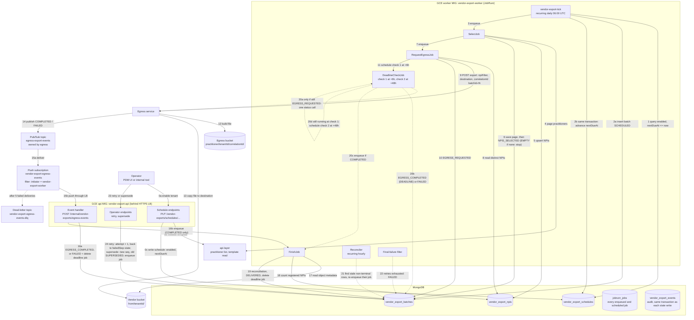

# Design: Vendor export — scheduled selection, file build through the egress service, event-driven completion, and the export registry

**Confluence:** [CP-39602 - Design: Directory accuracy vendor export](https://certifyos.atlassian.net/wiki/spaces/Engineerin/pages/2252767300/CP-39602+-+Design+Directory+accuracy+vendor+export) · published 2026-09-24 without the lifecycle flowchart

## Purpose and scope

One question per tenant, on a schedule: **which practitioners do we send to the accuracy vendor this period, what did we send, and did the file land where the vendor reads it?**

**This module owns:**

- **The schedule** — one row per tenant and vendor: enabled, cadence, timezone, selection filter, egress template, next due time. Created and changed only through this service's endpoints.
- **Selection** — run the tenant's filter through api-layer; get the list of NPIs for this period.
- **Export registry** — one batch row per tenant, vendor, and period; one row per NPI sent. Ids only, never field values.
- **File build by delegation** — ask the egress service (the platform's template-driven export engine, repository `core-dal-egress-practitioner-async`) to build the file, one row per practitioner × practice location, and place it in the vendor's folder.
- **Completion** — learn that egress finished through a completion event; one bounded deadline check as the only fallback.
- **Failure handling** — retries without a second batch id; a placed file is never rewritten; every wait has an end.
- **Audit** — one event per lifecycle step, same transaction as the state change, kept 7 years.

**Markers used in this doc:** **Needs egress change** or **Needs api-layer change** means the existing service does not do this today and must be extended; the full list with reasons is in *Rollout*. **Egress supports this today** means it exists and we only use it. Everything in this service is new and carries no marker.

## Section triage

| Section | Included | Reason |
| --- | --- | --- |
| Approach | Yes | Lifecycle flowchart, then the steps |
| Alternatives considered | Yes | Tenant configuration as the home for the schedule, and Cloud Run in two variants, each with what it does well, what it costs, and why it lost |
| Components and files touched | **No** | Pre-implementation design doc — no file lists yet |
| Contracts and interfaces | Yes | Schedule endpoints, tick, job payloads, egress request, completion event, operator endpoints, file contract, configuration |
| Data model and migration | Yes | The collections this service creates, and JobRunr's own |
| Security, privacy, and access | Yes | Provider PII in flight, one service identity per instance group, authenticated callers |
| Performance and scale | Yes | Volumes, budgets, the always-on instance cost, the 1M-row scenario |
| Observability | Yes | Scheduled and event-driven work with a silent-failure mode (an event that never arrives) |
| Audit trail | Yes | **Added section** — the export batch is the anchor every later event correlates to |
| Failure modes and rollback | Yes | Egress failures, missed events, stuck rows, re-runs, kill switch |
| Test strategy | **No** | Design phase; decisive cases are in Failure modes |
| Rollout | Yes | Egress asks and api-layer asks, each with what exists today and why we need it |

## Approach

The service runs on two GCE managed instance groups built from one image, the same shape as the file-ingestion service: `vendor-export-api` serves the schedule, read, and event endpoints behind an HTTPS load balancer, and `vendor-export-worker` runs the JobRunr job server with no inbound traffic. When the ingestion phase is added, its review API joins the api group and its jobs join the worker group.



**0. Enabling a tenant — one operator call creates the schedule.**

- **What:**
  - An operator (a CertifyOS user with the `vendor-export:manage` permission, through the PDM UI or an internal tool) calls `PUT /vendor-exports/schedules/{tenantId}/{vendor}` with cadence, timezone, and selection filter.
  - The service verifies the platform token and the permission, confirms the tenant exists (internal check, no api-layer call), and checks the selection criteria against our schema (known fields, known operators, correctly typed values).
  - **It then provisions the tenant's vendor template.** The vendor's mappings CSV — the column definitions for the contract file — is authored once by this team, reviewed like code, and versioned in this module's repository. Enabling a tenant submits it through api-layer's existing template-upload flow (`POST /egress-templates`, the same flow the ProviderHub UI uses), which validates every mapping against the field catalog, writes the CSV to `gs://<bucket>/egress-templates/<tenantId>/<templateId>/v1/mappings.csv`, and creates the tenant's `EgressTemplate` row in DAL. The returned `templateId` is stored on the schedule. If the tenant already has a template for this vendor, the call verifies it instead of creating one.
  - Re-running provisioning rolls out a new master revision: api-layer writes `v2/mappings.csv` and bumps the row's `version`; earlier CSV revisions are never overwritten (`EgressTemplateService.java:992-997`), which is what per-batch pinning (step 3) relies on.
  - Before enabling, the operator can call preview to see how many practitioners the criteria match today. A wrong value in a criterion shows up here as zero or an unexpected count.
  - It writes one row into `vendor_export_schedules` with `enabled = true` and `nextDueAt` computed from the cadence in the tenant's timezone. Audited with the operator's identity.
  - The same endpoint changes a schedule later: send the full desired schedule with the `version` last read. Cadence or timezone changes recompute `nextDueAt`; filter or template changes do not.
  - "Is vendor export on for this tenant" is answered by `GET /vendor-exports/schedules`. Nothing is written to the platform's tenant configuration store. The alternative, and what that store would need before it could hold the schedule, is in *Alternatives considered*.

- **Why this module provisions the template, not operators:**
  - Every participating tenant needs its own template row (egress scopes templates and their GCS paths by tenant), but every tenant's template must express the same vendor contract. Hand-creating twenty copies in the UI is twenty chances to drift; machine-creating them from one reviewed file in git is none.
  - Egress cannot own this consistency: it is a generic export engine and has no way to know that these particular templates are meant to be identical. Only this module knows the vendor contract, so provisioning and keeping the copies consistent is this module's job.
  - An operational rule follows: a vendor template with non-terminal batches must not be deleted — an open batch's pinned CSV revision (step 3) must stay readable.

- **Payloads:** *Contracts → lifecycle step 0*.

**1. Daily tick — turn due schedules into batches.**

- **What:**
  - A JobRunr recurring job, `vendor-export-tick`, registered in code at startup with cron `0 6 * * *`, runs the tick every day at 06:00 UTC. Registration is idempotent by id: the first boot creates the row, every later boot updates it. No endpoint and no manual step.
  - The tick runs one indexed query on `vendor_export_schedules`: rows with `enabled = true` and `nextDueAt <= now`. The tick calls no other service.
  - For each due row, in one transaction, it inserts a row into `vendor_export_batches` (state `SCHEDULED`, id `<tenantId>-<vendor>-<yyyy-MM>-<seq>`) and advances the schedule's `nextDueAt` to the next occurrence.
  - `seq` starts at `001`. A later re-export of the same period, done through supersede (step 8), gets `002`, so two files for one period never share an id. The tick itself never creates a second batch for a period.
  - The batch insert is unique on tenant, vendor, period, and sequence: `001` and `002` can exist side by side, and a second `001` is refused.
  - For each inserted batch it enqueues one JobRunr job, `SelectJob(exportBatchId)`, and returns. Nothing else happens in the tick.
  - An operator can also run the tick on demand: `POST /vendor-exports/tick` (permission-gated) calls the same method, as does the JobRunr dashboard's trigger button.

- **A known limitation, and why it is harmless here:**
  - JobRunr's open-source edition does not run a recurring job that was missed while no job server was alive: "recurring jobs that were missed during downtime will not be scheduled again in JobRunr OSS once your BackgroundJobServer is up again" (JobRunr recurring-jobs documentation).
  - A deploy or outage spanning 06:00 UTC therefore skips that day's tick.
  - Every schedule that was due stays due (`nextDueAt` is still in the past), so tomorrow's tick creates every missed batch. A missed tick day costs one day of delay, never a period.

- **Why persist `nextDueAt` and query by it:** the standard way to find due work is to store the next run time and query it with an index. One query, the same cost for ten tenants or ten thousand, and no dependency on another service to discover work.

- **Why one daily tick and not one recurring job per tenant:** one job serves every tenant and cadence; a tenant's cadence is a row in our database, not a code change.

- **Why `nextDueAt <= now` and not `== today`:** if the tick is skipped or fails on the cadence day, tomorrow's tick still finds the row due.

- **What if it fails:**
  - The tick throws mid-way: JobRunr retries it with backoff; rows already advanced are not due any more, so the retry processes only the rest.
  - No worker VM alive at 06:00: the run is skipped (see the limitation above); tomorrow's tick catches up; alert E1 if no tick completes in 26 hours.
  - The job server thread dies inside a live worker VM: alert E10 at 5 minutes; the instance group's health check replaces the VM.

- **Payloads:** *Contracts → lifecycle step 1*.

**2. Select job — get the NPIs from api-layer and record them.**

- **What:**
  - JobRunr starts `SelectJob` within seconds. It loads the batch row and checks the state is `SCHEDULED`.
  - It reads the selection criteria copied onto the batch and calls api-layer's practitioner list endpoint with them, page by page, tenant header set. api-layer applies the criteria; we only carry them.
  - After each page it upserts one row per practitioner into `vendor_export_npis` with `_id = <exportBatchId>|<npi>`. The same NPI on a retried page hits the same id and is a no-op, so duplicates are impossible by construction.
  - After each page it also saves the page number on the batch row (`vendor_export_batches.selection.page`), so a retry resumes from the next page.
  - After the last page it moves the batch to state `NPIS_SELECTED` with the counts and enqueues `RequestEgressJob`.
  - Zero practitioners: the batch becomes `EMPTY`, an alert fires, nothing else runs.

- **Why record NPIs before the file exists:** the id set is fixed the moment we select; the ingestion module later needs "what did we send" to exist before the vendor can answer. Ids only — the file is the record of values.

- **Why save the page number on the batch row:** a retry continues from the last saved page instead of starting over. A large tenant is many pages, and a restart must never re-fetch or double-register. The batch row is the one place every retry reads first, so the page number lives there.

- **Why this runs as a JobRunr job and not inside the tick:** this job talks to one external service, api-layer, over many calls. Anything that talks to an external service needs retry with backoff, resumption after a crash, and a visible failure record. JobRunr provides all of that; we do not build it.

- **What if it fails:**
  - api-layer unavailable: the job throws; JobRunr retries with exponential backoff; the retry resumes from the saved page.
  - The instance dies mid-page: JobRunr sees the missing heartbeat, re-enqueues the job, it resumes from the saved page.
  - Retries exhausted: the final-failure filter (step 7) marks the batch `FAILED` with `failedStep = SELECT` and alerts.

- **Payloads:** *Contracts → lifecycle step 2*.

**3. Request-egress job — ask egress to build and place the file, then set one deadline.**

- **What:**
  - Load the batch row from `vendor_export_batches` and check that its state is `NPIS_SELECTED`.
  - **On a retry only (`attempt > 1`): cancel the previous attempt first.** The batch row still holds the prior `egress.correlationId`; call egress's existing cancel endpoint (`POST /api/v1/egress/jobs/practitioner/{tenantId}/{correlationId}/cancel`, CP-35570 — **egress supports this today**) with it, and write the audit event `EXPORT_PRIOR_ATTEMPT_CANCELLED` or `EXPORT_PRIOR_ATTEMPT_CANCEL_REJECTED` with the old id.
    - `202`: egress marked the job `CANCELLED`; a still-running pipeline tears itself down at its next checkpoint. Proceed.
    - `409`: the prior attempt already reached a terminal state. If it reached `COMPLETED`, its file may already sit at the destination or land shortly — check the destination object. A complete object is the answer we wanted: move the batch to `EGRESS_COMPLETED`, enqueue `FinishJob`, and stop; no second export. Otherwise proceed.
  - **Pin the template — once per batch, before anything is sent.** If the batch row does not yet carry a pin, read the tenant's template row once (`GET /egress-templates/{templateId}`) and write onto the batch row: `templateVersion`, `mappingsCsvUrl` (version-specific, e.g. `…/v3/mappings.csv`), `separator`, `outputFormat`, `rowExpansionKeys`. The pin is written before the export call, so a crash between the two leaves a rerun that reads the saved pin instead of re-resolving the row. A retry finds the pin already present and never touches the template row again; if the live row's version has moved since, log it — the pin makes the drift harmless, and the new version applies from the next batch.
  - Read the distinct NPIs for this batch from `vendor_export_npis`.
  - Call the egress export endpoint (`POST /api/v1/egress/export`) with the tenant id, the NPIs as `npiFilter`, the tenant's `egressTemplateId`, **the pinned `mappingsCsvUrl`, `separator`, `outputFormat`, and `rowExpansionKeys`** (all existing request fields — **egress supports this today**), and a `correlationId` of `<exportBatchId>-r<attempt>`, for example `org-xyz-candor-2026-10-001-r1`.
  - **Needs egress change:** egress accepts at most 100 NPIs in `npiFilter` today. It must accept the whole list for one tenant.
  - If egress answers `202`, store the job reference it returns and move the batch to `EGRESS_REQUESTED`, in one write. If egress answers `409`, it already has a job for this correlation id; take that job's reference and do the same write.
  - Schedule one future job, `DeadlineCheckJob`, to run `egressDeadlineHours` (default 6) from now. This is the safety net for step 4: if the completion event never arrives, this job is the only thing that will notice. Until then nothing else runs for this batch.
  - Egress does the rest on its own: one Spanner row per practitioner, one file row per practice location (`rowExpansionKeys: ["locations"]`), columns from the template's mappings CSV. It writes the file to its own bucket as `gs://<egress bucket>/practitioner/<tenantId>/<correlationId>/export.csv`. **Egress supports this today.**
  - **Needs egress change:** the request also carries a `destination` (bucket and object name). When the export completes, egress copies the file there **create-only** (`ifGenerationMatch: 0`), with the object metadata including the `correlationId`, and writes nothing else beside it. A `412 Precondition Failed` on the copy is a no-op success — a file is already in place. The copy is skipped when the job's status is `CANCELLED`.
  - Today egress copies a finished file only to a connector found in tenant configuration, names it `<entity>_<YYYYMMDD>.csv` itself, and always writes a `.manifest.json` next to it.

- **Why the attempt suffix on `correlationId`:**
  - Egress treats a repeated correlation id as the same job and answers `409` (`core-dal-egress-practitioner-async/src/main/java/com/certifyos/dal/egress/practitioner/resource/EgressExportResource.java:383-384`).
  - When an egress job fails and we retry, egress needs a new id, but the vendor must keep seeing the same batch id. The suffix gives egress a new id without changing ours.

- **Why cancel first, and why cancel alone is not enough:**
  - Marking our batch `FAILED` does nothing to the job egress is still running. The two `FAILED` causes an operator retries from (`EGRESS_DID_NOT_FINISH`, `FILE_NOT_FOUND`) are exactly the ones where the old attempt may still be alive, so without a cancel two egress jobs can hold a write claim on one destination object, and the older one can land late and silently replace the newer file.
  - The cancel is cooperative: it sets the job `CANCELLED` atomically in egress's metadata, and running pipelines poll that flag at checkpoints (`SeedPipeline.java`, `DataflowJobLauncherService.java`). A pipeline past its last checkpoint still finishes and still writes its file. The cancel closes the window almost entirely; the create-only precondition on the destination copy is the atomic guard that closes it completely — first writer wins, the late writer's `412` is harmless, and the vendor never sees two files or a changed file.
  - Whichever attempt's file wins is valid: the NPI set was fixed in `vendor_export_npis` at selection and both attempts use the same template, so the only difference is the read time of the data. `FinishJob` records which attempt produced the file from the `correlationId` in the object metadata.

- **Why pin the template per batch, and why this needs nothing from egress:**
  - The template row is mutable — it always points at the latest definition — but everything downstream of it is already immutable: api-layer writes every template edit to a new `v<N>/mappings.csv` and never overwrites an old revision, and egress copies the request's `mappingsCsvUrl`, `separator`, `outputFormat`, and `rowExpansionKeys` into its own job metadata at request time (`ExportOrchestrationService.java:459-465`) and builds the file from that stored copy, never re-reading the template row mid-run (`TemplateMappingExportPipeline.java:524`). `templateId` itself does not select the columns; the URL does — egress uses the id only for display and file metadata.
  - The one unpinned hop was between our attempts: without the pin, each attempt re-resolves the row, so an edit between attempt 1 and a retry silently changes what the same batch id produces. Pinning resolves the row once per batch and hands every attempt the same answer — the same reasoning that freezes the NPI set in `vendor_export_npis` at selection, applied to the file definition.
  - This is also what makes the comment-1 guarantee true: "either attempt's file is valid" holds because both attempts export the same NPI set with the same pinned definition.

- **Why one deadline and not polling:** a poll has no natural end. A deadline is set once and exists only to answer "did the event fail to arrive". The normal path never touches it.

- **What if it fails:**
  - Egress answers `5xx` or `429`: the job throws and JobRunr retries it. The retry usually gets `409`, because egress accepted the first call, and completes normally.
  - The cancel call fails with `5xx`: the job throws and JobRunr retries it. The retry's cancel finds the job already `CANCELLED` and gets `409`, which is the terminal answer, and the job proceeds. Cancelling is safe to repeat.
  - Our instance dies after egress accepted but before we wrote the batch row: JobRunr re-runs the job, it gets `409`, and it completes the write. The state and the correlation id are written together, so the row is never half-updated.
  - The template read for the pin fails: the job throws and JobRunr retries it. Once the pin is written it is never read again from DAL, so this failure mode exists only on a batch's first attempt.
  - The pinned mappings CSV is gone at export time (the template was deleted despite the rule in step 0): the egress job fails to load its columns and reports `FAILED`; the batch fails with egress's error, and the operator re-provisions the template and supersedes the batch.
  - Egress answers `404` (the tenant has no practitioners in egress): the batch moves to `FAILED` with the egress error and an alert fires.

- **Payloads:** *Contracts → lifecycle step 3*.

**4. Completion event — egress tells us the file is ready.**

- **What:**
  - **Needs egress change:** when an export reaches `COMPLETED` or `FAILED`, egress publishes one Pub/Sub message to a topic it owns. Today egress has no event, webhook, or callback of any kind.
  - Our push subscription on that topic delivers the message to the event endpoint on the api group (`POST /internal/vendor-exports/egress-events`), through the load balancer. The handler verifies Pub/Sub's identity token (issuer and audience) before it reads the message, the same check the file-ingestion receiver performs.
  - The handler looks up the batch in `vendor_export_batches` by the correlation id in the message, and checks that the tenant in the message matches the tenant on the batch.
  - If no batch is found, or the batch's state is already past `EGRESS_REQUESTED`, the handler answers `200` and logs the message. It is either a duplicate delivery or not ours, and answering `200` stops Pub/Sub from sending it again.
  - If the batch's state is `EGRESS_REQUESTED` and the phase is `COMPLETED`, the handler moves the batch to `EGRESS_COMPLETED` in one write, recording the output path, the counts, and `completionSource = EVENT`. The audit events `EXPORT_EVENT_RECEIVED` and `EXPORT_EGRESS_COMPLETED` are written in the same transaction. Then it enqueues `FinishJob` and answers `200`.
  - If the batch's state is `EGRESS_REQUESTED` and the phase is `FAILED`, the handler moves the batch to `FAILED` in one write, with `failedStep = EGRESS`, `cause = EGRESS_FAILED`, and egress's failure message as `lastError`. The audit events `EXPORT_EVENT_RECEIVED` and `EXPORT_BATCH_FAILED` are written in the same transaction.
  - It then deletes the pending deadline job, fires alert E4, and answers `200`. Nothing else runs for this batch until an operator retries (step 8).
  - The handler does nothing heavy itself. All work happens in the job it enqueued.

- **Why the batch moves to `EGRESS_COMPLETED` here and not only when delivery finishes:**
  - Hearing that egress is done and confirming the file are two moments, sometimes hours apart. `EGRESS_COMPLETED` is the note for the gap: "egress is done, our turn, delivery not confirmed yet".
  - With that note in place, the deadline check sees the state has moved on and exits without calling egress, and a crash between this write and the enqueue leaves a row the hourly reconciler recognises and re-enqueues.

- **What if it fails:**
  - The handler throws before it writes the state: it answers `500`, Pub/Sub redelivers later, and the state check makes the redelivery safe.
  - The handler writes `EGRESS_COMPLETED` but crashes before it enqueues `FinishJob`: the row sits in `EGRESS_COMPLETED` with no job, and the hourly reconciler (step 7) enqueues `FinishJob` within the hour.
  - Five deliveries in a row fail: Pub/Sub moves the message to our dead-letter topic (a holding topic for messages that could not be processed) and alert E5 fires.
  - Egress never publishes at all: the deadline check in step 5 catches it.

- **Payloads:** *Contracts → lifecycle step 4*.

**5. Deadline check — the fallback if the event never comes. Runs at most twice.**

- **What:**
  - `egressDeadlineHours` after the egress request (default 6), `DeadlineCheckJob` runs. It loads the batch row from `vendor_export_batches`.
  - If the state is already past `EGRESS_REQUESTED`, the event arrived and the job exits. This is the normal outcome.
  - If the state is still `EGRESS_REQUESTED`, the job makes one call to the egress status endpoint.
  - If egress reports `COMPLETED` with `gcs_complete = true`, the job moves the batch to `EGRESS_COMPLETED` with `completionSource = DEADLINE`, writes `EXPORT_EGRESS_COMPLETED` and `EXPORT_EVENT_MISSED` in the same transaction so we know the event path failed for this batch, and enqueues `FinishJob`.
  - If egress reports `FAILED`, the job moves the batch to `FAILED` the same way the event handler does (`failedStep = EGRESS`, `cause = EGRESS_FAILED`, egress's message as `lastError`), writes `EXPORT_BATCH_FAILED` and `EXPORT_EVENT_MISSED` in the same transaction, and fires alert E4.
  - If egress reports the job is still running, the job writes `EXPORT_EGRESS_STALE`, fires alert E3, and schedules a second `DeadlineCheckJob` for `egressAbandonHours` (default 48) after the request.
  - If the second check also finds egress still running, the job first requests cancellation of the stored `egress.correlationId` (best effort — a `409` means the job just reached a terminal state, and the next event or retry handles it), then moves the batch to `FAILED` with cause `EGRESS_DID_NOT_FINISH`. Cancelling here stops an abandoned pipeline from running on, and makes the retry's own cancel a cheap `409`. From here an operator decides.

- **Why a fallback at all:** if egress crashes before it publishes, the event is lost for good. Every batch must still reach a terminal state within a known time, with a human at the end of the unknown case.

- **What if it fails:**
  - The status call fails: JobRunr retries the job with backoff, so the check simply runs a few minutes late.
  - Egress is unreachable for hours: the retries run out and the final-failure filter (step 7) marks the batch `FAILED` and alerts.

- **Payloads:** *Contracts → lifecycle step 5*.

**6. Finish job — confirm the file, reconcile the counts, mark the batch delivered.**

- **What:**
  - Load the batch row from `vendor_export_batches` and check that its state is `EGRESS_COMPLETED`. That is the state the event handler or the deadline check set when it learned egress was done; the finish job finds it on its first run and on every retry.
  - Read the object at `gs://<vendorBucket>/from/<tenantId>/<tenantId>_<exportBatchId>_<yyyyMMdd>.csv`, the `destination` this batch sent to egress in step 3 and stored on the batch row. If the object is missing, move the batch to `FAILED` with cause `FILE_NOT_FOUND`.
  - Read the metadata egress set on the object: `complete=true`, `totalRecords` (the number of practitioners), `totalRows` (the number of file rows), and `correlationId` (the attempt that produced the file). Record the producing attempt on the batch row as `egress.fileProducedBy`.
  - Compare `totalRecords` with the number of rows in `vendor_export_npis` for this batch. Write the result to the batch row as `reconciliation.registered`, `reconciliation.inFile`, and `reconciliation.match`. The NPI rows themselves are not touched.
  - If the two counts differ, `match` is `false`, alert E6 fires, and an operator compares the file with the registry.
  - Move the batch to `DELIVERED` with the file facts and counts, delete the pending deadline job, and write `EXPORT_BATCH_DELIVERED`.

- **What reconciliation writes:** one object on the batch row. NPI rows stay as `SelectJob` wrote them.

```json
{ "reconciliation": { "registered": 1240, "inFile": 1240, "match": true, "reconciledAt": "2026-10-01T07:12:09Z" } }
```

- **Why reconcile by count and not per NPI:**
  - Egress reports counts only (`totalRecords` and `totalRows` in the object metadata, `TemplateMappingExportPipeline.java:627-633`). It never tells us which of our NPIs it resolved, and this module does not read the CSV.
  - A per-NPI status would only copy the batch-level result onto every row, so NPI rows carry none.
  - A mismatch is counted, audited, and alerted, never guessed at.

- **What a count match does not prove:**
  - Egress selects practitioner records by `JSON_VALUE(c.data, '$.npi') IN UNNEST(@npiFilter)` (`EgressTableService.java:476`) and counts records, not distinct NPIs.
  - One NPI that matches two practitioner records plus another NPI that matches none still gives equal counts. A match means the counts agree, not that the sets are identical.
  - The rare duplicate case is found only when an operator compares the file against the registry.

- **Why never overwrite a placed file:** the vendor may already have downloaded it. Two different files under one name and one batch id make the vendor's echo ambiguous. A re-run after delivery is a new sequence number (step 8).
  - This is enforced at write time, not by convention: the destination copy is create-only (`ifGenerationMatch: 0`, step 3), so a late copy from a cancelled earlier attempt gets `412` and changes nothing.
  - The object metadata carries the `correlationId` of the attempt that produced the file. `FinishJob` records it on the batch row as `egress.fileProducedBy`; a file from an earlier attempt is equally valid, because every attempt exports the same registered NPI set with the same template.

- **What if it fails:**
  - The object is missing at the expected path: the batch moves to `FAILED` with cause `FILE_NOT_FOUND` and `failedStep = EGRESS`, an alert fires, and an operator retries, which asks egress again under attempt `r2`.
  - The metadata read fails: JobRunr retries the job. The object is never modified, so a retry is always safe.

- **Payloads:** *Contracts → lifecycle step 6*.

**7. Safety nets — two small things JobRunr cannot see.**

JobRunr retries a job that throws, re-runs a job whose instance died, and keeps a scheduled job across a redeploy. Two gaps remain, and each is closed by one small piece.

- **Final-failure filter.**
  - When a job has used up all its retries, JobRunr marks it failed in its own collection and stops. Our batch row would still say `SCHEDULED` or `NPIS_SELECTED`, and nobody would know.
  - A JobRunr hook runs at that moment. It moves the batch to `FAILED`, records the step name and the exception, writes `EXPORT_BATCH_FAILED`, and fires alert E4.
- **Hourly reconciler.**
  - Writing a batch row and enqueueing its job are two separate writes. A crash exactly between them leaves a row that no job will ever pick up.
  - A JobRunr recurring job runs every hour. It finds batches in a non-terminal state that have not been updated for longer than `reconcilerStaleMinutes` (default 30), enqueues the job for that state, and fires alert E2.
  - Because every job checks the row state first, enqueueing a job that is already running does nothing.

- **What if it fails:** the reconciler is itself a JobRunr job with retries. If the whole process is down, alert E1 from the missing tick is the signal.

**8. Retry and supersede — operator actions.**

- **Retry** (`POST /vendor-exports/{id}/retry`), for a batch in `FAILED`:
  - Keeps the batch id, adds one to `attempt`, puts the batch back in the state it failed from, and enqueues that state's job.
  - A selection that already succeeded is not redone for an egress failure. The vendor never sees a different batch id.
  - The endpoint itself only flips state and enqueues. Cancelling the previous attempt and the destination preflight live inside `RequestEgressJob` (step 3), so they get JobRunr's retry and backoff if egress is unreachable at retry time — which is likely, given the batch just failed there.
- **Supersede** (`POST /vendor-exports/{id}/supersede`), for a batch in `DELIVERED` whose file turned out to be wrong:
  - Creates a new batch for the same period with `seq + 1` and enqueues its `SelectJob`. The new batch runs the full lifecycle from step 2.
  - Moves the old batch to `SUPERSEDED`. Its file is left in the vendor folder, because the vendor may already have read it.
- **Acknowledge:** the ingestion module, when it exists, sets `acknowledgedAt` on the batch when the vendor's response echoes this batch id. This module only defines the field.

- **Payloads:** *Contracts → lifecycle step 8*.

**Why four jobs and not one — and why JobRunr at all:**

- **The number of jobs is not the design; the boundaries are.** A job boundary is a retry boundary, a resume point after a crash, and a place an operator can restart from. A boundary sits wherever the next step talks to a different external system or waits on an external event.
- **Four job types, two recurring jobs (the tick and the reconciler).** Each of the four talks to exactly one external system and has one kind of failure:

| Job | Talks to | Why it is its own job |
| --- | --- | --- |
| `SelectJob` | api-layer | Many paged reads; api-layer failures; retry resumes from the saved page number |
| `RequestEgressJob` | egress export endpoint | One outbound call, exactly once per attempt; egress failures; retry is "call again, accept 409" |
| `DeadlineCheckJob` | egress status endpoint | Runs hours later; a timer with a check attached; nothing else is alive at that moment |
| `FinishJob` | GCS and our registry | Triggered by an external event whose timing we do not control; the earlier jobs finished hours before |

- **Why select and request-egress are not one job,** although they run back to back:
  - Retry scope would be wrong: egress returns `503` after a long selection, and the merged job re-runs selection from page one unless we hand-write a "skip to egress" branch — a job boundary written as an if-statement.
  - Retry policies could not differ: api-layer hiccups deserve quick retries; egress down for an hour deserves fewer, slower ones.
  - The operator entry point blurs: today `failedStep = EGRESS` re-enqueues only the egress request.
  - The state-to-job mapping breaks: each batch state has exactly one job, which is what makes the reconciler trivial.
  - What merging saves: one job document and one enqueue call per batch. Nothing else.
- **Why rely on JobRunr for this:**
  - Every job talks to an external system, so every job needs retry with backoff, resumption after a crash, and a failure record. The alternative is not "no jobs"; it is the same jobs with that machinery written by us.
  - The reliance is narrow: payloads are a batch id, jobs are plain methods, the batch row holds all state. The same four methods could run from Cloud Tasks or a sweep with no change to the state machine.
  - The dashboard (every job, attempt, and exception per batch id) is free.

**What the approach deliberately does NOT do:**

- It does not poll. The only status calls egress ever gets from us are the one or two deadline checks, and only when the event did not arrive.
- It does not read a point-in-time snapshot. Egress reads each practitioner at process time; rows in one file come from instants minutes apart. No read-timestamp bound exists in the platform, and monthly cadence tolerates this.
- It does not filter locations inside egress. Egress exports every practice location of every NPI it receives.
- It does not copy or archive the file. Egress writes it once, to the vendor folder. The vendor bucket's retention is the platform team's.
- It does not read the CSV. Reconciliation is by count from object metadata.
- It does not exclude individual NPIs from selection. NPIs skipped by a reviewer in the vendor-review flow (phase 2) are not filtered out: whether a skipped NPI should sit out later cadences is an open product decision, with reviewer-workload and per-NPI vendor-cost consequences. When it is taken, the hook is a module-owned exclusion list consulted by `SelectJob` after the criteria match — a practitioner-record flag was considered and set aside, since "do not send to this vendor" is a fact about the export relationship, not master data. Neither api-layer nor egress changes either way.

### Decisions

| ID | Decision | Instead of |
| --- | --- | --- |
| D1 | Two GCE managed instance groups from one image, the same shape as the file-ingestion service: `vendor-export-api` (schedule, read, and event endpoints, behind an HTTPS load balancer) and `vendor-export-worker` (JobRunr server, no inbound traffic) | Cloud Run services; a single always-on instance |
| D2 | The daily tick is a JobRunr recurring job registered in code; a skipped tick day is harmless because due schedules stay due | Cloud Scheduler calling a tick endpoint; one recurring job per tenant |
| D3 | JobRunr owns execution — retries, backoff, delayed jobs, orphan recovery, dashboard — in our MongoDB, running on the worker group; every job talks to one external system, which is where that machinery pays | Cloud Tasks; a hand-written state machine driven by a 5-minute sweep |
| D4 | The batch row is the truth; every job checks the row state first and exits as a no-op on mismatch | Trusting the job queue as the source of state |
| D5 | Selection runs through api-layer's list endpoint only; the criteria are stored on the schedule and copied onto each batch | Direct DAL reads; stored SQL; a saved view |
| D6 | File build and placement are delegated to egress: the export endpoint builds the file, and a `destination` on the request tells egress where to copy it | A file builder here; a copy step here; the connector-based delivery egress ships today, which fixes the filename and the manifest in egress and reads the target from tenant configuration, so every consumer inherits one consumer's conventions |
| D7 | Completion is event-driven: egress-owned topic, our push subscription delivering to the api group, with filter and dead-letter topic | Status polling; a consumer-owned topic; a pull subscription on the worker |
| D8 | One deadline check at 6 hours, a second at 48 hours, then `FAILED` with a human decision | An open-ended poll loop; no fallback |
| D9 | The registry stores ids and batch facts only; one document per NPI per batch; reconciliation by count | A pre-export value snapshot; NPIs as an array on the batch document; per-NPI reconciliation from the CSV |
| D10 | Batch id `<tenantId>-<vendor>-<yyyy-MM>-<seq>`, deterministic per period; egress `correlationId` = batch id + attempt suffix | A random id per run; one id for both purposes |
| D11 | A placed file is never rewritten: the destination copy is create-only (`ifGenerationMatch: 0`), the first attempt to finish wins, a retry cancels its predecessor first, and a re-run after delivery is a new sequence number | Overwriting under the same name; cancel alone (cooperative, so a pipeline past its last checkpoint still writes) |
| D12 | Seven asks to the egress team, phrased as needs with reasons (*Rollout*) | Post-processing the file here |
| D13 | A JobRunr final-failure filter plus an hourly reconciler close the write-then-enqueue gap and the retries-exhausted gap | Relying on JobRunr alone; a 5-minute sweep |
| D14 | The vendor mappings CSV is authored once in this repo and provisioned per tenant by the enable call; each batch pins the template's version-specific `mappingsCsvUrl`, `separator`, `outputFormat`, and `rowExpansionKeys` on the batch row at first request and sends the pin on every attempt | Hand-created templates per tenant; re-resolving the template row on each attempt; asking egress for immutable template revisions (a cross-team feature whose only saving here would be the pin fields we store anyway) |
| D14 | Schedule definition, enablement, and runtime state (`nextDueAt`, run history) are one row in our database, written only through our endpoints; the tick is one indexed query and calls no other service | Everything in tenant configuration, found each day by scanning the discovery endpoint, the way auto-recredentialing works today. Rejected in *Alternatives considered* |

## Alternatives considered

Each alternative: what it is, what it does well, what it costs in practice, and why it lost. Claims about existing behaviour cite the code.

### Keep the schedule and the enablement in tenant configuration

The platform habit is that "is this feature on for this tenant" lives in tenant configuration. This alternative follows that habit all the way: the cadence, the timezone, the selection filter, the template id, and the on/off flag all sit in one `directory-accuracy-config` entry per tenant. This service keeps no schedule of its own.

- **How it would work:**
  - We register the configuration type once in DAL with a JSON schema. DAL then checks every entry against that schema when it is created or updated (`TenantConfigurationService.java:143, 232`).
  - Every morning the tick needs to know which tenants are due. Tenant configuration cannot answer that. It has no way to search on a field inside an entry.
  - The only cross-tenant read is DAL's discovery endpoint (`ConfigurationDiscoveryResource.java`). You give it a configuration type id, and it returns every tenant that has that type, 500 per page, with the full configuration JSON for each.
  - So the tick would fetch every page, open every entry, and work out in our own code which tenants are switched on and due today.
  - Auto-recredentialing does exactly this today. It pages the same endpoint with its own type id and checks each returned entry with `isAutoRecredEnabled(config)` in a loop (`AutoRecredService.java:185-235`).
- **What is good about it:**
  - It follows the convention. Support and the PDM UI find the settings next to the tenant's other settings, with the tools they already use.
  - We build no schedule collection and no schedule endpoints. The JSON schema on the type still checks the selection filter.
  - The endpoint and the pattern already exist, so DAL needs nothing new for the read.
- **What it costs:**
  - The daily read is a scan, not a query. With 500 enrolled tenants the tick downloads 500 configuration blobs every day to find the few that are due. The filtering happens in our code, after the download, every day, even when nothing is due.
  - Every blob is parsed and judged in code for "on" and "due". A bug in that loop means a tenant is skipped, and nothing in the store shows it. A slow DAL page at 06:00 delays every tenant behind it.
  - There is nowhere to keep run state. The next due time, the last run, and the reason a tenant was paused either do not exist, or a background job writes them into the same entry that operators edit.
  - That entry is replaced whole on every update with no version check (`TenantConfigurationResource.java:440`), so the tick and an operator can overwrite each other without noticing.
  - Changes are found by polling. Tenant configuration sends no event when an entry changes, so a new cadence or filter is only seen at the next scan. The by-type read is also cached (`TenantConfigurationResource.java:80-95`), which can delay it further.
  - Operator changes go through the generic configuration endpoints, so our audit event with the field diff and the reason is never written. DAL records that a write happened, not why.
  - The discovery endpoint is a cross-tenant DAL read that api-layer calls through an internal client. We would either call DAL directly, as egress does for its connector configuration, and need DAL credentials and cross-tenant read rights, or ask api-layer for a new endpoint. Either way it is an ask.
- **Why we rejected it:**
  - A scheduler needs one cheap answer every day: which rows are due right now. Tenant configuration cannot give that answer. It can only hand back every tenant with the type and leave the deciding to a loop in our code. That loop costs the same whether one tenant or five hundred are enrolled.
  - Auto-recredentialing can live with this because it keeps nothing between runs. A schedule does. It has to remember when it next runs, whether it is paused, why, and what it last produced. A blob with no version check, no field search, and no change event is the wrong place for that.
  - Keeping the schedule in this service turns the daily question into one indexed query on our own collection, `enabled = true and nextDueAt <= now`. No network call, and no dependence on DAL being up at 06:00. That is the design in *Approach*.

### What tenant configuration would need for this to be the right home

Written down so the rejection reads as a gap in the store, not a matter of taste. If the platform builds these, this decision should be looked at again.

- **Searchable fields.** A way to ask "give me all tenants where `enabled` is true and `nextDueAt` is in the past" in one call, instead of getting every blob back and filtering it ourselves.
- **Change events.** A message when an entry is created, changed, or deleted, with the tenant id, the type, and the fields that changed. A service that keeps its own copy of some setting could then update on change instead of rescanning on a timer.
- **A version on each entry.** So two writers cannot silently overwrite each other. Today the update replaces the whole entry (`TenantConfigurationResource.java:440`).
- **Field-level audit with a reason.** Who changed which field, from what to what, and why, so an operator's pause reason lives next to the flag it explains.

With those four things, the schedule could live in tenant configuration and this service would just listen for changes. Without them, the service owns the schedule.

### Cloud Run with Cloud Scheduler and Cloud Tasks

Two distinct alternatives hide under "use Cloud Run", and they lose for different reasons, so they are separated.

**Variant 1 — the same design, hosted on Cloud Run.**

- **What it is:** two Cloud Run resources from one image. `api` is a Cloud Run service that serves requests and scales to zero.
  - `worker` hosts the JobRunr server either as a service with minimum one instance and CPU always allocated, or as a Cloud Run worker pool, the resource type built for non-request workloads with no endpoint and per-instance billing. Jobs, state machine, and completion event are unchanged.
- **What it does well:**
  - No load balancer, no IAP, no instance template, no VM lifecycle. Revisions and rollback are built in.
  - Pub/Sub push to a Cloud Run endpoint authenticates with IAM and an OIDC token out of the box; on GCE the same check is written into the handler, as file-ingestion does today.
  - `api` costs nothing while idle, and a worker pool is the honest fit for a job server: no port to listen on, CPU always on, instance count set by us.
- **What it costs in practice:**
  - The worker is billed per instance-second whether it is a service or a worker pool. At phase 2 sizing, 2 vCPU and 4 GiB always on is about $114 a month against about $49 for the e2-standard-2 it replaces.
  - The two instance groups with load balancer and external IPs total about $106 on demand, about $79 with a one-year commitment, and about $130 with Cloud NAT instead of external IPs.
  - If DAL or egress ever allowlist a static egress IP, Cloud Run also needs VPC egress and Cloud NAT, and the gap widens in GCE's favour by the same $32.
  - Cloud Run gives an instance 10 seconds after SIGTERM before it is killed, and it terminates the old worker instance on every revision rollout. A deploy during a ten-minute selection kills the job; JobRunr's orphan recovery re-runs it from the saved page after the heartbeat timeout.
  - Correct, but every deploy is a recovery. On the instance group the rolling update drains on a window we set, so the job finishes first.
  - The JobRunr dashboard still needs authenticated ingress somewhere, which removes part of the "no IAP" saving.
- **Why rejected:**
  - The workload has two halves and Cloud Run is good at only one of them. The api half is small, bursty, and request-shaped; that is where scale-to-zero and per-request billing pay, and it is a few thousand requests a month.
  - The worker half is always on, has no requests, and runs jobs of up to ten minutes; that is where Cloud Run's per-instance-second premium and its fixed 10-second shutdown cost the most. The ingestion phase grows the worker, not the api, so the premium grows with the roadmap.
  - The always-on worker is the expensive half on Cloud Run and the cheap half on a VM, by roughly 2.3 times for the same 2 vCPU and 4 GiB. The load balancer that makes GCE look dearer today is a fixed cost that the api group and the ingestion API will share; the Cloud Run premium is per vCPU and scales with every worker we add.
  - A worker pool removes the "wrong resource type" objection but not the billing or the shutdown behaviour, so it does not change the outcome.
  - Splitting the runtimes, Cloud Run for `api` and an instance group for `worker`, would put each half where it fits, at the price of two deployment models for one service. That is a real option and it is rejected for a plain reason: the api half is too small to be worth a second runtime.
  - Sharing one topology, Terraform module, and runbook with file-ingestion is a tiebreaker in GCE's favour, not the reason. Cost parity at phase 1 and the platform note to avoid Cloud Run are recorded, not relied on.

**Variant 2 — Cloud Scheduler and Cloud Tasks instead of JobRunr.**

- **What it is:** Cloud Scheduler calls a tick endpoint on `api` daily with an identity token. The tick creates one Cloud Task per batch; each step is a task that calls back into `api`; the deadline check is a task scheduled hours ahead. No worker, no job server.
- **What it does well:**
  - Cloud Scheduler fires whether or not our service was up at 06:00. JobRunr's open-source edition skips a recurring run missed during downtime. This is a real advantage, though `nextDueAt <= now` already makes a skipped day cost one day of delay and never a period.
  - Cloud Tasks gives retries with configurable backoff, task names that block duplicates for up to 24 hours after a task ran or was deleted, and tasks scheduled up to 30 days ahead, which covers the +6 hour and +48 hour checks.
  - Nothing to host for execution; the queue and the scheduler are managed.
- **What it costs in practice:**
  - Every step becomes an HTTP request into the request-serving service. Cloud Run allows up to 60 minutes per request, and the largest selection is about 700 api-layer calls in 5 to 10 minutes, so it fits, but `api` must now be sized for a ten-minute job and a deploy during that request can cut it off.
  - Resume-by-page is still needed; nothing is saved.
  - When a task uses up its retries, Cloud Tasks drops it with a log line. Nothing tells our batch row.
  - The hourly reconciler becomes the only way to learn a step gave up, so a final failure is noticed within an hour instead of at once, and the exception that caused it is in Cloud Logging rather than on the job.
  - JobRunr keeps the failed job with its stack trace until an operator clears it and runs the final-failure filter at that moment.
  - Cloud Tasks keeps no record of completed tasks. "What happened to batch X" is a log search across the tick, the select task, and the egress task. JobRunr keeps succeeded jobs for 36 hours and failed ones indefinitely, per batch id, in a dashboard.
  - Cloud Scheduler is not immune to the outage case either: a failed attempt is retried per its retry configuration and a run that overlaps a still-running one is skipped, so a long enough `api` outage loses the day's run exactly as JobRunr does. The mitigation is the same `nextDueAt <= now` query in both designs.
  - Two more managed resources, the queue and the scheduler job, each with an invoker service account and OIDC configuration in Terraform. Local development needs a substitute for the queue; JobRunr runs in-process against a local MongoDB.
- **Why rejected:** both variants can run this lifecycle. Variant 2 loses on where failure state lives.
  - JobRunr keeps every attempt, exception, and scheduled check in our own database next to the batch row; Cloud Tasks discards them, and the design would have to rebuild that record by hand to stay debuggable.
  - Cloud Scheduler's one real advantage over a JobRunr recurring job is already neutralised by the due-time query, so it does not buy enough to justify a second execution model. Cloud Scheduler and Cloud Tasks are free at this volume; cost plays no part in this rejection.

## Contracts and interfaces

**Where the endpoints live:** the `vendor-export-api` instance group, behind an external HTTPS load balancer. Everything under `/vendor-exports/…` is an operator endpoint and requires a platform JWT carrying `vendor-export:manage` (writes: schedules, tick, retry, supersede) or `vendor-export:read` (reads). The one path under `/internal/…` is the Pub/Sub event endpoint and accepts only a Pub/Sub identity token for the push service account. The worker group has no endpoints.

### The lifecycle, end to end

> Order: schedule (once) → tick → select job → egress request → completion event (or deadline check) → finish job → retry or supersede. Rationale per step: *Approach* (0→step 0, 1→step 1, 2→step 2, 3→step 3, 4→step 4, 5→step 5, 6→step 6, 8→step 8).

**Step 0 — Schedule endpoints (operator, once per tenant and vendor).**

| Call | Does | Audit |
| --- | --- | --- |
| `PUT /vendor-exports/schedules/{tenantId}/{vendor}` | Create or replace the schedule's settings. No `version` in the body: create only; `201`, or `409` if the schedule exists. With `version`: replace; must match the stored one or `409`; `200`. Create sets `enabled = true`; replace never changes `enabled`. Safe to retry: never duplicates or overwrites; a retry after a landed write gets `409` | `SCHEDULE_CREATED` or `SCHEDULE_UPDATED` (field diff) |
| `GET /vendor-exports/schedules?tenantId=…` · `GET …/{tenantId}/{vendor}` | Read schedules, including `enabled`, `disabledAt`, `disabledReason` | none |
| `POST …/{tenantId}/{vendor}/disable` | Body `{ "reason": "…" }`, mandatory. Sets `enabled = false`, `disabledAt`, `disabledReason`; the tick skips the row. Used both for a tenant leaving the program and for a temporary hold. Row and history stay. `409` if already disabled. `200` with the schedule | `SCHEDULE_DISABLED` |
| `POST …/{tenantId}/{vendor}/enable` | Body `{ "reason": "…", "catchUp": false }`; `reason` mandatory, `catchUp` optional. Sets `enabled = true` and clears `disabledAt`, `disabledReason`. `catchUp: true` sets `nextDueAt` to the most recent cadence occurrence between `disabledAt` and now, so the next tick runs that one period; if none, the next future occurrence. `false` sets the next future occurrence. `409` if already enabled. `200` with the schedule | `SCHEDULE_ENABLED` |
| `POST …/{tenantId}/{vendor}/run-now` | No body. Creates a batch for the current period now and, in the same transaction as the tick would, advances `nextDueAt` and sets `lastBatchId` and `lastRunAt`. The unique index refuses if the period already has a batch. How the pilot's first export is started. `201 { "exportBatchId", "jobId", "nextDueAt" }` | `SCHEDULE_RUN_NOW`, `EXPORT_BATCH_SCHEDULED` (`trigger = MANUAL`) |
| `POST …/{tenantId}/{vendor}/preview` | Body: the `selection` object to test, or empty to test the stored one. Runs it against api-layer with page size 1. `200 { "totalCount" }`. Used before enabling and after any criteria change | none |

`PUT` request:

```json
{
  "version": 2,
  "cadence": { "type": "monthly", "dayOfMonth": 1 },
  "timezone": "America/New_York",
  "selection": { "data.delegationStatus": { "in": ["Direct", "Delegated"] } }
}
```

- `version` — omit to create; the call is refused with `409` if the schedule already exists, so a second create never overwrites. On update, send the value last read; stale means `409`.
- `PUT` never changes `enabled`; a disabled schedule can be edited and stays disabled until `enable`.
- `cadence.type` — `monthly` with `dayOfMonth` 1–28, or `cron` with a cron expression. Days 29–31 are refused so every month has the day.
- `egressTemplateId` is not in the request: create provisions the tenant's vendor template from this module's master mappings CSV (through api-layer's `POST /egress-templates` upload flow) and stores the returned id on the schedule. If the tenant already has a template for this vendor, it is verified and reused. An optional `egressTemplateId` override is accepted for the pilot, verified to belong to the tenant.
- Validation order: token and permission → tenant exists (internal) → schema (fields, operators, value types; tenant id contains no underscore, because the filename uses underscores as separators) → template provisioned or verified (api-layer egress-template flow) → write. The schedule write is one write; if template provisioning succeeded but the schedule write fails, the template row is left in place and the retried call finds and reuses it.

`PUT` response `201` on create, `200` on replace:

```json
{ "tenantId": "org-xyz", "vendor": "candor", "enabled": true, "version": 3, "nextDueAt": "2026-11-01T05:00:00Z" }
```

**Changing a schedule** uses the same `PUT`. What each change does to `nextDueAt`:

| Change | `nextDueAt` |
| --- | --- |
| Cadence | Recomputed as the next occurrence of the new cadence from now, in the tenant's timezone |
| Timezone | Recomputed for the same cadence in the new zone |
| Filter, template id | Unchanged — they affect what the next run does, not when |
| Any change while a batch is in flight | The batch is untouched; it copied the selection at creation |
| Any change while disabled | Recomputed as usual; `enabled` stays `false`; `enable` with `catchUp` decides the missed period |

- A recomputed `nextDueAt` is never in the past. Changing day 15 to day 1 on the 10th means next month's day 1, not now. An operator who wants a run now calls run-now.

**Step 1 — The daily tick.**

- JobRunr recurring job `vendor-export-tick`, cron `0 6 * * *`, registered at startup. No payload.
- Manual trigger: `POST /vendor-exports/tick` — operator JWT with `vendor-export:manage`; no body; runs the same method.
- **Query:** `vendor_export_schedules` where `enabled = true` and `nextDueAt <= now`, on the `(enabled, nextDueAt)` index. No other service is called.
- **Per due row, one transaction:** insert the batch, advance `nextDueAt`, set `lastBatchId` and `lastRunAt`, write `EXPORT_BATCH_SCHEDULED`.
- **Period** for the batch id is the month of the due `nextDueAt` in the tenant's timezone, so a tick that runs a day late still names the right period.
- **Batch id:** `<tenantId>-<vendor>-<yyyy-MM>-<seq>`. Hyphens inside, never underscores — the filename uses underscores as leg separators (contract proposal §3.3). Tenant ids containing underscores are refused by the schedule `PUT`.

Result, recorded in `EXPORT_TICK_COMPLETED` and returned by the manual trigger as `202`:

```json
{
  "tickId": "tick-2026-10-01T06:00:03Z",
  "schedulesDue": 1,
  "batchesCreated": [
    { "tenantId": "org-xyz", "vendor": "candor", "exportBatchId": "org-xyz-candor-2026-10-001", "jobId": "3f9a…", "nextDueAt": "2026-11-01T05:00:00Z" }
  ],
  "skippedAlreadyExists": 0
}
```

- `schedulesDue` equals `batchesCreated` plus `skippedAlreadyExists`. The latter is defensive only: `run-now` advances `nextDueAt` like the tick does, so a period can be created twice only by a race between the two.

**Step 2 — The select job.**

- JobRunr job `SelectJob`, payload `{ "exportBatchId": "org-xyz-candor-2026-10-001" }`. Job payloads carry ids only; everything else is read from the batch row.
- Calls api-layer `practitionerFindMany` (`fe-api-coredal/api-layer/src/main/java/com/certifyos/api_layer/practitioner/resource/PractitionerResource.java:3672`) with the tenant header, page size 100, and the criteria below passed as its `filter` JSON.

Selection criteria, as stored on the schedule and copied onto the batch. A flat object keyed by field, one clause per field; all clauses are combined with AND, mirroring api-layer's `filter` parameter:

```json
{
  "data.delegationStatus": { "in": ["Direct", "Delegated"] },
  "data.practitionerRoles": { "in": ["PCP", "Specialist"] },
  "data.licensedStates": { "in": ["OH", "MD"] }
}
```

Fields our schema accepts for the pilot, and the operators allowed on each:

| Field | Operators | Note |
| --- | --- | --- |
| `data.delegationStatus` | `eq`, `in` | Platform values today: `Direct`, `Delegated`, `CredNotRequired`, `DeDelegated`, exact casing |
| `data.practitionerRoles` | `in` | |
| `data.practitionerType` | `in` | |
| `data.licensedStates` | `in` | Two-letter state codes |
| `data.statesToCredential` | `in` | Two-letter state codes |
| `data.lineOfBusiness` | `in` | |
| `credentialingStatus` | `eq`, `in` | |
| `data.credentialingDueDate` | `gte`, `lte` | ISO dates |
| `data.userDefinedFields.<key>` | `eq`, `in` | Any key; tenant-specific |
| `rosterIds` | `in` | Max 20 UUIDs (api-layer limit) |

- The schema checks field names, operators, and value types. It does not check values against platform enums; the preview endpoint is where an operator confirms the criteria select what they expect.
- Location-level criteria — **Needs api-layer change**; refused by the schema until they exist.
- Page size 100 (the platform's maximum); offset paging by page number, default order newest first. A practitioner created during selection can appear on two pages, which the upsert id absorbs; one removed during selection can be skipped. Acceptable at monthly cadence.
- Each page carries the full practitioner body; only `npi` and `id` are kept. The list response carries the practitioner's platform id as `id` (`PractitionerResponse.java:43-45`, set from `certifyId`); it is stored as `certifyPractitionerId`.
- After each page: upsert `vendor_export_npis` rows (`_id = <exportBatchId>|<npi>`), save the page number to `vendor_export_batches.selection.page`.
- **Audit written:** `NPIS_REGISTERED` (one per page); `EXPORT_SELECTION_COMPLETED` on the `NPIS_SELECTED` transition; `EXPORT_BATCH_EMPTY` when nothing matched.

**Step 3 — The egress request.**

- `POST {egressBaseUrl}/api/v1/egress/export` — identity token for the worker group's service account, `vendor-export-worker`; headers `X-Forwarding-Tenant-Id: <tenantId>` and the initiating identity header egress expects (`EgressExportResource.java:386-387`).

Request:

```json
{
  "type": "practitioner",
  "tenantId": "org-xyz",
  "correlationId": "org-xyz-candor-2026-10-001-r1",
  "templateId": "c9a418b5-348e-44e6-95f0-04c45f527367",
  "mappingsCsvUrl": "gs://egress-templates/org-xyz/c9a418b5-348e-44e6-95f0-04c45f527367/v3/mappings.csv",
  "separator": ";",
  "outputFormat": "csv",
  "rowExpansionKeys": ["locations"],
  "npiFilter": ["1234567893", "2345678918"],
  "userId": "vendor-export-worker",
  "destination": {
    "bucket": "vendor-sftp",
    "objectName": "from/org-xyz/org-xyz_org-xyz-candor-2026-10-001_20261001.csv"
  }
}
```

- `templateId` — the tenant's vendor template, provisioned by this module at enablement (step 0). Egress does not resolve columns from it: it uses the id for the Activity Center display and the output file's metadata only.
- `mappingsCsvUrl`, `separator`, `outputFormat`, `rowExpansionKeys` — the batch's pinned template values (step 3), all existing request fields. Egress validates the URL is tenant-scoped (`GcsPathValidator.java:49-59`), stores all four on its job metadata at request time, and builds the file from that stored copy (`TemplateMappingExportPipeline.java:524`). Every attempt of a batch sends the same pinned values, so a retry is built from a byte-identical definition.
- `npiFilter` — the distinct NPIs recorded for this batch. **Needs egress change:** capped at 100 today (`EgressConfig.java:32-33` — `filterMaxListSize`; `EgressExportResource.java:346-375` — `validateFilters`, `400` above the cap).
- `destination` — where the finished file must land. **Needs egress change:** the request has no destination field today; output always goes to `gs://<egress bucket>/practitioner/<tenantId>/<correlationId>/export.csv` (`DataflowJobLauncherService.java:619-621`). The copy to the destination is create-only (`ifGenerationMatch: 0`): a `412` is a no-op success, the object metadata carries the producing `correlationId`, and the copy is skipped when the job's status is `CANCELLED`.
- The bucket is our `vendorBucket` setting. The object name is built here from the tenant id, the batch id, and today's date in the schedule's timezone, so the filename is fixed before egress runs.

Response `202` or `409` (already exists — treated as success):

```json
{ "job": { "type": "practitioner", "tenant_id": "org-xyz", "correlation_id": "org-xyz-candor-2026-10-001-r1", "table": "practitioner:org-xyz:org-xyz-candor-2026-10-001-r1", "ttl_days": 7 } }
```

- After the response the job schedules `DeadlineCheckJob` at now + `egressDeadlineHours` and stores its JobRunr id as `egress.deadlineJobId`.
- **Audit written:** `EXPORT_EGRESS_REQUESTED`.

**Step 4 — The completion event.**

- Topic `egress-export-events`, owned by egress — **Needs egress change**. Egress owns the topic because other consumers may want the same event; we own only our subscription. Our push subscription `vendor-export-egress-events` delivers to `POST /internal/vendor-exports/egress-events` on the api group, through the load balancer, with an identity token for the `pubsub-push` service account.
- Subscription filter: `attributes.initiator = "vendor-export-worker"`, the identity that made the export request. Dead-letter topic `vendor-export-egress-events-dlq` after 5 delivery attempts. Acknowledgement deadline 60 seconds.

Message egress publishes:

```json
{
  "schemaVersion": "egress-export-event-v1",
  "type": "practitioner",
  "tenantId": "org-xyz",
  "correlationId": "org-xyz-candor-2026-10-001-r1",
  "phase": "COMPLETED",
  "outputUri": "gs://vendor-sftp/from/org-xyz/org-xyz_org-xyz-candor-2026-10-001_20261001.csv",
  "totalRecords": 1240,
  "totalRows": 1873,
  "failureMessage": null,
  "completedAt": "2026-10-01T07:11:52Z"
}
```

- Attributes duplicated for filtering: `tenantId`, `correlationId`, `phase`, `initiator`. Pub/Sub filters on attributes, not the body.
- `totalRecords` is practitioners; `totalRows` is file rows.

Handler contract:

| Condition | Response | Effect |
| --- | --- | --- |
| Token invalid or wrong service account | `401` | Rejected by the handler's token check before the message is read |
| Body unparseable or `schemaVersion` unknown | `200` | Acknowledged; `EXPORT_EVENT_REJECTED`; alert E5 on repeat |
| No batch with this `correlationId` | `200` | Acknowledged; logged — not ours or a stale replay |
| Batch tenant differs from message tenant | `200` | Acknowledged; `EXPORT_EVENT_REJECTED`; alert E5 |
| Batch state past `EGRESS_REQUESTED` | `200` | Acknowledged; duplicate, no effect |
| Batch state `EGRESS_REQUESTED`, phase `COMPLETED` | `200` | Batch → `EGRESS_COMPLETED` (`completionSource = EVENT`) with `EXPORT_EVENT_RECEIVED` and `EXPORT_EGRESS_COMPLETED` in one transaction; `FinishJob` enqueued |
| Batch state `EGRESS_REQUESTED`, phase `FAILED` | `200` | Batch → `FAILED` (`failedStep = EGRESS`) with `EXPORT_EVENT_RECEIVED` and `EXPORT_BATCH_FAILED` in one transaction; deadline job deleted; alert E4 |
| Exception before the state write | `500` | Pub/Sub redelivers with backoff; the state check makes the redelivery safe |
| Crash after the state write, before the enqueue | none | Row sits in `EGRESS_COMPLETED` with no job; a redelivery is acknowledged as a duplicate; the hourly reconciler enqueues `FinishJob` |

**Step 5 — The deadline check.**

- JobRunr scheduled job `DeadlineCheckJob`, payload `{ "exportBatchId": "…", "attempt": 1, "check": 1 }`, run at request + `egressDeadlineHours` (check 1) or + `egressAbandonHours` (check 2).
- Status call, only when the batch is still `EGRESS_REQUESTED`: `GET {egressBaseUrl}/api/v1/egress/status/practitioner/{tenantId}/{correlationId}`.

Response `200`:

```json
{ "state": "COMPLETE", "phase": "COMPLETED", "total_rows": 1240, "rows_with_data": 1240, "gcs_uri": "gs://…", "gcs_complete": true }
```

- `phase` values: `QUEUED, SEEDING, SEED_COMPLETED, EXPORTING_NDJSON, EXPORTING_TEMPLATE, COMPLETED, FAILED` (`openapi.yaml:810`). Only `COMPLETED` with `gcs_complete = true` advances; `FAILED` fails; anything else at check 1 alerts and schedules check 2; anything else at check 2 fails the batch.
- Check 2, before failing the batch: `POST {egressBaseUrl}/api/v1/egress/jobs/practitioner/{tenantId}/{correlationId}/cancel` (best effort; `202` or `409` both proceed).
- **Audit written:** on `COMPLETED`, `EXPORT_EGRESS_COMPLETED` (`completionSource = DEADLINE`) and `EXPORT_EVENT_MISSED` in the `EGRESS_COMPLETED` transition; on still running, `EXPORT_EGRESS_STALE` (check 1) or `EXPORT_BATCH_FAILED` with cause `EGRESS_DID_NOT_FINISH` (check 2), plus `EXPORT_PRIOR_ATTEMPT_CANCELLED` or `EXPORT_PRIOR_ATTEMPT_CANCEL_REJECTED` for the cancel.

**Step 6 — The finish job.**

- JobRunr job `FinishJob`, payload `{ "exportBatchId": "…" }`.
- Filename: `<tenantId>_<exportBatchId>_<yyyyMMdd>.csv`; `yyyyMMdd` is the date `RequestEgressJob` ran, in the schedule's timezone (contract proposal §3.3). Path: `gs://<vendorBucket>/from/<tenantId>/<filename>`. Both are stored on the batch row as `egress.destination` when the request is sent, and the finish job reads them from there.
- Reads object metadata egress sets on completion: `complete=true`, `totalRecords`, `totalRows`, `templateId` (`TemplateMappingExportPipeline.java:626-637`), and `correlationId` (**Needs egress change**, part of ask 6) — recorded on the batch row as `egress.fileProducedBy`, since with the create-only copy the file may come from an earlier attempt than the current one.
- Reconciles by count: `totalRecords` versus registered NPI rows, written to the batch row's `reconciliation` object. NPI rows are not updated. Not equal → `reconciliation.match = false`, alert E6.
- The CSV is the only object written to the vendor folder for a batch. No helper files of any kind. **Needs egress change:** egress's delivery today always writes `<filename>.manifest.json` beside the file (`SftpDeliveryService.java`); for a request-supplied destination it must write only the file.
- **Audit written:** `NPIS_RECONCILED`; `EXPORT_BATCH_DELIVERED` in the transaction that flips the state.

**Step 7 — Read the state of a batch.**

- `GET /vendor-exports?tenantId=…&period=2026-10` and `GET /vendor-exports/{exportBatchId}` — tenant-scoped reads for operators and the PDM reviewer UI. Return the batch document minus internal job ids.
- `GET /vendor-exports/{exportBatchId}/npis` — paged list of NPI rows for a batch; on a count mismatch, the list the operator diffs against the file.

**Step 8 — Retry and supersede.**

- `POST /vendor-exports/{exportBatchId}/retry` — from `FAILED`; body `{ "reason": "…" }` mandatory. Adds one to `attempt`, moves the batch to the state its `failedStep` names, enqueues that state's job. Response `202 { "exportBatchId", "attempt", "jobId" }`.

| `failedStep` | Set by | Retry moves the batch to | Job enqueued |
| --- | --- | --- | --- |
| `SELECT` | `SelectJob` retries exhausted | `SCHEDULED` | `SelectJob` |
| `EGRESS` | egress `FAILED` (event or deadline), `EGRESS_DID_NOT_FINISH`, `404` on request, or `FILE_NOT_FOUND` in the finish job | `NPIS_SELECTED` | `RequestEgressJob` under `-r<attempt>` |

- A missing file is an `EGRESS` failure, not a finish failure: the fix is to ask egress again, and the registered NPIs are reused.
- `POST /vendor-exports/{exportBatchId}/supersede` — from `DELIVERED`; body `{ "reason": "…" }` mandatory. Creates `seq + 1` in `SCHEDULED`, enqueues its `SelectJob`, marks the old batch `SUPERSEDED`, and sets the schedule's `lastBatchId` to the new batch. Response `201 { "exportBatchId", "jobId" }`.
- **Audit written:** `EXPORT_RETRY_REQUESTED`; `EXPORT_BATCH_SUPERSEDED` (old batch); `EXPORT_BATCH_SCHEDULED` (new batch); all with the operator's identity.

### The outbound file contract — what the template must make egress produce

The column list is the contract proposal's `certify-export-v1` (§4.3, 30 columns, one row per practitioner × practice location). The mappings CSV expressing it is authored once by this team, reviewed like code, and versioned in this module's repository; step 0 provisions it per tenant through api-layer's template-upload flow, and step 3 pins the resulting version-specific CSV per batch. Verified mapping paths against egress's practitioner JSON:

| Column | Egress mapping | Note |
| --- | --- | --- |
| `schema_version`, `entity_type`, `address_type` | blank path, `default_value` constant | `TemplateFieldExtractor.java:373-388, 1203-1208` — a blank path yields the default |
| `export_batch_id`, `export_generated_at` | `_export_batch_id`, `_generated_at` | **Needs egress change** — injected beside the existing `_certify_id` (`TemplateMappingExportPipeline.java:499`) |
| `tenant_id`, `certify_practitioner_id`, `npi` | `tenant_id`, `certifyPractitionerId`, `npi` | Present in the test export |
| `name_prefix` … `name_suffix` | `prefix`, `firstName`, `middleName`, `lastName`, `suffix` | |
| `group_affiliation` | `groupMemberships[].tenantGroup.group.data.name` | Resolves to this row's group. **Open:** contract says all groups `;`-joined |
| `certify_location_id` | `groupMemberships[].groupPractitionerLocations[].groupLocation.locationId` | The core location id (`fe-api-coredal/core-data-access-layer/.../CompositePractitionerOperationalValueRepository.java:887-891`). The existing tenant template uses `locations[].locationId`, which resolves to nothing |
| `location_name` | `…groupLocation.location.data.name` | |
| `address_line1` … `zip` | `…locationEntityAddresses[data.addressType=service].address.data.*` | Filter syntax proven by the existing template's mailing, IRS, and billing columns |
| `location_phone` | `…groupPractitionerLocations[].data.phone` | v2 §6.7.1 — no fallback to the location |
| `practitioner_phone`, `telehealth_url` | not identified | **Open** — source field to name |
| `website` | `…data.groupPracticeLocationWebsite` | |
| `specialty`, `languages` | `tenantPractitionerSpecialties[data.status=active].tenantSpecialty.displayName`, `languages[].language`; `comma_separated` | **Needs egress change** — joiner is hard-coded `", "` (`TemplateFieldExtractor.java:705-721`); contract wants `;` |
| `accepting_new_patients`, `telehealth_available` | `…data.acceptingNewPatients`, `telemedicineAvailable` | Schema says boolean; live data carries `Accepting New` and `Existing Patients Only`. **Open:** `Y`/`N` rendering |
| `ada_accommodations` | `…groupLocation.location.data.handicapAccessible` | Rendering to agree with the vendor |

Template settings: `entityType = practitioner`, `outputFormat = csv`, `rowExpansionKeys = ["locations"]` (alias for `groupMemberships` → `groupPractitionerLocations`, `ExpansionKeyResolver.java:51-52`). The template carries no destination; that travels on each request. Exact field names to be confirmed when the pilot template is created.

### Configuration and flags

**Two places hold configuration.** Nothing about this module lives in the platform's tenant configuration store; the trade-off is in *Alternatives considered → Keep the schedule and the enablement in tenant configuration*.

- **Schedule, per tenant and vendor:** one row in our `vendor_export_schedules` collection (*Data model*). Written only through the schedule endpoints (*Contracts → step 0*).
- **Per environment:** the instance template's deployment configuration (environment variables set by Terraform), shared by both instance groups.

**No feature flags.** The kill switches are `enabled` on the schedule (per tenant, set by `enable` and `disable`; also used for a temporary hold) and `enabled` on the deployment (service-wide).

| Key | Lives in | Type | Default | Controls |
| --- | --- | --- | --- | --- |
| `enabled` | schedule row | boolean | `true` on create; changed only by `enable` and `disable` | Whether the tick considers this tenant and vendor at all; the read endpoint is how the PDM UI shows "vendor export on" or "off" with `disabledReason` |
| `cadence` | schedule row | object `{ "type": "monthly", "dayOfMonth": 1 }` | required | When the next batch is due; `type = cron` allowed; `dayOfMonth` 1–28 |
| `timezone` | schedule row | IANA zone | `UTC` | The day boundary for `cadence` |
| `selection` | schedule row | object (schema-validated: fields, operators, value types) | required | The practitioner (later location) criteria (*Contracts → step 2*); copied onto each batch at creation |
| `egressTemplateId` | schedule row | string (UUID) | required | The egress template that produces and places this vendor's file |
| `nextDueAt`, `lastBatchId`, `lastRunAt`, `version` | schedule row | system-written | — | Runtime state; never set by an operator directly |
| `egressBaseUrl` | deployment | URL | per environment | The egress service to call |
| `egressDeadlineHours` | deployment | integer | 6 | When the first deadline check runs after the egress request |
| `egressAbandonHours` | deployment | integer | 48 | When the second check runs and a still-running job is failed |
| `vendorBucket` | deployment | bucket name | per environment | Sent to egress as `destination.bucket` on every export request; where `FinishJob` verifies the file |
| `jobRetries` | deployment | integer | 8 | JobRunr retry count per job; exponential backoff |
| `reconcilerStaleMinutes` | deployment | integer | 30 | Age after which an untouched non-terminal batch is re-enqueued and alerted |
| `enabled` | deployment | boolean | `true` | Service-wide kill switch: tick inserts nothing, jobs exit as no-ops, events are acknowledged and ignored |

Rules:

- `selection` is validated against our JSON schema on every `PUT` and again when a batch is created. Unknown fields or operators are refused, never ignored.
- `cadence` and `timezone` changes recompute `nextDueAt` at once (*Contracts → step 0*). A batch already created is unaffected.
- `egressTemplateId` must belong to the tenant — checked on `PUT` through api-layer, and enforced by egress too (`ExportOrchestrationService.java:197-215`).
- Egress-side settings we depend on: the tenant is in `egress.template-pipeline-tenants` (`application.properties:315-316`); the rate limit excludes our identity (`application.properties:267`); `filterMaxListSize` covers the tenant's count. All are *Rollout* items.

## Data model and migration

**Where:** the `vendor-export` service's own MongoDB database. Migrations are additive only. The ingestion module, when designed, joins this database so it reads the registry without a network hop.

**Collections this service creates:**

| Collection | One document per | Written by |
| --- | --- | --- |
| `vendor_export_schedules` | tenant and vendor | Schedule endpoints (definition), tick (`nextDueAt`, run history) |
| `vendor_export_batches` | tenant, vendor, period, sequence | Tick (insert), every job (state transitions), operator endpoints |
| `vendor_export_npis` | NPI within a batch | `SelectJob` (register, write-once) |
| `vendor_export_events` | lifecycle event | Every transition and handler (*Audit trail*) |

**Collections JobRunr creates on first start:**

| Collection | Holds | Our code touches it |
| --- | --- | --- |
| `jobrunr_jobs` | every enqueued, scheduled, processing, succeeded, or failed job | Never directly; through the JobRunr API only |
| `jobrunr_recurring_jobs` | the tick and reconciler cron registrations | Never directly |
| `jobrunr_background_job_servers` | heartbeats of running instances | Never directly; alert E10 reads it |
| `jobrunr_metadata` | JobRunr's own version and settings | Never |

**`vendor_export_schedules` — sample after the October run:**

```json
{
  "_id": "org-xyz|candor",
  "tenantId": "org-xyz",
  "vendor": "candor",
  "enabled": true,
  "cadence": { "type": "monthly", "dayOfMonth": 1 },
  "timezone": "America/New_York",
  "selection": { "data.delegationStatus": { "in": ["Direct", "Delegated"] } },
  "egressTemplateId": "c9a418b5-348e-44e6-95f0-04c45f527367",
  "nextDueAt": "2026-11-01T05:00:00Z",
  "lastBatchId": "org-xyz-candor-2026-10-001",
  "lastRunAt": "2026-10-01T06:00:12Z",
  "version": 3,
  "createdBy": "user:ops-1",
  "createdAt": "2026-09-15T14:02:11Z",
  "updatedBy": "system:vendor-export",
  "updatedAt": "2026-10-01T06:00:12Z"
}
```

- `_id` = tenant + vendor; one schedule per pair.
- `nextDueAt` is UTC, computed from `cadence` in `timezone`. The tick's only question is "is it past".
- `version` increments on every operator write; a `PUT` with a stale version is refused; a `PUT` with no version on an existing schedule is refused.
- `enabled` is the per-tenant on/off: `true` on create, then changed only by `enable` and `disable`; `PUT` never touches it.
- Present only while disabled: `disabledAt`, `disabledReason`.
- Indexes: unique `_id`; `(enabled, nextDueAt)` for the tick; `(tenantId)` for reads.

**`vendor_export_batches` — sample after delivery:**

```json
{
  "_id": "org-xyz-candor-2026-10-001",
  "tenantId": "org-xyz",
  "vendor": "candor",
  "period": "2026-10",
  "seq": 1,
  "state": "DELIVERED",
  "attempt": 1,

  "selection": {
    "criteria": { "data.delegationStatus": { "in": ["Direct", "Delegated"] } },
    "page": null,
    "practitionersSelected": 1240,
    "completedAt": "2026-10-01T06:00:41Z"
  },

  "egress": {
    "correlationId": "org-xyz-candor-2026-10-001-r1",
    "jobReference": "practitioner:org-xyz:org-xyz-candor-2026-10-001-r1",
    "templateId": "c9a418b5-348e-44e6-95f0-04c45f527367",
    "templateVersion": 3,
    "mappingsCsvUrl": "gs://egress-templates/org-xyz/c9a418b5-348e-44e6-95f0-04c45f527367/v3/mappings.csv",
    "separator": ";",
    "outputFormat": "csv",
    "rowExpansionKeys": ["locations"],
    "destination": {
      "bucket": "vendor-sftp",
      "objectName": "from/org-xyz/org-xyz_org-xyz-candor-2026-10-001_20261001.csv"
    },
    "requestedAt": "2026-10-01T06:00:44Z",
    "deadlineJobId": "8f3c…",
    "completedAt": "2026-10-01T07:11:52Z",
    "completionSource": "EVENT",
    "fileProducedBy": "org-xyz-candor-2026-10-001-r1"
  },

  "file": {
    "name": "org-xyz_org-xyz-candor-2026-10-001_20261001.csv",
    "path": "gs://vendor-sftp/from/org-xyz/org-xyz_org-xyz-candor-2026-10-001_20261001.csv",
    "rowCount": 1873,
    "bytes": 1912044,
    "schemaVersion": "certify-export-v1"
  },

  "reconciliation": { "registered": 1240, "inFile": 1240, "match": true, "reconciledAt": "2026-10-01T07:12:09Z" },

  "deliveredAt": "2026-10-01T07:12:09Z",
  "createdAt": "2026-10-01T06:00:12Z",
  "updatedAt": "2026-10-01T07:12:09Z"
}
```

- `selection.criteria` is a copy at run time, so a later schedule change never rewrites history. `selection.page` is the last page fetched while selection runs, null when done; a retried `SelectJob` resumes from the next page.
- `egress.deadlineJobId` lets `FinishJob` delete the pending deadline check. `egress.completionSource` is `EVENT` or `DEADLINE`; `DEADLINE` means the event path failed for that batch.
- Present only when set: `failedStep`, `lastError` (on `FAILED`); `supersededBy` (on `SUPERSEDED`); `acknowledgedAt`, `inboundBatchId` (written later by the ingestion module).
- Indexes: unique `(tenantId, vendor, period, seq)`; `(state, updatedAt)` for the reconciler; `(egress.correlationId)` for the event handler; `(tenantId, deliveredAt)` for reads.
- States: `SCHEDULED → NPIS_SELECTED → EGRESS_REQUESTED → EGRESS_COMPLETED → DELIVERED`; terminal side states `EMPTY`, `FAILED`, `SUPERSEDED`. Every transition is a compare-and-set on `state`.

**`vendor_export_npis` — one document per practitioner sent, per batch:**

```json
{
  "_id": "org-xyz-candor-2026-10-001|1234567893",
  "exportBatchId": "org-xyz-candor-2026-10-001",
  "tenantId": "org-xyz",
  "npi": "1234567893",
  "certifyPractitionerId": "cert-000123",
  "registeredAt": "2026-10-01T06:00:31Z"
}
```

- `_id` = batch id + NPI, so a re-run's upserts are no-ops. Written once by `SelectJob` and never updated; the reconciliation result lives on the batch row (*Approach → step 6*).
- `certifyPractitionerId` comes from the same api-layer page as the NPI (response field `id`), at no extra call.
  - Stored because the platform keys practitioners by `certify_id`, not NPI: the NPI-to-practitioner mapping can change after selection (duplicates, merges, corrections), and the ingestion module matches the vendor's echoed `certify_practitioner_id` against this row.
  - It cannot be recovered later for past batches.
- Why a separate collection and not an array on the batch: NPI and practitioner id pairs push a large tenant toward Mongo's 16 MB document limit; every page appended during selection would rewrite the whole document; "when did we last send NPI X" would need a multikey index across all batches.
- Indexes: `(exportBatchId)`; `(tenantId, npi)`.
- The practitioner leg is `certify_practitioner_id` in every contract and query, per platform convention. Practitioner × location grain is a later extension for the ingestion module.

**Retention:** schedules, batches, NPIs, and events kept 7 years (v2 D2-20); a disabled schedule stays. JobRunr deletes succeeded jobs after 36 hours by default and keeps failed ones until cleared; its collections are operational, not audit.

## Security, privacy, and access

- **Data in flight:** the file carries provider names, addresses, phones, NPIs, emails — PII, no member data. Egress writes it inside the project; it reaches the vendor only through the platform SFTP layer. We read object metadata; we never download the file.
- **Two service identities, one per instance group,** matching the platform's per-deployable service accounts:
  - `vendor-export-api`: read and write schedules and batches; api-layer read for the template check.
  - `vendor-export-worker`: invoke egress; `storage.objects.get` on the vendor bucket under `from/`; api-layer read for the practitioner list.
  - The Pub/Sub push service account is a third, Google-managed identity that only the event endpoint accepts.
- **Inbound callers:** all inbound traffic reaches the api group through the load balancer. The event endpoint verifies Pub/Sub's identity token, issuer and audience, and rejects anything else with `401`. The worker group has no inbound traffic.
- **Egress networking:** VMs reach api-layer, egress, and GCS through Cloud NAT or per-VM external IPs; the choice is DevOps's and does not change the design.
- **Operator endpoints:** schedule writes, the manual tick, retry, and supersede require a platform JWT verified the same way api-layer verifies it, carrying `vendor-export:manage`. The caller is a CertifyOS operator, never the tenant. Every write records the operator's identity in the audit event.
- **Writes to other systems:** none. This service never writes tenant configuration or any other platform store.
- **Egress authentication:** egress authenticates through IAP (`IapAuthenticationFilter.java`, header `X-Goog-IAP-JWT-Assertion`) and scopes every request to the tenant header (`EgressExportResource.java:386-387`, `checkCallerTenant`). We call with an identity token and always set `X-Forwarding-Tenant-Id`.
- **Tenant isolation:** the tenant id comes from the schedule row being processed; it is stamped on the batch and every NPI row, sent to egress as header and body field, is the folder leg in the vendor path, and is compared against every completion event. Reads require the caller's tenant claim to match.
- **Selection safety:** the criteria are data, never code — schema-validated for fields, operators, and value types, and passed to api-layer as its typed `filter` parameter. No string concatenation into any query.
- **Vendor bucket:** the vendor's SFTP account is read-only on `from/` (v2 D2-03). We never write, delete, or overwrite there.
- **Job payloads and logs** carry ids and counts, never field values. The JobRunr dashboard sits on an internal port behind IAP.

## Performance and scale

| # | Item | Value / assumption |
| --- | --- | --- |
| N0 | Runtime | `api` group 2 × e2-small, `worker` group 1 × e2-standard-2, sized for the ingestion phase; about $106 a month on-demand, $79 with a one-year commitment |
| N1 | Tenants on the program | Tens; one batch per tenant per month |
| N1a | Tick cost | One indexed query on `vendor_export_schedules` regardless of tenant count; no call to any other service; one Mongo transaction per due tenant; seconds end to end |
| N2 | Practitioners per tenant export | Tens to ~70,000; test sample was 1 practitioner, 3 locations |
| N3 | File rows | Practitioners × practice locations, assumed 1.5–3× — up to ~200,000 for the largest tenant |
| N4 | Selection budget | Pages of 100 (platform maximum); 70,000 practitioners = 700 calls ≈ 5–10 minutes in one job; the saved page number makes any interruption resumable |
| N5 | Egress budget | Seed concurrency 20 (`application.properties:279`); one Cloud Run Job per export; wall time per 10,000 practitioners **to be measured in staging** (Rollout ask 1); hard ceiling 7-day table TTL, our deadline 48 hours |
| N6 | Completion | Event latency seconds; deadline fallback 6 hours; at most 2 status calls per batch |
| N7 | The 1,000,000-row scenario | Egress streams the file; our work is ≈ 333,000 NPI upserts in bulk writes of 500 and one metadata read — no row held in memory |
| N8 | Storage | NPI rows ≈ 200 bytes × 70,000 = 14 MB per large tenant per month; batches and events negligible; JobRunr collections a few MB, self-pruned |

## Observability

Telemetry is best-effort and never blocks a transition. Every alert is evaluated from the database or from the absence of an audit event, so a dead service still alerts.

**Metrics** (labels: tenant, vendor; never practitioner):

```
vendor_export.tick.duration              timer
vendor_export.tick.schedules_due         gauge
vendor_export.schedules.by_state         gauge   {state = ENABLED | DISABLED}
vendor_export.batches.created            counter {tenant, vendor}
vendor_export.selection.practitioners    gauge   {tenant, vendor}
vendor_export.selection.pages            counter {tenant}
vendor_export.egress.wait.seconds        gauge   {tenant}   (requested → completed)
vendor_export.egress.failed              counter {tenant, reason}
vendor_export.completion.source          counter {source = EVENT | DEADLINE}
vendor_export.event.rejected             counter {reason}
vendor_export.reconcile.mismatch         counter {tenant}
vendor_export.batches.by_state           gauge   {state}
vendor_export.jobs.retries               counter {job}
vendor_export.jobs.final_failures        counter {job}
```

**Alerts:**

| # | Condition | Threshold | Response |
| --- | --- | --- | --- |
| E1 | No `EXPORT_TICK_COMPLETED` | 26 hours | Page — the job server or the service was down across 06:00 UTC; due schedules wait for the next tick |
| E2 | Batch untouched in `SCHEDULED`, `NPIS_SELECTED`, or `EGRESS_COMPLETED` | `reconcilerStaleMinutes` (30) | Warn; reconciler re-enqueues; page if it repeats for the same batch |
| E3 | `EXPORT_EGRESS_STALE` (first check found egress still running) | at once | Warn; the second check decides at `egressAbandonHours` |
| E4 | `EXPORT_BATCH_FAILED`, any cause | at once | Page; operator retry once the cause is known |
| E5 | Dead-letter message, or `EXPORT_EVENT_REJECTED` twice in an hour | at once | Page — the event contract or subscription is broken |
| E6 | `reconciliation.match = false` | at once | Warn — egress found fewer or more practitioners than we registered; operator compares file and registry |
| E7 | `completionSource = DEADLINE` for any batch | at once | Warn — the event path failed; check topic, subscription, publisher |
| E8 | `EMPTY` batch | at once | Warn — usually a configuration error |
| E10 | JobRunr server heartbeat absent on every worker VM | 5 minutes | Page — no job server is running; nothing will execute |
| E11 | `api` group below target size, or load balancer health check failing | 5 minutes | Page — operators and the completion event cannot reach the service |

**Correlation:** `exportBatchId` → egress `correlationId` → egress table name → vendor object path → event `messageId` → (later) the ingestion module's inbound batch reference. Every log line, job payload, and audit event carries `exportBatchId`.

## Audit trail

*Added section — the export batch is the anchor every inbound row is later attributed to.*

**Audit collection:** `vendor_export_events`. The only audit collection this module writes. The ingestion module decides whether to share it or add its own.

Rules: append-only; written in the same transaction as the state change where one exists, otherwise as a standalone fact idempotent on its natural key; 7-year retention (v2 D2-20); every batch event carries `exportBatchId`.

### The common envelope

```json
{
  "id": "ev-9c1f…",
  "type": "EXPORT_BATCH_DELIVERED",
  "tenantId": "org-xyz",
  "vendor": "candor",
  "exportBatchId": "org-xyz-candor-2026-10-001",
  "attempt": 1,
  "actor": "system:vendor-export",
  "jobId": "3f9a…",
  "occurredAt": "2026-10-01T07:12:09Z",
  "detail": { }
}
```

- `exportBatchId` — set on every batch event; null on schedule events, which are found by `tenantId` and `vendor`.
- `actor` — `system:vendor-export` for tick, jobs, reconciler; `system:egress-event` for the event handler; a user id for every schedule endpoint, the manual tick, `retry`, and `supersede`.
- `jobId` — the JobRunr job that wrote the event; null for HTTP handlers; links the audit row to the dashboard entry.
- Reserved for the ingestion module's row-level events: `certifyPractitionerId`, absent in this module.

### Per-event contracts

| Event | Committed in | `detail` fields |
| --- | --- | --- |
| `SCHEDULE_CREATED` | the schedule insert | `cadence`, `timezone`, `selection`, `egressTemplateId`, `nextDueAt` |
| `SCHEDULE_UPDATED` | the schedule write | `version`, `changes[]` (field, before, after), `nextDueAtBefore`, `nextDueAtAfter` |
| `SCHEDULE_ENABLED` | the schedule write | `reason`, `catchUp`, `nextDueAt` |
| `SCHEDULE_RUN_NOW` | its own write | `period`, `exportBatchId` |
| `SCHEDULE_DISABLED` | the schedule write | `reason`, `disabledAt` |
| `EXPORT_TICK_COMPLETED` | its own write | `schedulesDue`, `batchesCreated[]`, `skippedAlreadyExists`, `durationMs` |
| `EXPORT_BATCH_SCHEDULED` | the batch insert and `nextDueAt` advance | `period`, `seq`, `cadence`, `trigger` (`TICK` \| `SUPERSEDE` \| `MANUAL`), `nextDueAt` |
| `NPIS_REGISTERED` | its own write, one per page | `page`, `count`, `firstNpi`, `lastNpi` |
| `EXPORT_SELECTION_COMPLETED` | the `NPIS_SELECTED` transition | `criteria`, `pages`, `practitionersSelected`, `durationMs` |
| `EXPORT_BATCH_EMPTY` | the `EMPTY` transition | `criteria` |
| `EXPORT_EGRESS_REQUESTED` | the `EGRESS_REQUESTED` transition | `egressCorrelationId`, `templateId`, `npiCount`, `egressResponse` (`202` \| `409`), `deadlineAt` |
| `EXPORT_EVENT_RECEIVED` | its own write, idempotent on `messageId` | `messageId`, `publishTime`, `phase`, `outputUri`, `totalRecords`, `totalRows` |
| `EXPORT_EVENT_REJECTED` | its own write | `messageId`, `reason` (`UNPARSEABLE` \| `UNKNOWN_SCHEMA` \| `TENANT_MISMATCH`) |
| `EXPORT_EVENT_MISSED` | its own write | `check`, `phaseFound`, `hoursSinceRequest` |
| `EXPORT_EGRESS_STALE` | its own write, once per check | `check`, `phaseLastSeen`, `hoursWaiting` |
| `EXPORT_EGRESS_COMPLETED` | the `EGRESS_COMPLETED` transition | `outputUri`, `totalRecords`, `waitSeconds`, `completionSource` |
| `NPIS_RECONCILED` | its own write | `registered`, `inFile`, `match` |
| `EXPORT_BATCH_DELIVERED` | the `DELIVERED` transition | `deliveredAt`, `fileName`, `rowCount`, `bytes`, `completionSource` |
| `EXPORT_BATCH_FAILED` | the `FAILED` transition | `failedStep`, `cause`, `lastError`, `jobAttempts` |
| `EXPORT_RETRY_REQUESTED` | the attempt increment | `fromState`, `failedStep`, `newAttempt`, `reason` |
| `EXPORT_PRIOR_ATTEMPT_CANCELLED` / `EXPORT_PRIOR_ATTEMPT_CANCEL_REJECTED` | its own write, before the new egress request (step 3) or before `EGRESS_DID_NOT_FINISH` (step 5, check 2) | `cancelledCorrelationId`, `outcome` (`202` accepted / `409` already terminal) |
| `EXPORT_BATCH_SUPERSEDED` | the `SUPERSEDED` transition | `supersededBy`, `reason` |
| `EXPORT_BATCH_ACKNOWLEDGED` | the ingestion module's inbound registration (later) | `inboundBatchId`, `vendorBatchId`, `daysToResponse` |

- "Committed in" is a contract: an event listed with a transition is written inside it — if the transition rolls back, so does the event.
- Questions this answers: "what did we send in October?" (`EXPORT_BATCH_DELIVERED`) · "did egress find as many practitioners as we registered?" (`NPIS_RECONCILED.match`) · "did the event path work?" (`EXPORT_EVENT_RECEIVED` vs `EXPORT_EVENT_MISSED`) · "why two files for one period?" (`EXPORT_BATCH_SUPERSEDED.reason`) · "how long did egress take?" (`EXPORT_EGRESS_COMPLETED.waitSeconds`).

## Failure modes and rollback

**Three places work can stall, three answers:**

1. **Before egress** (tick, selection, registration): JobRunr retries and resumes from the saved page; the reconciler re-enqueues a row whose job was never created; the final-failure filter fails the batch and alerts. Nothing has left the service.
2. **Inside egress:** the event is the normal signal; the first deadline check catches a lost event; the second cancels the job and turns an unfinished one into `FAILED` with a human decision. A failed egress job is retried by an operator under a new attempt suffix, after the previous attempt is cancelled.
3. **After egress** (verification and reconciliation): idempotent by object path and NPI id; the file is never touched. The destination write itself is create-only, so no attempt — live or cancelled — can replace a file that has landed.

**Edge cases:**

| Case | Handling |
| --- | --- |
| api-layer down during the `PUT` template check | `503`; nothing written; operator retries later |
| Two operators edit one schedule | Second `PUT` has a stale `version`; `409`; re-read and resubmit |
| Create retried after a timeout, first write landed | Retry has no `version`, finds the schedule, `409`; caller reads it and sees its own settings |
| Schedule disabled while a batch is in flight | Batch finishes; no new batch; a later `enable` turns it back on; `catchUp` chooses whether the most recent missed period runs |
| Tick fires twice in a day | First tick advanced `nextDueAt`, so the second finds nothing due; the batch unique index is a second guard |
| No worker VM alive at 06:00 (deploy, outage) | JobRunr OSS skips that run; `nextDueAt` is still in the past tomorrow, so every missed batch is created then; E1 fires |
| Tick throws mid-way | JobRunr retries with backoff; rows already advanced are no longer due, so only the rest are processed |
| Tick inserts a batch, crashes before `enqueue` | Reconciler enqueues `SelectJob` within the hour |
| Cadence changed mid-period | `nextDueAt` recomputed, never into the past; in-flight batch keeps its copied criteria |
| Enable after a temporary hold | `catchUp = true` runs the most recent missed period at the next tick, one period only; `false` skips to the next cadence |
| Selection matches zero practitioners | `EMPTY`; nothing sent; E8 |
| api-layer down during selection | JobRunr retries; resumes from the saved page; final-failure filter after `jobRetries` |
| Criteria value misspelt (for example a role that does not exist) | api-layer matches nothing; batch `EMPTY`; E8. Preview before enabling is how this is caught early |
| Worker VM replaced or dies during any job | JobRunr re-enqueues the job; it re-reads the row state and continues |
| Egress returns 409 | Same job; treated as success |
| Egress returns 429 or 5xx | JobRunr retries; rate limit must exclude our identity (*Rollout*) |
| Egress publishes `FAILED` | Handler moves the batch to `FAILED` inline; E4; operator retry with `r2` |
| Egress never publishes | Deadline check 1 at 6 hours finds `COMPLETED` → `FinishJob`; `EXPORT_EVENT_MISSED`; E7 |
| Egress still running at 6 hours | `EXPORT_EGRESS_STALE`; E3; check 2 at 48 hours |
| Egress still running at 48 hours | `FAILED`, cause `EGRESS_DID_NOT_FINISH`; E4; operator decides |
| Event arrives twice | Second delivery finds the row past `EGRESS_REQUESTED`; acknowledged; no effect |
| Event for an unknown batch | Acknowledged and logged |
| Event tenant differs from batch tenant | Acknowledged; `EXPORT_EVENT_REJECTED`; E5 |
| Event handler throws before writing the state | `500`; Pub/Sub redelivers; state check makes it safe |
| Event handler writes `EGRESS_COMPLETED`, crashes before enqueue | Row sits in `EGRESS_COMPLETED` with no job; reconciler enqueues `FinishJob` within the hour; E2 |
| Event arrives while the deadline check is due | Handler sets `EGRESS_COMPLETED`; the check finds the state moved on and exits without calling egress |
| Five deliveries fail | Dead-letter topic; E5 |
| Egress practitioner count differs from registered | Batch `DELIVERED` with `reconciliation.match = false`; E6; operator diffs the NPI list against the file |
| File missing at the expected path | `FAILED`, cause `FILE_NOT_FOUND`; retry re-requests egress under `r2` |
| Job exhausts retries | Final-failure filter → `FAILED` with `failedStep` and the exception; E4 |
| JobRunr server thread dies in a live worker VM | E10 from the missing heartbeat; the instance group's health check replaces the VM |
| Wrong data discovered after delivery | `supersede` → new `seq`; old file stays |

**Rollback:**

- Two switches, no deployment: `disable` on a schedule stops that tenant's new batches (`enable` with `catchUp` brings it back); `enabled = false` on the deployment stops the service — tick inserts nothing, jobs exit as no-ops, events are acknowledged and ignored.
- Delivered files stay in the vendor's folder — the vendor may have read them. An operator asks the platform team to remove one only when the vendor confirms it was not consumed.
- Schedule rows, registry rows, NPI rows, and audit events always stay. JobRunr's failed jobs are operational state, cleared by an operator.
- Schema is additive only; the egress changes are backward-compatible.

## Rollout

### Asks to the egress team — what we need to be true, and why

| # | Ask | Today | Why we need it |
| --- | --- | --- | --- |
| 1 | Accept a large NPI list in one export request — at least the largest tenant's practitioner count | **Needs egress change.** Cap of 100 (`EgressConfig.java:32-33`; `EgressExportResource.java:346-375`) | One tenant per period must be one request and one file under one batch id. 70,000 practitioners in requests of 100 would be 700 files to merge — the file handling this module avoids |
| 2 | Make the request's correlation id and the job's generation time available to the template as record fields, the way `_certify_id` is today | **Needs egress change.** `_certify_id` is injected per record (`TemplateMappingExportPipeline.java:499`); the template can map a constant (`default_value`) but has no per-run value and no "now" function | The contract columns `export_batch_id` and `export_generated_at` are how the vendor echoes the batch on every row and knows the data's freshness. A template cannot know either value on its own; once egress exposes them as record fields, the template maps them like any other column (the attempt suffix is stripped with the existing `substitute` transformation) |
| 3 | Let the template choose the joiner for multi-value columns | **Needs egress change.** Fixed `", "` (`TemplateFieldExtractor.java:705-721`) | The contract joins specialties and languages with `;`. Commas inside CSV fields are fragile for the vendor's parser, and some specialty names contain commas |
| 4 | Suppress completion and failure emails for requests from our identity | **Needs egress change.** Every terminal export emails the initiating user (`ExportNotificationService.java:32-50`, SendGrid) | Our initiating user is a service identity; the emails bounce or land as noise and carry nothing the event does not |
| 5 | Publish one completion event per terminal export to an egress-owned Pub/Sub topic: tenant id, correlation id, phase, output URI, counts, failure message; the same ids as message attributes | **Needs egress change.** No Pub/Sub, webhook, or callback; completion is the status endpoint, email, and a GCS metadata marker | Without it we can only learn a job finished by asking repeatedly. An event gives seconds of latency and keeps the status call as a rare fallback. Attributes are needed because Pub/Sub filters on attributes, not the body |
| 6 | Accept an optional `destination` (bucket, object name) on the export request; when present it overrides the configured connector. On `COMPLETED`, copy the file there create-only (`ifGenerationMatch: 0`; a `412` is a no-op success), with its metadata including the producing `correlationId`, write no manifest, skip the copy when the job's status is `CANCELLED`, and put the destination URI in the completion event | **Needs egress change.** Output is fixed to `gs://<egress bucket>/practitioner/<tenantId>/<correlationId>/export.csv` (`DataflowJobLauncherService.java:619-621`). CP-37875 (`c41badd`, 2026-09-17) added a post-export copy, but it finds the target in the tenant's `gcs-roster-automation` configuration by template id, names the file `<entity>_<YYYYMMDD>[_n].<ext>`, always writes `<filename>.manifest.json`, is typed `roster-export`, and is off by default (`egress.sftp-delivery.enabled=false`) | Egress is a shared service, and where a file lands is the caller's decision, not the service's. Today the delivery target is looked up in tenant configuration and the filename and manifest are fixed by egress, which encodes one consumer's conventions for every consumer. Each new consumer would need its own naming rule inside egress and its own entry in a store it does not own. A destination on the request removes both: the caller names its output, egress writes what it is told, and the configured connector stays as the default for exports that have no caller. For this module it also means one place owns the setup, the schedule row, and the vendor folder receives only the files this module asked for. The copy code from CP-37875 is reused; only the source of the target and the manifest switch change. The create-only precondition and the `correlationId` in the metadata close the retry race: a cancelled earlier attempt that finishes late cannot replace the newer file, and we always know which attempt produced the file that landed |
| 7 | Enable our tenants on the template pipeline and exempt our identity from rate limiting | Configuration: tenant gate `egress.template-pipeline-tenants` (`application.properties:315-316`); rate limit (`application.properties:267`) | Configuration switches; a rate limit would turn a legitimate monthly request into a retry loop |

For our notes: the code suggests asks 1 to 4 are small; ask 5 fits where egress already detects terminal exports for the email; ask 6 is a thin layer on the CP-37875 delivery service, which already does the server-side copy, the collision probe, and the `sftp_*` bookkeeping.

### Asks to the api-layer team

| # | Ask | Today | Why we need it |
| --- | --- | --- | --- |
| 1 | Location-level filters on the practitioner list endpoint: active location only, location state | **Needs api-layer change.** The list endpoint filters on practitioner fields only | Without them a location rule needs one relationships call per practitioner, 70,000 calls for a large tenant, instead of one paged list call |

Not needed for the pilot. It widens what a tenant can select.
