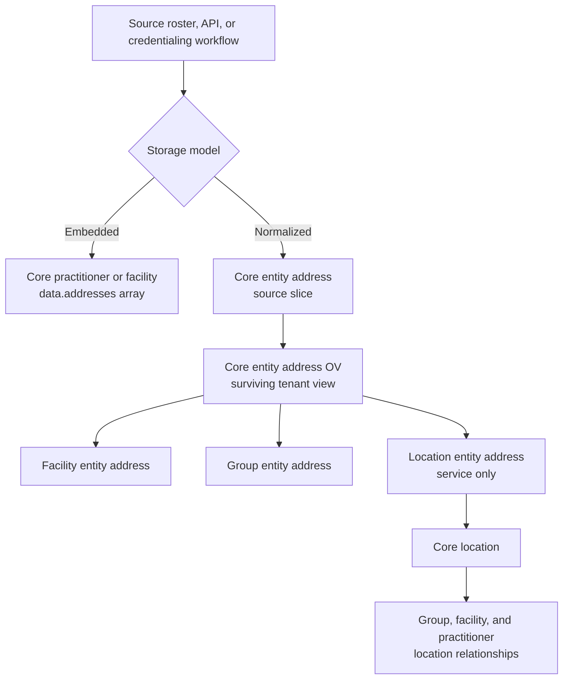
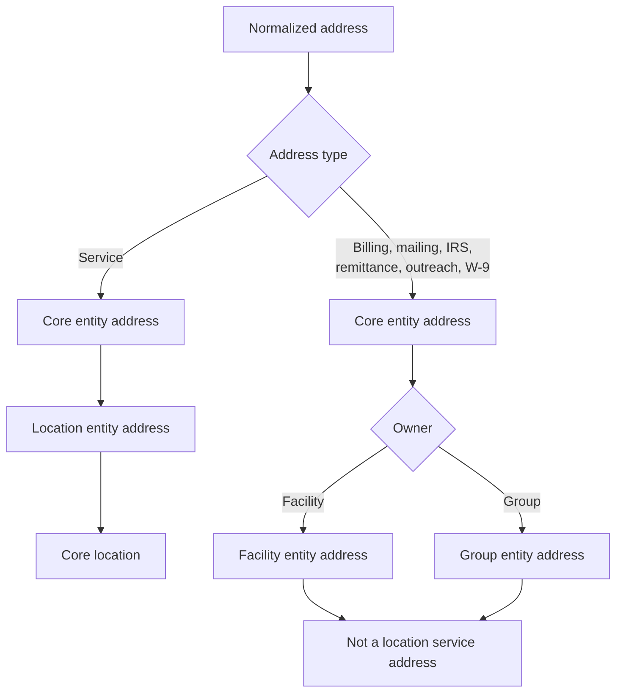
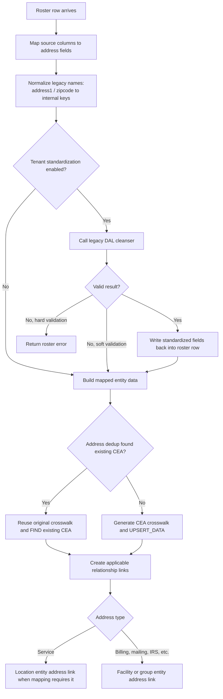
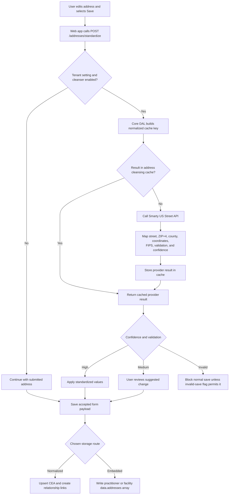

# PDM address management: end-to-end technical reference

**Audience:** technical leadership, platform engineers, data engineers, and application teams
**Scope:** how PDM receives, stores, standardizes, links, reads, and updates US addresses
**Evidence reviewed:** source on `main` in the PDM repositories on 2026-09-11. This is a code-based reference, not a live-production data snapshot.

## Executive summary

PDM has **two address storage models**, not one.

1. **Embedded addresses** are JSON objects inside a practitioner or facility record. They use fields such as `address1`, `address2`, and `zipcode`. Credentialing workflow addresses use this model.
2. **Core entity addresses** are separately identified address records. They are linked to facilities, groups, practitioners, and locations through relationship tables. Roster ingestion and location lookup use this model when the relevant roster mapping creates those entities.

A `CoreLocation` is not a postal address. It holds location details such as name and accessibility. Its service address is a separately stored `CoreEntityAddress`, connected by `LocationEntityAddress`.

**Smarty is the default address-cleansing provider**, and it uses Smarty US Street Address Verification. It is not the only possible provider: configuration can select Google or Radar for the newer standardization endpoint. Legacy requests that require CASS or FIPS are deliberately routed to Smarty. Address standardization is optional at several layers; therefore, the system does **not** guarantee that every stored address is standardized.

The important leadership conclusion is that a consumer must first choose its address model and purpose. Reading `core_entity_addresses_ov` will not return workflow-only embedded addresses. Reading `core_facilities.data.addresses` or `core_practitioners.data.addresses` will not return every normalized address linked through `FacilityEntityAddress`, `GroupEntityAddress`, or `LocationEntityAddress`.

## 1. Terms used in this document

| Term | Plain meaning |
|---|---|
| Address | Postal details: street lines, city, state, ZIP, and optional county, coordinates, and ZIP+4. |
| Location | A business/service site. It has a name and operational attributes. Its postal address is linked, rather than stored as the location's street fields. |
| Embedded address | An address object inside `data.addresses[]` on a core practitioner or facility record. |
| Core entity address (CEA) | A separately stored address entity in `core_entity_addresses`, with its own identity and source history. |
| Base slice | One source's version of an entity. The source can be a roster, a UI/API write, or the cleansing service. |
| OV | “Operational value”: the tenant-specific surviving view assembled from source slices. Read paths generally use an `*_ov` table. |
| Standardization | Asking an address provider to validate and return a deliverable, consistently formatted address plus enrichment such as ZIP+4 or coordinates. |
| Normalization | Making equivalent input field shapes comparable inside our code. It does not prove that an address is real or deliverable. |
| Crosswalk ID | A stable identity fingerprint used for upsert and deduplication. It is not a postal authority or a replacement for standardization. |

## 2. The model at a glance



The arrows describe possible paths, not an automatic migration. An embedded address is not automatically promoted into a CEA, and a CEA is not automatically copied back into an embedded array.

## 3. Physical storage and ownership

### 3.1 Normalized address tables

| Table | What it stores | Key points |
|---|---|---|
| `core_entity_addresses` | Source slices of a CEA | `certify_id`, `crosswalk_id`, `source_id`, `survivor_id`, and JSON `data`. Multiple source rows may represent the same logical address. |
| `core_entity_addresses_ov` | Tenant-specific surviving CEA | `certify_id` + `tenant_id`, JSON `data`, and contributing-slice/crosswalk metadata. This is the normal read model. |
| `facility_entity_addresses` | Facility-to-CEA link | Supports any CEA associated with a facility. |
| `group_entity_address` | Group-to-CEA link | Holds link metadata including effective dates. |
| `location_entity_addresses` | Location-to-CEA link | The roster resource configuration creates this only for `addressType = service`. |
| `practitioner_entity_addresses` | Practitioner-to-CEA link | Table exists, but the reviewed roster mappings do not use it for the usual practitioner location path. |
| `address_cleansing_results` | Provider result cache | A cached result keyed by normalized input and provider; it is not the canonical business address table. |

The base and OV table definitions are in `core-data-access-layer/src/main/resources/db/changelog/core-entity-address/` and `core-entity-addresses-ov/`. Relationship table definitions are in the sibling `facility-entity-address/`, `group-entity-address/`, `location-entity-address/`, and `practitioner-entity-address/` change-log folders.

### 3.2 Embedded address storage

| Parent | JSON path | Typical field names | Main users |
|---|---|---|---|
| Core facility | `core_facilities.data.addresses[]` | `address1`, `address2`, `city`, `state`, `country`, `zipcode`, `type`, lifecycle fields | Some facility rosters and facility credentialing workflow. |
| Core practitioner | `core_practitioners.data.addresses[]` | Same legacy field shape | Practitioner credentialing workflow and selected legacy/source flows. |

The canonical schemas make this distinction explicit: `schemas/entities/Facility.schema.json` and `Practitioner.schema.json` define embedded arrays, while `schemas/entities/EntityAddress.schema.json` defines the normalized CEA shape.

### 3.3 What is in address JSON

The normalized CEA schema supports `addressLine1`, `addressLine2`, `city`, `state`, `zip`, `zipExtension`, `country`, `county`, `formattedAddress`, `latitude`, `longitude`, state/county FIPS, validation status, and `addressType`. The exact fields remain JSON, so a table row does not have one SQL column per postal field.

`CoreLocation` intentionally has no street-address fields in `schemas/entities/Location.schema.json`. It represents the site; its service address is retrieved through `location_entity_addresses` and the CEA OV.

## 4. Entity and location relationships

### 4.1 Normal paths

| Business question | Normalized path |
|---|---|
| What address belongs directly to a facility? | `facility_entity_addresses` → `core_entity_addresses_ov` |
| What address belongs to a group? | `group_entity_address` → `core_entity_addresses_ov` |
| What is a location's service address? | `location_entity_addresses` → `core_entity_addresses_ov` |
| Which site does a practitioner work at? | `group_practitioner_locations` → group/location relationships → `location_entity_addresses` → CEA OV |
| Which facility site is being queried? | Either direct facility-location relationships or the facility → group → location chain, then `location_entity_addresses` → CEA OV |

For a practitioner, the standard operating relationship is **practitioner → group-practitioner-location → location → service CEA**. There is no equivalent normal `tenant_practitioner_locations` path in the reviewed model.

### 4.2 Address type and link behavior

`ResourceConfiguration` in the API layer applies different rules:

- `LocationEntityAddress` is created only for a `service` address.
- `GroupEntityAddress` accepts a non-null address type, so group billing, remittance, mailing, outreach, IRS, and similar addresses can be linked to a group.
- `FacilityEntityAddress` is not restricted to the service type.

This distinction matters: a non-service group address can exist as a CEA and group link without appearing as a location's service address.



### 4.3 Location identity

Roster code builds an address fingerprint from, in order, `addressLine1`, `addressLine2`, `city`, `state`, `zip`, and `addressType`, then computes SHA-256. A location crosswalk is a normalized, URL-encoded location name plus that address hash.

Changing the address can therefore change the crosswalk. When roster deduplication finds an existing CEA, the code deliberately retrieves the original base-slice crosswalk rather than recomputing a fingerprint from OV data. This avoids creating a duplicate record when survivorship or standardization changed the displayed values.

Evidence: `api-layer/src/main/java/com/certifyos/api_layer/roster/service/LocationHashService.java` and `.../roster/service/AddressStandardizationService.java`.

### 4.4 Where the CEA crosswalk is created and stored

**It is created in the API layer, before the Core DAL write.** It is then sent as the `crosswalkId` in the CEA upsert request. Core DAL persists that value in the `crosswalk_id` column of the source-slice row in `core_entity_addresses`. The database table is the storage location; it does not calculate the hash.

```text
Mapped CoreEntityAddress data
       |
       v
EntityCrosswalkGenerator.createEntityAddressCrosswalkId(...)
       |
       v
LocationHashService.createAddressHash(...)
  SHA-256 of the address fields in a fixed order
       |
       v
Roster transaction / direct facility operation:
  body.crosswalkId = generated value
  filters.crosswalkId = generated value
       |
       v
Core DAL CoreEntityAddress UPSERT_DATA
       |
       v
core_entity_addresses.crosswalk_id
```

For roster ingestion, `ResourceConfiguration` registers this generator for `CoreEntityAddress`. The transaction builder uses the generated value both to find an existing source-slice row and in the upsert body. For direct facility-location and facility-address operations, `FacilityLocationService.buildCoreEntityAddressOp` calls `generateCoreEntityAddressCrosswalk(address)`, which uses the same address-hash service.

There are important exceptions:

| Situation | Crosswalk behavior |
|---|---|
| New normal CEA | SHA-256 address fingerprint is generated before the write. |
| Roster dedup finds a matching existing CEA | The original base-slice `crosswalk_id` is reused; it is not recomputed from OV values. |
| Non-service address on a pinned group update | The roster generator returns `addressType + "+" + groupId`, rather than an address hash. |
| Embedded facility/practitioner address | No CEA is created, so there is no CEA address crosswalk. |
| Location itself | Its crosswalk is a separate composite: normalized location name plus the address hash. |

This means `core_entity_addresses.crosswalk_id` is normally an address fingerprint, but it is **not safe to assume every row is a SHA-256 address hash** without considering the write path and exception above.

Evidence: `api-layer/src/main/java/com/certifyos/api_layer/common/generator/EntityCrosswalkGenerator.java` (`createEntityAddressCrosswalkId` and `generateCoreEntityAddressCrosswalk`), `api-layer/.../roster/service/ResourceConfiguration.java` (the `CoreEntityAddress` registration), `api-layer/.../facility/service/FacilityLocationService.java`, and `core-data-access-layer/src/main/resources/db/changelog/core-entity-address/001-create-core-entity-address.yaml`.

## 5. How roster ingestion handles addresses

### 5.1 First step: map fields into an address shape

Roster feeds use several field naming conventions. The roster address service maps equivalents such as:

| Incoming shape | Internal normalized key |
|---|---|
| `address1` or `addressLine1` | `addressLine1` |
| `address2` or `addressLine2` | `addressLine2` |
| `zipcode`, `zipCode`, or `zip` | `zip` |
| omitted type | `service` by default in the helper |

This is **normalization**. It aligns field names for processing and retains the original spelling when writing back to an embedded/legacy object. It does not correct a street name, validate the ZIP, or make the address deliverable.

Evidence: `api-layer/.../roster/service/AddressStandardizationService.java`, `extractAddressFields` and `writeBackToMap`.

### 5.2 Standardization during roster validation

During roster-row validation, configured address groups are collected, then standardization is attempted before the location crosswalk is calculated. The standardizer may update the row with provider output before the transaction is built.

The supported practitioner/group field groups include practice/service location, billing, remittance, outreach, group location, mailing, IRS, and W-9/contractee. For a facility roster, the configured group is `facilityLocation*`.

The roster service sends a legacy DAL cleanser request, writes back standardized line 1/2, city, state, ZIP (with ZIP+4 where returned), county, country/region, FIPS, coordinates, and validation code. An invalid result is handled according to tenant validation configuration: a hard mode produces an error; a soft mode records a soft error. Disabled or failed standardization normally leaves the input usable.

The row validator also has optional pre-standardization location deduplication. It is limited to the primary service/practice address group; other address types are intentionally skipped because the group-address lookup path is not yet available.

Evidence: `api-layer/.../roster_record/service/RosterRowValidationService.java`, `.../roster/service/AddressStandardizationService.java`, and `.../roster/service/TransactionOrchestrator.java`.

### 5.3 Roster address lifecycle



### 5.4 What each roster shape persists

| Roster / mapping pattern | Address persistence |
|---|---|
| Default facility roster | CEA plus facility link; group link when applicable; service CEA can also receive a location link. |
| Default practitioner roster | CEA plus group link and service location link; practitioner-to-CEA is not the usual path. |
| Group roster | CEA plus group link; service address can be location-linked. |
| Humana / credentialing-style facility roster | Embedded facility `data.addresses[]`, rather than CEA relationship records. |
| Humana / Zing practitioner mappings reviewed | No corresponding normalized address columns in those mappings. |

The exact outcome is mapping-driven. “Roster ingestion” is therefore not one universal address write path.

### 5.5 Older validation path

The API layer also contains `AddressApiValidator` / `AddressValidationService`. It calls the legacy cleanser only to decide whether an address is valid. Its feature setting is off by default (`ADDRESS_API_VALIDATION_ENABLED=false`), it retries certain failures, and it fails open after service failures. It is separate from the roster standardization write-back flow.

## 6. API and UI address behavior

### 6.1 UI preview standardization

The user interface calls:

```text
POST /addresses/standardize
```

The API-layer resource checks tenant ingestion configuration and forwards the request to Core DAL. This endpoint is a preview: it does not itself create or update an entity. A 204 response means no result is available, including when cleansing is globally disabled.

The front end applies these rules when the Flagsmith feature is enabled:

| Provider confidence / status | UI behavior |
|---|---|
| High | Applies the standardized values automatically. |
| Medium | Shows a comparison/decision flow when there is a material difference. |
| Low | Warns the user. |
| Invalid | Blocks the normal save, unless the separate invalid-address-save flag allows a non-blocking path. |

The returned standard postal fields are applied to the visible form. Enrichment such as `zipExtension`, county, coordinates, FIPS, and `formattedAddress` is also preserved when the relevant storage shape can carry it. Country and address type are not replaced by the response transformer.

Evidence: `api-layer/.../address/resource/AddressStandardizationResource.java`, `.../address/service/AddressStandardizationService.java`; `frontend/apps/web/features/address/`.

### 6.2 Direct facility APIs

Facility creation accepts top-level billing, office, mailing, and IRS address objects. The facility service creates a CEA and `FacilityEntityAddress` for each supplied object. These non-service top-level objects are not passed through the facility service's automatic roster-style standardization method.

Facility-location creation requires a service address and creates a CEA and a `LocationEntityAddress` link, but the direct service method builds the crosswalk and persists the caller's data; it does not independently invoke the standardization service.

**Practical result:** UI preview can produce standardized data before a save, but an API client can persist an unstandardized address through these direct endpoints unless another caller-side or MDM flow cleanses it.

Evidence: `api-layer/.../facility/service/FacilityService.java` and `.../facility/service/FacilityLocationService.java`.

## 7. What standardization does, and what it does not do

### 7.1 Standardization request and response

The newer Core DAL endpoint is `POST /standardize-address`. It requires line 1, city, state, and a five-digit US ZIP (optionally ZIP+4); it accepts country and address type. The request defaults a missing country to `US` and sets CASS/FIPS requirements to false.

Its response includes standardized street, city, state, ZIP, ZIP+4, county, and country; validation status and confidence; and available enrichment such as coordinates, FIPS, timezone, and provider details.

The confidence mapper treats `VALID` and `POSTAL_MATCH` as high confidence, `NEEDS_REVIEW` as medium, and `INVALID` as low/invalid.

### 7.2 Provider selection: Smarty, Google, and Radar

| Situation | Provider behavior |
|---|---|
| Default cleansing / default standardization configuration | Smarty |
| New standardization endpoint during a configured provider change or Smarty outage | May use Google or Radar, according to `address.cleanser.standardize.provider` / provider configuration. |
| Legacy request requiring CASS or FIPS | Forced to Smarty. |
| Global `address.cleanser.enabled=false` | No provider call; the endpoint returns no result. |

Smarty integration uses the Smarty US Street Address Verification SDK. It sends the street, city, state, and ZIP, then maps the returned delivery lines, USPS components, ZIP+4, county/FIPS, and coordinates into the PDM response. The integration hardcodes the result country as `US`; this is a US-address capability, despite the request model accepting a two-letter country.

The Core DAL default configuration has cleansing disabled. The default provider values still say `SMARTY`; those values do not enable calls by themselves.

Evidence: `core-data-access-layer/.../address_cleanser/service/AddressCleanserService.java`, `.../address_cleanser/service/SmartyAddressCleanser.java`, `.../address_cleanser/resource/dto/StandardizeAddressRequest.java`, and `src/main/resources/application.properties`.

### 7.3 Provider-result cache

Before calling a provider, Core DAL looks in `address_cleansing_results`. Its cache key is a lower-cased, trimmed, non-alphanumeric-stripped composite of the input fields and the provider. A hit updates `last_read_at`; a new result stores the raw provider response and normalized/enriched result fields.

This key preparation is another kind of **normalization**. It is only for cache matching. It must not be described as postal standardization, and it must not be used as a canonical crosswalk.

Evidence: `core-data-access-layer/.../address_cleanser/repository/SpannerAddressCleanserRepository.java` and `db/changelog/address_cleansing_results/001-create-address-cleansing-results.yaml`.

### 7.4 Lifecycle example: a service address standardized with Smarty

This example shows the normal **interactive UI** path. It assumes the relevant UI flag, tenant setting, and Core DAL cleanser setting are enabled, and that the selected provider remains the default, Smarty.



For example, Smarty may return a canonical delivery line and ZIP+4. The UI applies the returned postal fields and keeps the form's country and address type; enrichment is retained when the destination supports it. Smarty verification alone does not decide the final storage shape—the caller's API/roster mapping does.

If the normalized CEA is later handled by the MDM cleansing listener and `ADDRESS_CLEANSING_ENABLED` is on, that listener makes a **separate legacy request** with CASS/FIPS required. This also selects Smarty, then adds a `certify-cleanser` slice for survivorship. It does not overwrite the original UI/API slice.

The roster lifecycle is similar in purpose but different in mechanics: roster validation calls the legacy DAL cleanser directly, can standardize multiple configured address groups, writes the accepted values back into the row before transaction construction, and applies tenant hard/soft validation rules for invalid results.

## 8. MDM cleansing and survivorship

The MDM cleansing layer separately listens for address changes. When `ADDRESS_CLEANSING_ENABLED` is enabled, it:

1. reads the changed CEA source slice;
2. skips a slice already produced by the cleaner;
3. sends line, city, state, ZIP, and region to the DAL legacy cleanser with both CASS and FIPS required; therefore this route uses Smarty;
4. creates/upserts a new `certify-cleanser` source slice containing non-null standardized and enrichment fields; and
5. asks the MDM merge/survivorship flow to incorporate the new slice.

It does **not** overwrite the original roster/API source slice in place. That preserves provenance, but it also means consumers should read the CEA OV when they expect the surviving cleaned value. The cleaner is disabled by default. A provider error is recovered as “no cleansing needed,” so this asynchronous flow is fail-open.

The cleaner writes standardized address fields, county, ZIP+4, country, FIPS, formatted address, coordinates, and validation code. Its clean slice is intentionally an enrichment slice; it does not copy every arbitrary source field, including `addressType`. Consumers must not assume that an individual cleaner slice is a complete business-address record.

Evidence: `dal-mdm-cleansing-layer/src/main/java/com/certifyos/mdm_cleansing_layer/core_entity_address/service/AddressCleansingService.java` and `.../mdm/cleansing/service/MDMSliceCleansingService.java`.

## 9. How Core DAL consumes addresses

Location lookup is the principal normalized read use case.

### Practitioner location lookup

The practitioner lookup repository traverses group, practitioner, group-practitioner, group-location, and `location_entity_addresses`, then reads the CEA OV. It uses contributing-crosswalk metadata to line up tenant OVs with relationship records.

### Facility location lookup

The facility lookup supports both a direct facility → facility-location → location-address path and a facility → group → group/facility location → location-address path. Both resolve the address from the CEA OV, not from a location street column.

### Address comparison used by lookup

The shared matching service uses a weighted comparison: ZIP 40%, ZIP extension 10%, line 1 30%, city 15%, and state 5%. Its text comparison lower-cases, trims, and removes non-alphanumeric characters. The class states that both sides should already be cleansed; that is an assumption, not an enforced system invariant because standardization can be disabled or bypassed.

Evidence: `core-data-access-layer/.../practitioner_location_lookup/repository/PractitionerLocationLookupRepository.java`, `.../facility_location_lookup/repository/FacilityLocationLookupRepository.java`, and `.../location_lookup_shared/AddressMatchingService.java`.

## 10. Credentialing: confirmed read and write behavior

Credentialing workflows are a separate consumer and writer of the **embedded** model.

| Workflow | Address object | Update behavior | Relationship to CEA/location model |
|---|---|---|---|
| Practitioner credentialing workflow | `CorePractitioner.data.addresses[]`, legacy `address1` / `zipcode` shape | Replaces the complete addresses section, with contact-section soft-delete behavior. | Does not create/read a `CoreEntityAddress` link as part of this workflow update. |
| Facility credentialing workflow | `CoreFacility.data.addresses[]`, legacy shape | Replaces the complete facility addresses array. | Does not write through `FacilityEntityAddress` or `LocationEntityAddress` in this workflow update. |

`OVCopyService` explicitly includes `addresses` among the practitioner fields copied into the credentialing workflow. `CredentialingWorkflowService.updateCredentialingWorkflowAddresses` updates the `addresses` contact section. The facility DTO documentation likewise says it replaces the facility workflow's complete `addresses` array.

**There is drift by design today:** credentialing may show and modify an embedded address that is not the same record as the normalized CEA used by location lookup. A change in one model does not automatically update the other. Any product requirement for one shared “current address” must define source precedence and an explicit synchronization/ownership process; the reviewed code does not provide one.

Evidence: `api-layer/.../credentialing_workflow/service/OVCopyService.java`, `.../credentialing_workflow/service/CredentialingWorkflowService.java`, `.../credentialing_workflow/dto/AddressUpdateRequest.java`, and `.../facility_credentialing_workflow/dto/FacilityAddressUpdateRequest.java`.

## 11. Verified gaps and drift to manage

| Finding | Why it matters | Recommended owner/action |
|---|---|---|
| Two independently writable models: embedded arrays and CEAs. | The same business address can diverge across credentialing, roster, API, and lookup. | Establish ownership and synchronization rules before promising a unified address view. |
| Standardization has separate switches: UI feature flag, roster tenant setting, Core DAL global flag, and MDM cleansing flag. | “Smarty is enabled” in one path does not mean every ingestion path is standardized. | Publish a tenant/environment configuration matrix and monitor its effective values. |
| Direct facility API writes do not automatically standardize every address. | API clients can persist raw values even when the UI standardizes them. | Decide whether server-side standardization is mandatory for these APIs. |
| Address-type contracts are inconsistent. | The canonical enum lists values such as `w9Address`, while roster groups also use `w9`, `irs`, and `outreach`. | Reconcile schema enums, roster mappings, validation, and reporting definitions. |
| Location links only represent service addresses. | Billing, mailing, and remittance addresses should not be inferred as a location address. | Make this rule explicit in consumer contracts. |
| MDM cleaner output is a partial enrichment slice. | A consumer reading a source slice rather than the OV can miss type or source-specific fields. | Read CEA OVs for canonical display; retain source slices only for provenance/audit cases. |
| The legacy resource comment says standardization is always Smarty due to FIPS, while the newer request sets FIPS/CASS false and provider selection is configurable. | Documentation can lead teams to assume the wrong provider behavior. | Correct the resource Javadoc and test the configured failover path. |
| Smarty result mapping assumes available metadata/FIPS in some paths. | An unusual provider result could expose null/length handling risk. | Add defensive tests for candidates with absent metadata/FIPS. |

## 12. Consumer decision guide

| Need | Read/write target |
|---|---|
| Credentialing workflow contact address | Embedded `addresses[]` on the workflow's practitioner/facility record. |
| Address associated directly with a facility | `facility_entity_addresses` plus `core_entity_addresses_ov`. |
| Address associated with a group | `group_entity_address` plus CEA OV. |
| Physical service address for a location | `location_entity_addresses` plus CEA OV. |
| Practitioner’s service site | Start with the practitioner/group/location relationship; do not infer it from an embedded practitioner address. |
| Address provenance or raw submitted value | Base `core_entity_addresses` slice and its source/crosswalk metadata. |
| Best surviving normalized address | CEA OV, not an individual source slice. |
| Reusable provider validation/enrichment result | The standardization endpoint; do not query the cache table directly as a business source. |

## 13. Investigation SQL patterns

These are diagnostic patterns; adapt identifiers and tenant filters. They intentionally show the normalized model separately from embedded workflow data.

```sql
-- Normalized service address for a known location
SELECT lea.location_id,
       ea.certify_id AS entity_address_id,
       ea.data
FROM location_entity_addresses lea
JOIN core_entity_addresses_ov ea
  ON ea.certify_id = lea.entity_address_id
WHERE lea.location_id = @location_id
  AND ea.tenant_id = @tenant_id;
```

```sql
-- Every normalized address directly linked to a facility
SELECT fea.certify_facility_id,
       ea.certify_id AS entity_address_id,
       ea.data
FROM facility_entity_addresses fea
JOIN core_entity_addresses_ov ea
  ON ea.certify_id = fea.entity_address_id
WHERE fea.certify_facility_id = @facility_id
  AND ea.tenant_id = @tenant_id;
```

```sql
-- Raw source slices for one normalized address, including provenance
SELECT certify_id, crosswalk_id, source_id, survivor_id, data
FROM core_entity_addresses
WHERE certify_id = @entity_address_id;
```

For embedded addresses, inspect `core_facilities.data` or `core_practitioners.data` and extract `addresses[]`; do not join those arrays to CEA tables unless a product-specific reconciliation key exists.

## 14. Evidence index

All paths below are repository-relative to `/Users/devpandey/projects/pdm-dal-full/fe-api-coredal` unless stated otherwise.

| Area | Primary evidence |
|---|---|
| CEA and OV DDL | `core-data-access-layer/src/main/resources/db/changelog/core-entity-address/` and `core-entity-addresses-ov/` |
| Relationship DDL | `core-data-access-layer/src/main/resources/db/changelog/{facility,group,location,practitioner}-entity-address/` |
| Address schema and legacy embedded schemas | `../schemas/entities/EntityAddress.schema.json`, `Facility.schema.json`, `Practitioner.schema.json`, `Location.schema.json`, and `enums/AddressType.schema.json` |
| Roster field normalization, provider call, validation, dedup | `api-layer/src/main/java/com/certifyos/api_layer/roster/service/AddressStandardizationService.java` and `roster_record/service/RosterRowValidationService.java` |
| Roster relationship generation | `api-layer/src/main/java/com/certifyos/api_layer/roster/service/ResourceConfiguration.java`, `TransactionOrchestrator.java`, and `LocationHashService.java` |
| UI/API preview | `api-layer/src/main/java/com/certifyos/api_layer/address/` and `frontend/apps/web/features/address/` |
| Facility API writes | `api-layer/src/main/java/com/certifyos/api_layer/facility/service/FacilityService.java` and `FacilityLocationService.java` |
| Core DAL standardization/provider/cache | `core-data-access-layer/src/main/java/com/certifyos/dal/address_cleanser/` and `src/main/resources/application.properties` |
| Location lookup consumption | `core-data-access-layer/src/main/java/com/certifyos/dal/{practitioner_location_lookup,facility_location_lookup,location_lookup_shared}/` |
| MDM cleanser | `/Users/devpandey/projects/pdm-dal-full/dal-mdm-cleansing-layer/src/main/java/com/certifyos/mdm_cleansing_layer/` |
| Credentialing workflow behavior | `api-layer/src/main/java/com/certifyos/api_layer/{credentialing_workflow,facility_credentialing_workflow}/` |

## 15. Bottom line

PDM can standardize addresses with Smarty by default, retain the raw source value, enrich a surviving normalized CEA, and use that CEA as a location’s service address. It can also store a separate embedded address for credentialing or source compatibility. Those are complementary models, not interchangeable views of the same row.

Any team asking “what is the address?” must specify: **which entity, which address type, which storage model, which source/surviving view, and whether standardization is required for that path.**
