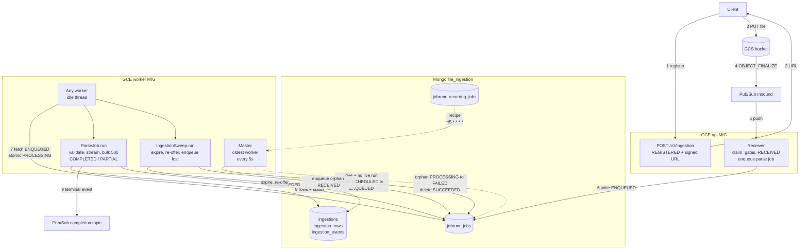

# JobRunr lifecycle

## Flow

## Roles
- api VM: enqueue only
- worker VM: run jobs
- master: oldest worker, auto re-elected
- Mongo: `jobrunr_jobs`, `jobrunr_recurring_jobs`, `jobrunr_background_job_servers`
- removed: Cloud Run, Cloud Scheduler
- kept: GCS, Pub/Sub, `ingestions`, `ingestion_events`

## 1. Code
- `@Job` parse method
- `@Recurring` sweep method

## 2. Boot
- all VMs: upsert recurring recipe
- workers: register, heartbeat 5s
- oldest alive = master

## 3. Register
- `POST /v1/ingestion` → `REGISTERED`, signed URL

## 4. Upload
- client `PUT` → GCS

## 5. Receive
- api VM
- Pub/Sub push
- claim, gates, `RECEIVED`
- enqueue parse, id = ingestionId
- ack

## 6. Claim
- worker fetches `ENQUEUED`
- atomic → `PROCESSING`

## 7. Parse
- CAS `RECEIVED` → `VALIDATING`
- validate, stream, bulk 500
- `COMPLETED` / `PARTIAL`, publish
- job heartbeat every 5s

## 8. Done
- `SUCCEEDED`, deleted after 36h

## 9. Fail
- exception → `FAILED` → retry
- worker dies → orphan → retry
- master dies → next oldest
- alert: `state = FAILED`

## 10. Sweep
- every 5 min
- master: recipe due? live instance? no → create job
- any worker runs it
- duties: expire `REGISTERED`, expire parked, re-offer lost, enqueue orphan `RECEIVED`
- once per tick, cluster-wide

## Q&A
- Q1: api MIG + worker MIG
- Q2: cap = `worker-count` × worker VMs; set 1 × MIG size
- Q3: JobRunr recurring, not Cloud Scheduler, not quarkus-scheduler

## Open
- Mongo cluster exists? F5 vs attestation brief says Spanner
- retry-aware claim CAS
